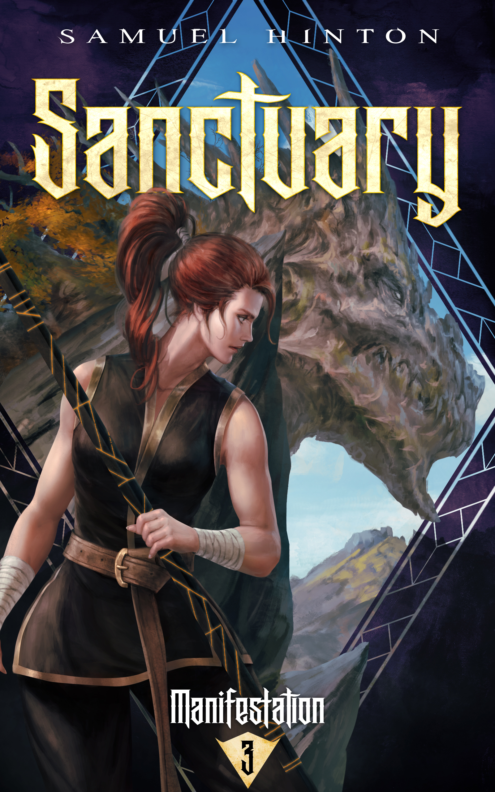
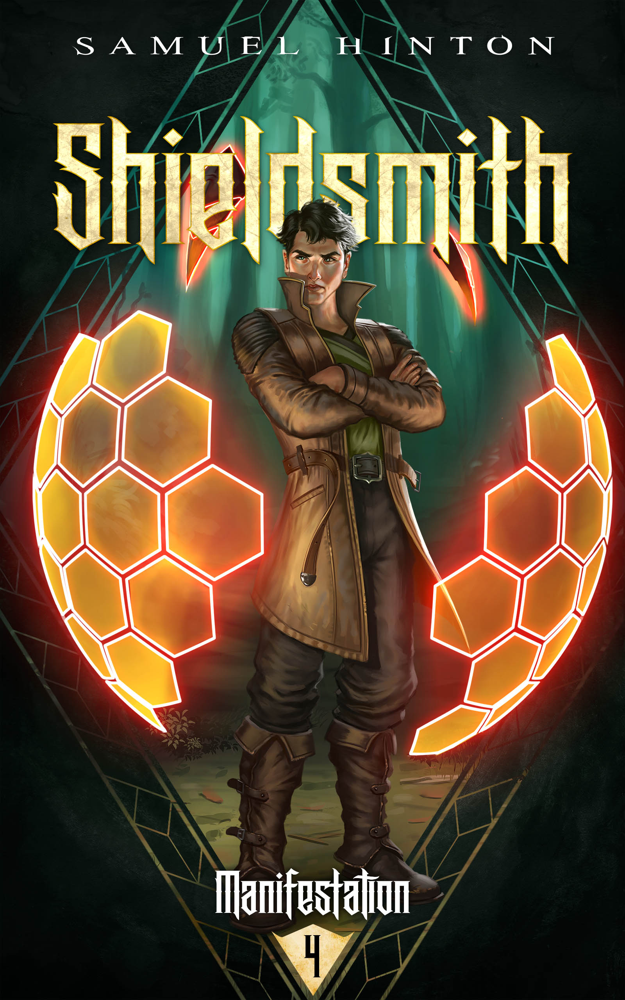
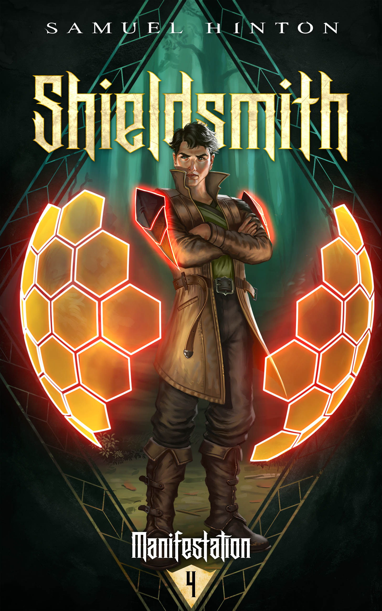

Hi everyone! It's been a while since I've checked in publically, so I thought I'd do that today.

For a summary of news on my end:

1. **Scion of Storms** is out now on Kindle and Audible.
2. **Sanctuary** (book three) is aiming to have a sync'd Kindle and Audible release, hence why it's taking long.
3. The book is finialised though, and just needs another copy-editing round.
4. While I'm waiting on copy edits, book four has been progressing well.
5. Book four's working title is **Shieldsmith**. I figured it was time Vashi was on a cover.
6. **Shieldsmith** has hit 60k words, and I'm coming up to the good stuff now.
7. A draft cover for book four is done as well!

Book three's art was done by [*Mansik Yang*](https://www.artstation.com/yam8417), and features Raysha and Qaeldicras, who you sort-of-met in the epilogue from book two.

Book four's art was done by [Rusty Dela Cruz](https://www.artstation.com/rustee) and I threw him a big old curveball in my requests to try and get some of Vashi's developing shields into the art. You can see the two drake-scale shields he has, plus he's adding more to his collection all throughout book three and four. Let me know if you want some more crafting PoV chapters from Vashi.

Also, I'm tossing up between a "drake-scale hovering" (though its occluded by the title text), or the "drake-scale-shoulders" shown in the second option below. If you have thoughts, let me know on discord!

And finally, to give people a taste but no more, here's the chapter distribution I generate from my chapter tags to help me track the flow of the books.

My writing productivity has been zero the past few days (thanks to Baldur's Gate 3), but I'm aiming to finish a first draft of book four by the end of the month.
