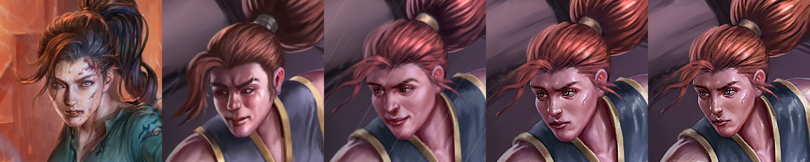

How does one commission high-quality cover art for a self-published book?

Alright, so I've now commissioned six book covers, and some non-cover art just for fun. This makes me definitely *not* an expert, but possibly seasoned enough that, for a new author, I can help illuminate the process, what to expect, and some red flags.

# The process

### Find the meta

Browse books in your niche. Find out what the current meta is for cover art and lean into it. For me, this is progression fantasy, cultivation, and LitRPG titles. If someone looks at my cover and gets romance or thriller vibes from it, my book would have been a complete commercial failure. If the artist you end up picking isn't familiar with the genre, sending some of these covers through as thematic examples can be useful.
   1. Check out my [review page](/reviews/?l=cover) to see a bunch of PF/LitRPG covers.
   2. Check out my [artist shoutout page](/artists/) to see even more covers.
   3. Just go to Royal Road / Amazon / Goodreads and find similar works.

### Shortlist a few artists

In the above step, when you find a cover you really like, see if you can find the artist behind it. In many KU books you can read the sample, and the artist attribution will hopefully be in the front matter of the book. Otherwise I'll point again to my [artist page](/artists/) (and heads up there's a google form you can contribute to so we can grow this larger).

Other options are to hit up Fiverr, or reddit's /r/HungryArtists or /r/CharacterDrawing subs.

Figure out your budget and a shortlist of artists. Expect it be hard to get quality art for under 300USD, a for an ebook only (aka portait 1.6 aspect ratio image), expect an average price of around 800-1200USD. For a full spread (front, spine, and back), add another 300+ on. This is just for the art, too, though some artists (especially studios) will include typography as well.

I'd reach out to these artists about prices and availability as soon as possible, because there's often a hefty (months) waiting period before their schedules can free up.

### Make your brief

I've seen briefs that were a paragraph and just text, and others a dozen-long page of reference images, hairstyles, clothing, themes, and colour palettes. Mine end up normally being somewhere in the middle. I have a few points about the character, what they look like, the setting, and the general *impression* I want readers to come away with.

For example, guess which two aspects from these references I asked to be part of the character design below:

If the artist isn't familiar with ebook and some of the fun aspects of paperback (ie trim and bleed), then I like to also send over a layout template for them. Here's a [link to the full resolution file.](layout.png)

At this point, throw your references and desires into a PDF and wait for the artists you reached out to get back to you. Hopefully you can find an affordable artist with availability in the next decade!

### Negotiations

I won't spend long on this.

1. Ensure that you have commercial rights to the final image.
2. Ensure that you get back a sketch before rendering and can make revisions.
3. Ensure you can make revisions after a rough render and after final render.
4. Request the original photoshop file.
5. Request that the artwork is done in layers (character and background at the very least) - which helps with typography and turning it into an animated video.
6. Put in some timelines as to expected deadlines. Don't expect these to be hit, but expect them to be useful if you need to go to PayPal for a refund if you get ghosted.
7. Do *not* use PayPal friends and family. Always use the professional option where you are protected if the artist fails to deliver.
8. Specify that the work is entirely original and not AI generated.

At this point, you've hopefully agreed to some terms, sent your brief, and have waited to get a sketch back.

### The sketch

Most character artists will give you a line art sketch, though some do sketch with block colour or rough renders from the beginning. It's very normal for environment artists and not that uncommon for character artists.

Here's one of the sketch options I got back from Mansik Yam for my book three cover:

And here's the four options Rusty provided for book five cover:

And here's the sketch from Poyjeee for book six, and note that given my books have had consistent typography, I overlaid my title and design on top of the layout png above so their sketch was able to be done with full context of how it would look with typography.

For block sketching, you might expect something like this sketch from Kart:

Poyjeee's sketch was the most refined, and anything too much more refined and I would have been suspicious of AI art filtering. This is what a line-art filter on AI art will look like, so if you see something like this, cancel the commission and find a new artist. The images will also generally be low resolution, unless the artist upscales before applying the line art filter in photoshop.

The more changes you make at this step to really nail the final layout and composition the better. It's much easier to update a rough sketch than a render.

### First Render

Hopefully this arrives a few days or a week after the sketch. I try to give artists creative freedom while making sure the key points are hit. For an example of requested changes, Rusty when making my book five cover was asked to emulate the character design in the first covers. In his first render, I felt the face was off, and asked for revisions and provided guidance until it was a lot closer.

Here's a progression from reference image to first render and then subsequent updates.

As you can see, we got a lot closer to the original character design with a few iterations.

### Final Render

This is generally the polishing phase, and if you've done a good job with guidance then there should be no further revisions needed as you caught everything early. Some artists just go straight from sketch to final render instead of doing any intermediate steps though, so your milage may vary.

Here's Poyjeee's final render for my book six cover:

### Typography

Unfortunately I don't have a list of typographers on hand. I used [Shawn T. King](http://www.stkkreations.com/book-covers.html), but he's now fully booked and on retainer with Wraithmarked. [Inorai](https://www.fiverr.com/inorai/design-professional-book-cover-typography) has done a ton of covers in the LitRPG space. [Lesia T, aka germancreative](https://www.fiverr.com/germancreative) has also done a bunch of similar work.

If you want to do it yourself, my general tip is "less is more" and "legibility over everything else." I've got a tutorial [here](/blogs/metallic_text/) about how to make metallic text and some of the font-picking tools you can use, but it's not a replacement for experience.

So the real process here is similar to the art. Find some illustrators, know what you want by looking at the genre, reach out and supply your art, wait for some great typography.

### Animations

If you want to create an animation of your cover image (which is handy for engagement on social media), I have a post written up about it [here](/blog/cover_animations) you can check out. As a TLDR, [Morgan Wright](https://www.morganwrightbooks.com/book-cover-animations-service) does high quality work at a disgustingly low price.

### Things I've done which aren't optimal

1. I did the typography myself for book one initially (as you can see in the animation above). It's just not as good as Shawn T. King's work.
2. My books didn't do well enough to justify the increasing cost of my original artist (Mansik) and I was priced out of his services, leading to inconsistent art style across the covers.
3. Initially I put the cover art in my ebook in high resolution as a chunky 2MB file. I also added an HD map and environmental art, making my final ebook a heavy 5MB. *Don't do this.* If your title is in KU, Amazon charges $0.15USD/MB, so if your book was set to sell for $3, you make 70% royalty = $2.1 profit per book... but then right at the end they subtract your delivery fee, which for me was 5*0.15 = $0.75, so my profit went effectively from $2.1 down to $1.35, which is a 35% loss in profit just for some art. Instead, put in low resolution art and link to your website or an external host.