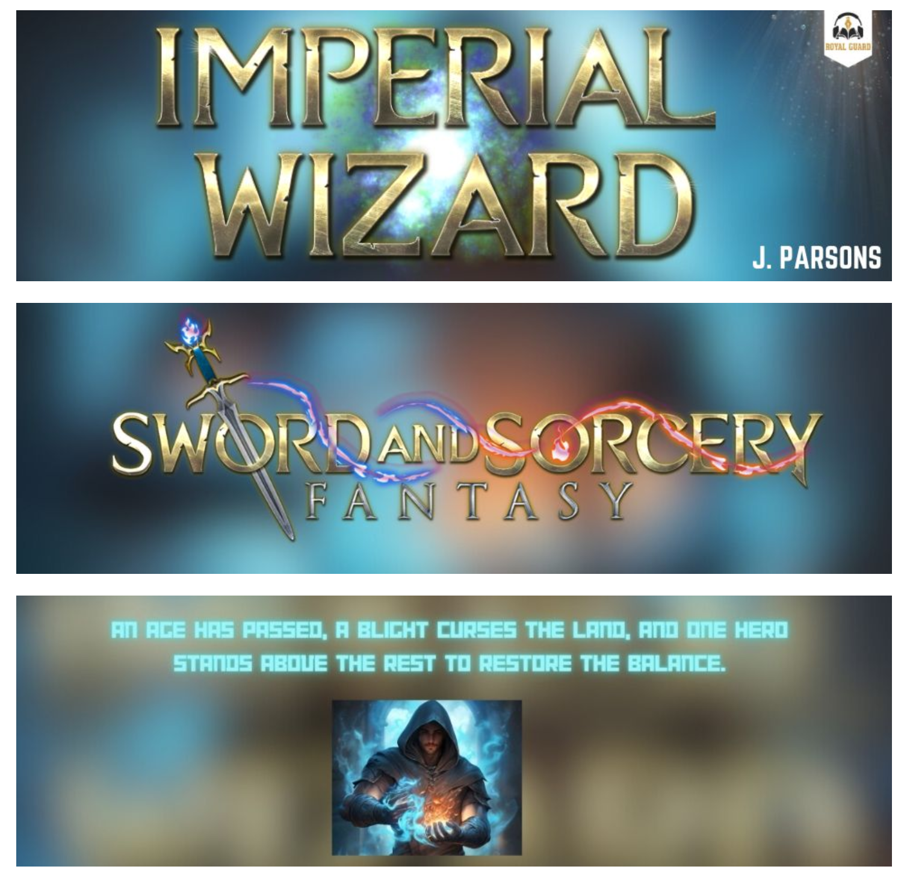

Alright, so A+ content is all the extra stuff outside of your product description that users will see on your landing page, and it's what you should be using to try and maximise your conversion ratio. It'll generally appear underneath the "More Like..." section, though Amazon does love to swap things around.

Here's a story without A+ content (mine). Notice we go from "More Like" right into the product details.

Booo! Boring! A+ content, if I had it, would go between those two sections in a "From the Publisher" section.

So my goal is to fix this up and make my landing page interesting. To do that, I figured I'd find a bunch of examples and throw them in a blog post to hopefully make someone else's life easier down the road too!

Amazon has instructions on how to add A+ content [over here](https://kdp.amazon.com/en_US/help/topic/G8EP5W6H9CY7T8GS), but to boil it down:

1. Go to KDP marketing
2. Pick your market. That's right, this **isn't** shared over marketplace, so either just do US or spend all day copy and pasting. So stupid.
3. Hit "Start Creating A+ content"
4. Throw your book name in the "Content Name"
5. Start adding fun things.

But what content should we add anyway? Let's check out the competition!

### He Who Fights With Monsters

Aethon has a fairly consistent A+ layout as you'll soon see. They generally include a big title, a shorter, punchier blurb, plus a few tags and callouts (Jason is Aussie, LitRPG+Cultivation, weak to strong, comedy).

### Defiance of the Fall

Similar layout, even the same LitRPG+Cultivation and generic progression fantasy callout.

### The Primal Hunter

Identical layout, but now there's a reference to Travis Baldree on narration because he's a big name.

### Edge of the Woods

Not Aethon this time, Podium published Edge of the Woods, and the layout is indeed different. Three full spans now, but still the title + punchier verb + narrator that's been found in prior layouts.

### Death Genesis

Podium as well, and you can tell by the layout.

### Wish Upon the Stars

Onto the third publisher: Timeless Wind Publishing. Full spread title like normal, but this time instead of a punchier verb, there's one which gives new information to the reader about the world, setting, and plot.

### Virtuous Sons

Another one Timeless Wind published, but a very different style to the others. They've used the A+ content to effectively make a tiny comic strip, smart.

### Pirate Wizard

And now onto Royal Guard. They mostly do harem titles, but I've found one that isn't... I think. The title spread here isn't that good, but this is the first one I've seen that has a stats section and explicit 5 star review callouts.

### Imperial Wizard

This is a more recent Royal Guard publication, and I see they've taken Podium's approach here. That said, as nice as the typography is on the golend, metallic text, the choice to have a sci-fi style cyan hookline, on a not dark background, and then add a glow, not great. Not. Great.

# Summary

Tons of books just don't have A+ content too. Cradle, all of Sanderson's works, Wheel of Time, Game of Thrones, etc. But for us self-publishers, I feel like every little thing counts, especially if you're stupid like me and didn't go through Royal Road to start with to build up a readership base. But, if you do want to put out some A+ content, hopefully this is a useful little reference.