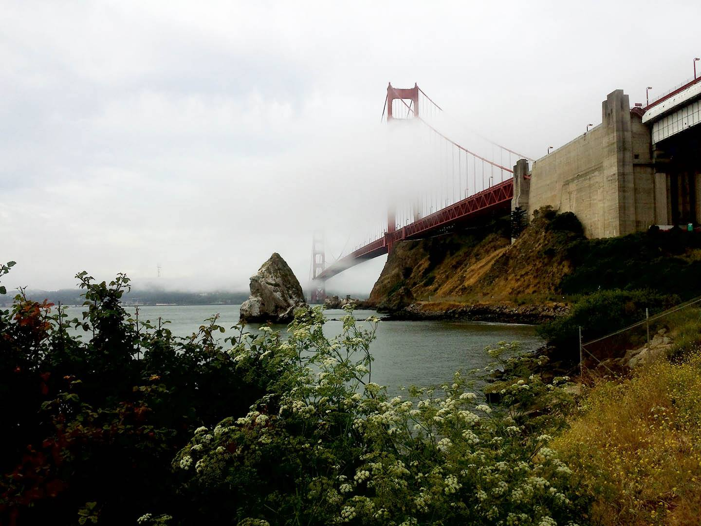
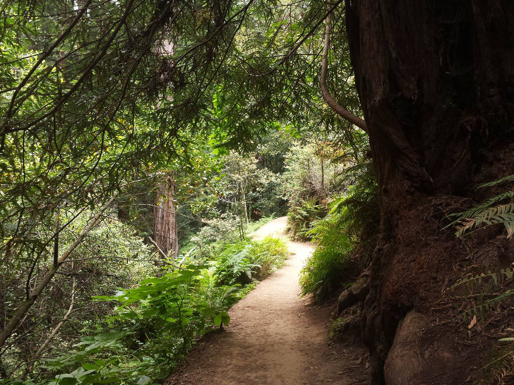
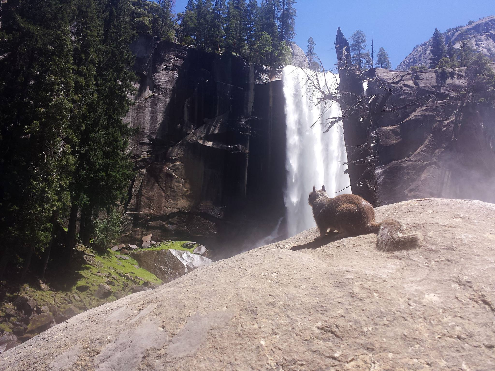
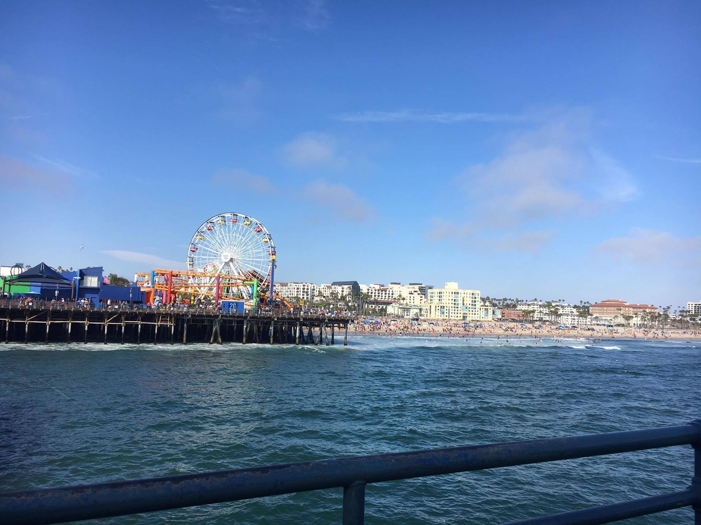

In the Australian summer of 2016 I went to study at
Lawrence Berkeley National Labs for a couple of months with Alex
Kim, working on my Bayesian model for supernova cosmology.

It was a very productive time, but that isn't what this page is about;
this page is about what I got up to outside of work.

The first thing to do when near San Francisco is to go to 
the Golden Gate Bridge. And of course, it was foggy.

A bit beyond the bridge is the Muir Woods with the giant redwoods.
Definitely check it out if you have the chance. Here's one of about a
million photos I took over there.

But perhaps better than that was Yosemite, which was
truly fantastic.

Even the local wildlife couldn't get over the natural beauty
of the place.

I was on a 3-day Green Tortoise bus tour (highly recommended), and
after Yosemite we got to visit other places, one a nice, sulphury hot 
spring. Some of the other places (such as Halfdome, below) are truly 
idyllic.

Whilst nothing could top that tour, Santa Monica was nice too,
albeit absolutely filled with people playing Pokemon Go, which had
come out the week before I flew in.

