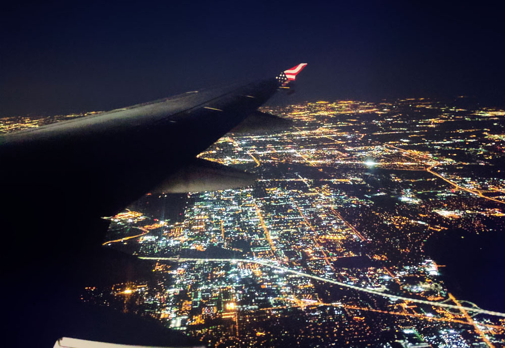
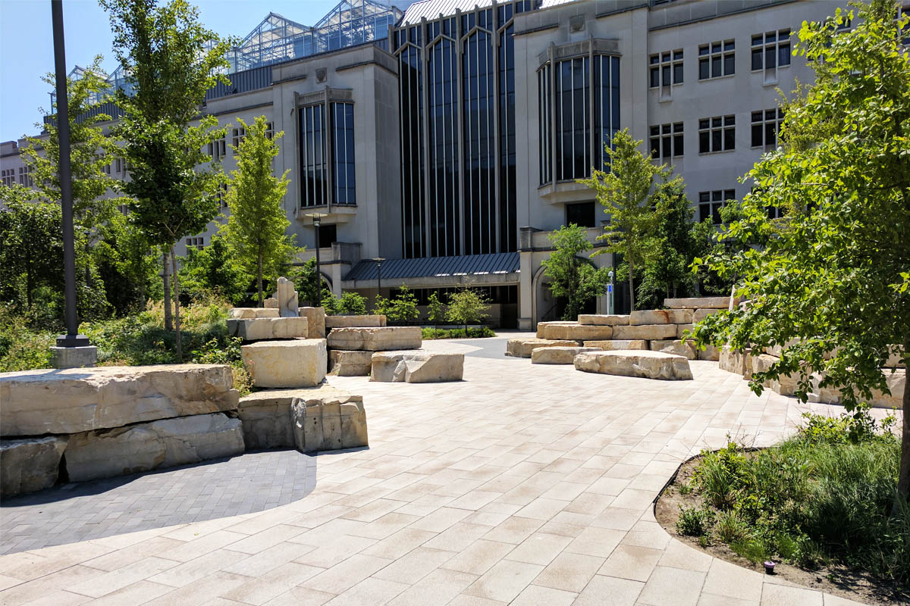
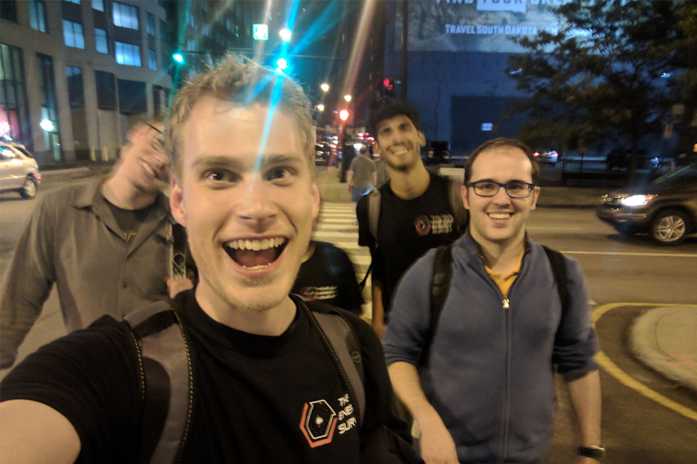
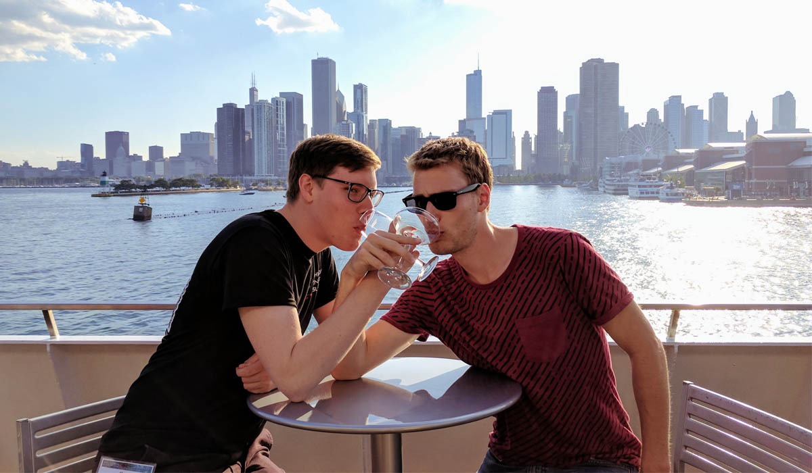
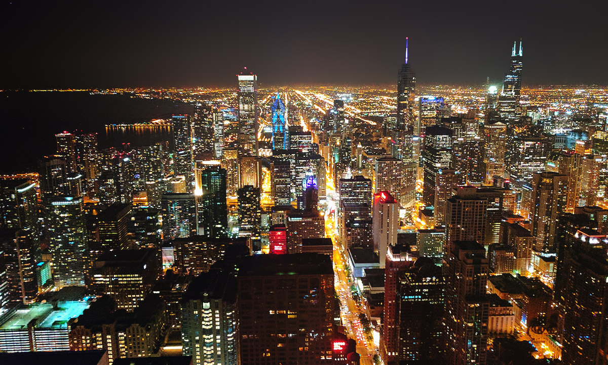

Once again escaping the Australian winter, I found myself 
 residing in the temperate Bay area. But I was still cold.
And so to Chicago I went... coincidentally, this 
was at the same time as a DES collaboration meeting. 

This visit now marks my greatest journey east into the US. I would
have liked to go to New York and visit the city, just to make that statement
incorrect, but alas, neither time nor money can be spared for
such an adventure. Next time, though!

As is tradition, I flew into a new city at night. As we all know,
late night is the best time to visit a new city, because then
you get to see the glowing web of streets spin through the countryside,
which is always a great sight.

The meeting was held about half an hour south of the airport, 
at the University of Chicago. I will freely admit that their
campus is very nice. Not as nice as my own campus at UQ of course,
but not too shabby either. And on a chilly morning, lying down
on the rocks and boulders in the courtyard was deliciously warming.

With Jacobo as tour guide, we spent a few nights in Downtown
Chicago, just wandering around and exploring. We found a
few good bars to grab a drink in and while away the night. I will
also point out that those monsters orphaned me in the city -
when I ducked into Macca's to grab some food they all kept walking!
Was sheer luck that, thanks my ridiculously fast "angry walk" 
speed, I managed to overtake them - even after giving them a ten minute 
head start!

After the exploring, we all retired, but the next day was even
better, because *boat dinner*. Of course, Per and I shared
a romantic evening. An Australian and a Dane in the US, battling
stereotypes left, right and center!

We spent most of the evening on the top of the boat, taking
in the great Chicago skyline whilst chatting and drinking. For me
I got a bit adventurous and had not one, but three pink lemonades! 

And given how much I like the below image, I thereby conclude my
photographic skills are proportionally tied to the amount of 
pink lemonade ingested.

Science.

After the boat tour, Jacobo lead up to Hancock tower. It was
a long wait for the one (out of three) elevators they had running,
but a hundred floors later we got to the bar. We got some drinks
(finally a Lemon Lime Bitters that was actually made correctly, 
I was so happy), and got this fantastic view!

I have to confess that this isn't an original image from my phone,
unlike the others. The glass introduced some reflections of lights from 
the bar that appeared to be hovering above the buildings in 
the image, so I removed them in Photoshop. But apart from the 
night sky, this is directly from my phone. I love the Pixel's camera
so much!

Relaxing 100 floors above the Chicago city with old and new friends,
it was a great night. The next morning, we listened to the 
summary talks, made farewells, and parted with most of the DES
researchers until the next meeting in Brisbane. Time to start
organising for that!
