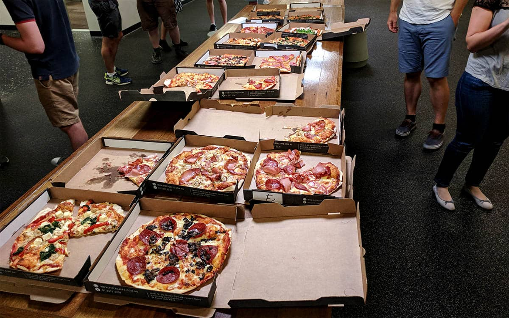

The idea to run a code workshop was born at the 2016 CAASTRO Annual Retreat. Fiona and I were talking to Elaine
about the problems we have had with the self-taught style of coding the most astronomers work with, specifically
the lack of structure, documentation and testing that so often accompanies astronomical projects and packages.

To fix this, we volunteered to run a code workshop, with a focus on teaching the astronomical community
better coding standards, better practises, giving them better tools and better resources. On top of this, 
CAASTRO was coming to an end, and so too many CAASTRO projects. This means that we expect there to be lots of 
code projects individual researchers have created over the years to make their lives easier which currently
only exist in the dim, dark corners of their physical harddrives. So we also wanted to cover how to open-source
and release code quickly and efficiently using Github.

Thus a full day workshop was born! We ran it in Brisbane, Melbourne, Sydney, Canberra and Perth
to academics, post-graduate students and undergraduates alike. Half the day was a series of presentations,
of which you can find annotated slides below, on the topics of Coding Practises, Fun Python Features, Code Testing,
Code Documentation and Shipping Code.

<iframe src="https://drive.google.com/file/d/1SwTiAw-c26Ui5NjXQNFPt4M9lZijIx5c/preview" width="100%" height="500px" style="border: none;"></iframe>

Sprinkled between these presentations were interactive sessions, wherein I got all participants to use Git to
fork an example project and personalise it. The example project itself, [WorkshopExample](https://github.com/Samreay/WorkshopExample),
is designed to be a project template with continuous integration, testing, documentation and more set up off-the-bat.
The grand plan here was for people to take any code they want shared, put it in the template, and a few minutes
later they could have it online and ready for download.

But of course, this is just the content. The real reason to have the workshop was the gratuitous amount
of pizza we ordered for lunch!

And, as it turns out, the kangaroos and picturesque scenery of the Mt Stromolo ANU campus in Canberra.

