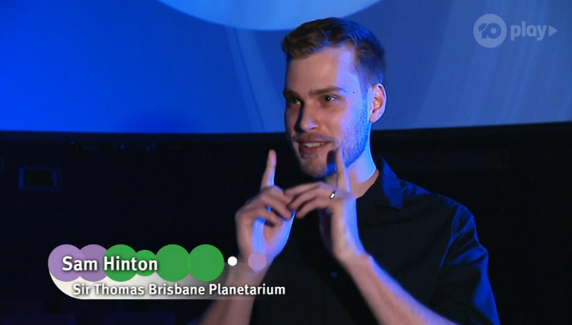

During the school shutdown during the COVID-19 outbreak in Australia, Education Queensland partnered with Channel 10
to produce the Coding@Home series - a series of episodes available for free on TenPlay about introducing code, concepts
and all the ways you can use coding in your life. 

I reached out about my experiences with coding in astrophysics, and we recorded a short
segment focused on machine learning, and how it has improved the lives of the average
astronomer by a huge amount.

No more trawling through photographic plates by eye inspecting hundreds of thousands
of objects in the night sky - now we simply get a computer to do the heavy lifting
and provide us with the interesting stuff without all the stuff we don't care about!

If you're curious, and are reading this in 2020, [here's the link, but note it will expire by the end of 2020 unfortunately!](https://10play.com.au/coding-at-home/episodes/season-1/episode-8/tpv200528tayju)

