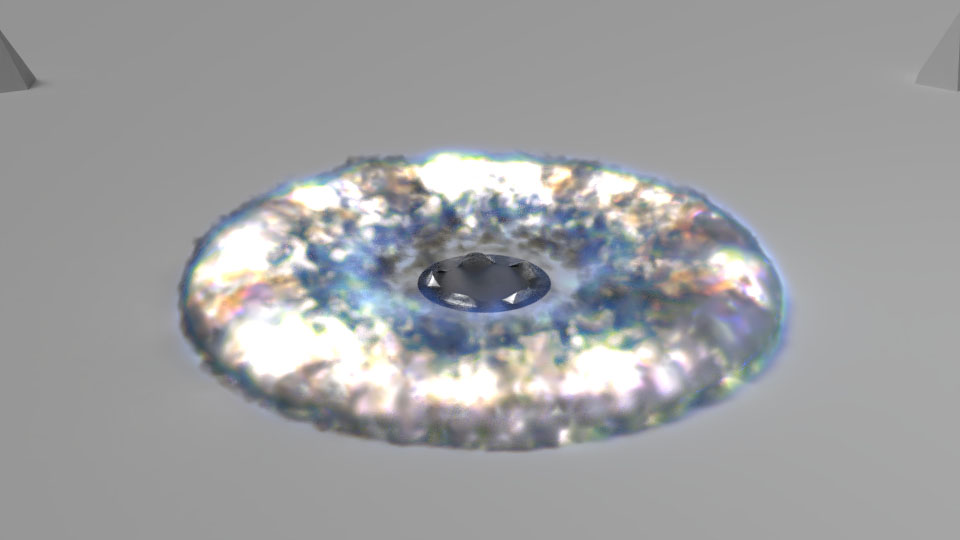

So I wanted to see how the soft body physics worked. So alright, lets just drop a ball. 
But a bouncing ball is boring, so lets squash it completely. And because I could, why not
have particles emit when the bottom of the ball impacts and have them shoot out.

And then because that was still dull, what if we tie the velocity of the smoke into its colour,
and have it that the more dense the smoke is, the more it glows and emits light.

So yeah, it's not exactly sensible, but it was fun to make. Here's the smoke shader I ended up using:

And the actual product in the end:

