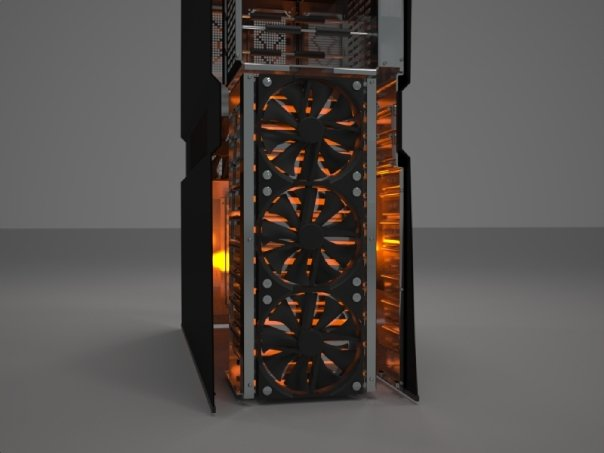
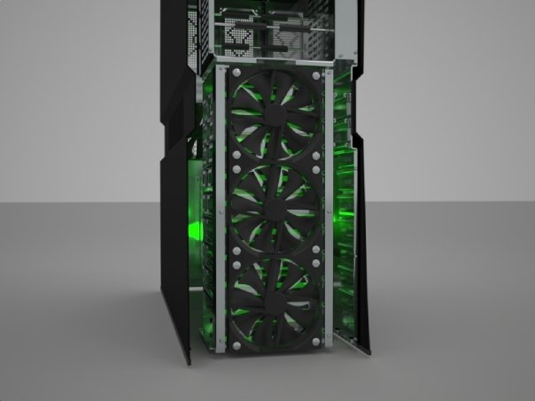

Every now and then, when I think work may be lulling, I try and pick this hobby back up.

And every single time I finish refamiliarising myself with 3DS, sometimes crops up, and I don't come back to it for a year.

Here is the last time I managed to get something properly tangible. From 2009 I believe. The original files are long
lost to computer failure. All that is left are these images, rendered out quickly at low resolution abut three quarters of the way
through the design. The final images are unfortunately lost, scattering into the binary winds.

This was a project to create a computer case that could be manufactured only with basic components and sheet metal, so every
metallic structure in the case can be made from a single sheet. It was make using CATIA, exported to 3DS Max, and then
rendered using Maxwell Render v1.

