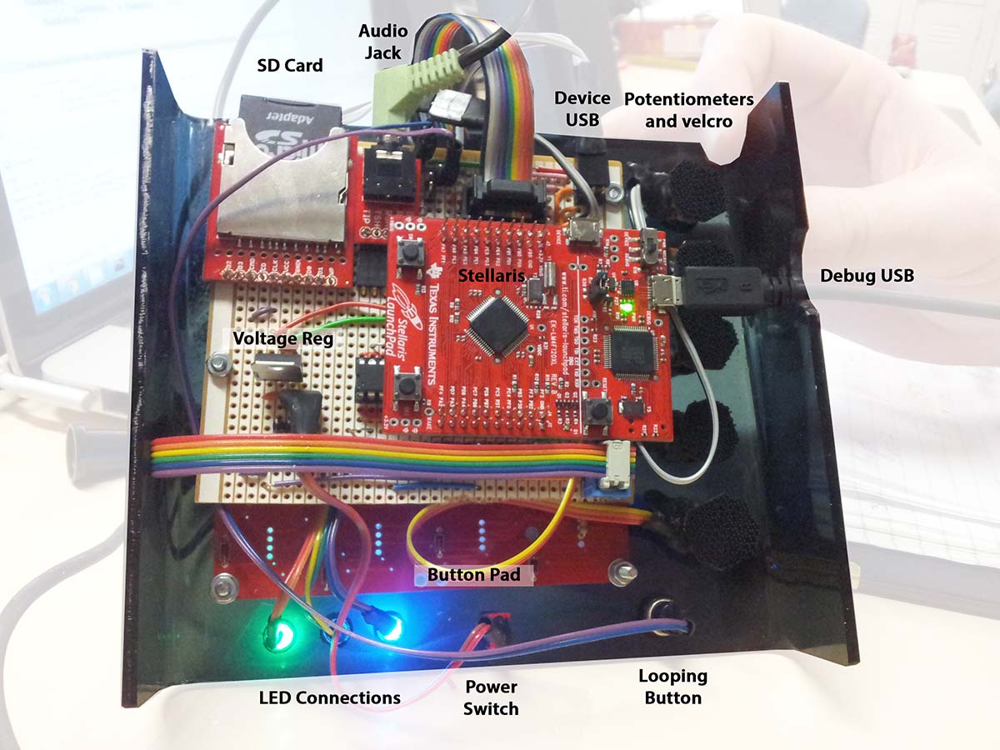
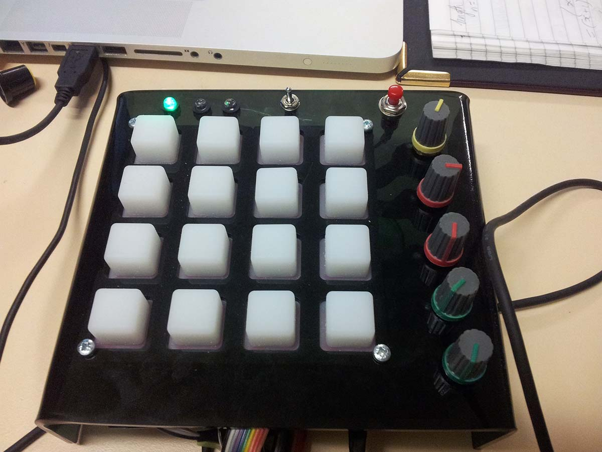
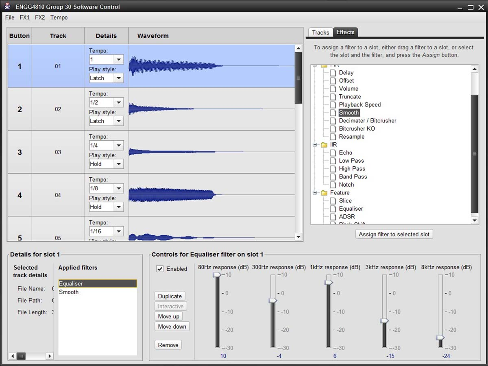

My first team project was to make a pseudo-satellite. Two years later, better equipped, I was hoping the second
project would be to built the rocket. Instead, we got a DJ board. People said I had unrealistically high expectations.

Maybe so.

The challenge of the DJ board was not conceptual, it was to be able to do it all on the tiny processor they gave us,
which had essentially no memory. Because polling the SD Card was slow, the goal was to minimise everything on the firmware such
that you can store as large an array of sound as possible.

Luckily for me, both of my team mates became seriously ill three weeks before the project was due, after we discovered our
circuit board was non-functional. To clarify, I am grateful of the things I learnt by shouldering the entire project, they have
been useful, especially the improvement in my soldering skills. The failure of the cirtcuit board lead to some last minute
creation of a verboard layout in Excel.

It's nasty, but it works perfectly. You can see it wired, with the components inserted below.

From the top, it actually looks quite clean.

Now, such a board needs a lot of testing. With 16 buttons, that's enough to put the words of an entire daft punk song on the board. I'm not joking
when I say that the workshop room was filled with different pitches and effects of "Faster, Better, Stronger, Harder" mashed out for days non-stop, as
everyone frantically tested their product.

In addition, to the physical device, we had to be able to connect the board, via USB, to a Windows computer, and provide software to load on
    MP3 files as well as provide certain filters. These filters, some of them shown below, is what gave us Daft Punk three octaves higher than normal.
I will also admit my passionate hatred of Java GUI's was cemented during the creation of this software. What an absolute nightmare.

Thankfully, the veroboard continued to work throughout my testing (unexpectedly), and I actually finished early.
    I celebrated by buying several kilograms of Starburst lollies and bringing them in for the other guys still pulling late nights. Nothing like
a late night sugar party to get productivity flowing again.