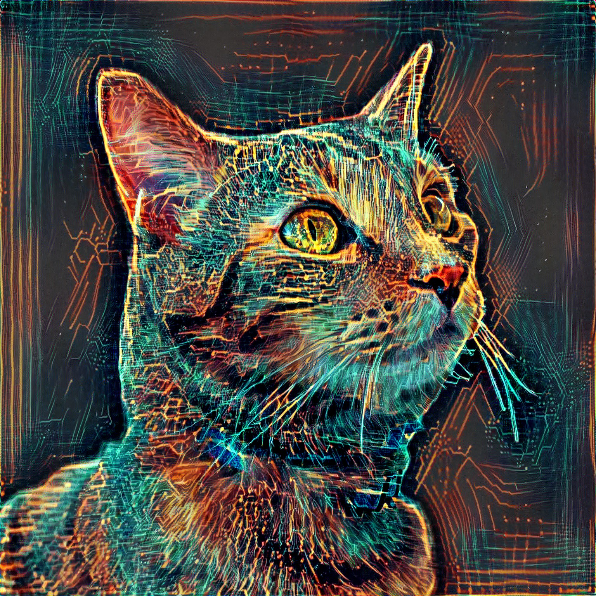
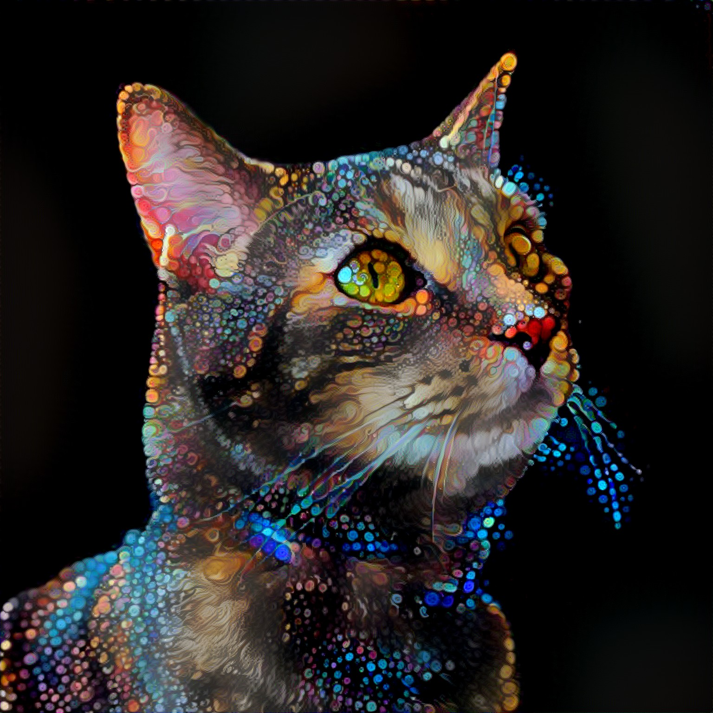
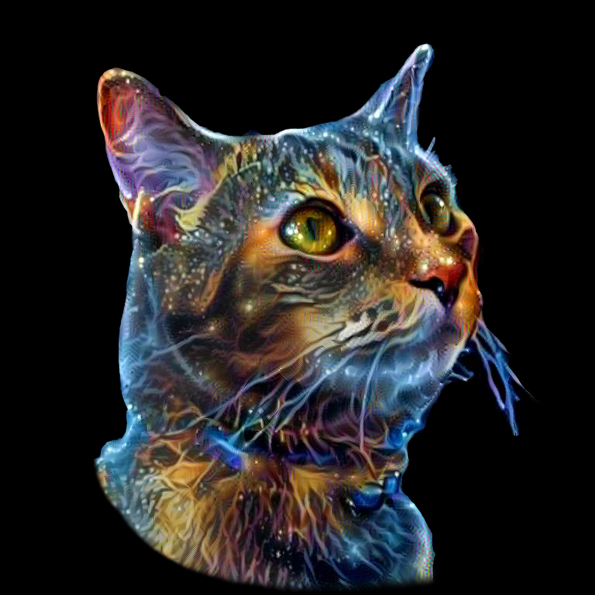

I normally suck at giving presents. Horrifically. Probably because I'm a nightmare to buy for - I *hate* useless gifts. Ornaments, decorations... "things" which aren't functional. 

It's all clutter.

And because I don't like receiving it, I don't give it. Which means the struggle is always for a functional gift. But not this time! My sister has a cat called Ducky.
Now, Ducky may not like me very much (breaks my heart), but Ali sure likes Ducky. So heck, why not print out a nice portrait of Ducky onto something. But a plain portrait
just looks gaudy to me. Got to make it *art*. And then I remembered a whole bunch of amazing images I saw using deep style learning. And I thought - how hard could it be to fork an existing 
project and adapt it to my needs. Let other people do the hard work, and just reap the benefits. For a test, I took this picture of Ducky below as the original source and trained it on van Goph's
Stary Night (also shown below the image doesn't immediately spring to mind). 

Three thousand steps of learning the style and transferring it onto the original image later, we have this masterpiece. It took a while figuring out learning algorithm, rates, resolutions, etc
to make something that looked good, but I like to think I succeeded!

With the proof of concept done, I then wrote some scripts to submit **bulk jobs** to the GPU's and generated images for dozens of styles. You can see all the styles in the [github repo](https://github.com/Samreay/neural-style-tf)
if you're curious. Here are a few nice samples from the styles you can flick through.

In the end, I had two printed - the [first the cosmic cat style](https://www.redbubble.com/people/samreay/works/39062745-cosmic-kitten-abstract-digital-space-cat-painting?asc=u&p=throw-pillow")
and the second the [low-poly orange cat](https://www.redbubble.com/people/samreay/works/39062530-striking-artistic-orange-low-poly-cat?p=throw-pillow"). I had them printed into cushions for 
the living room couch, and what can I say, I think they're fantastic!

