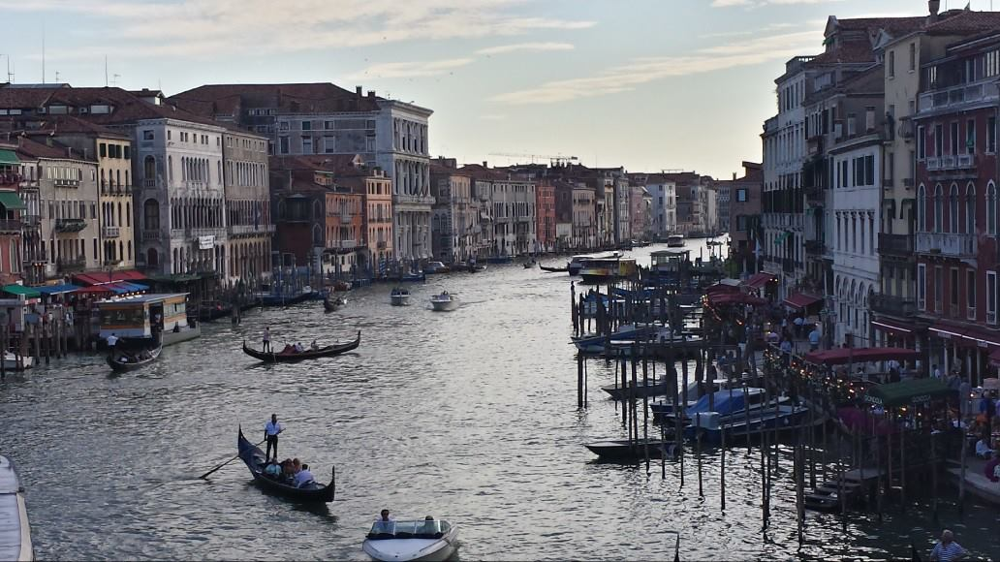
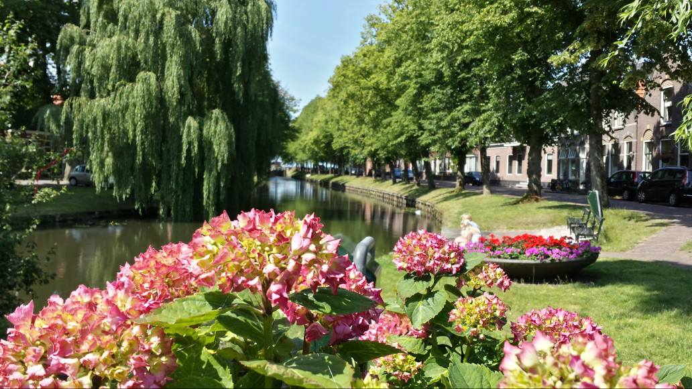
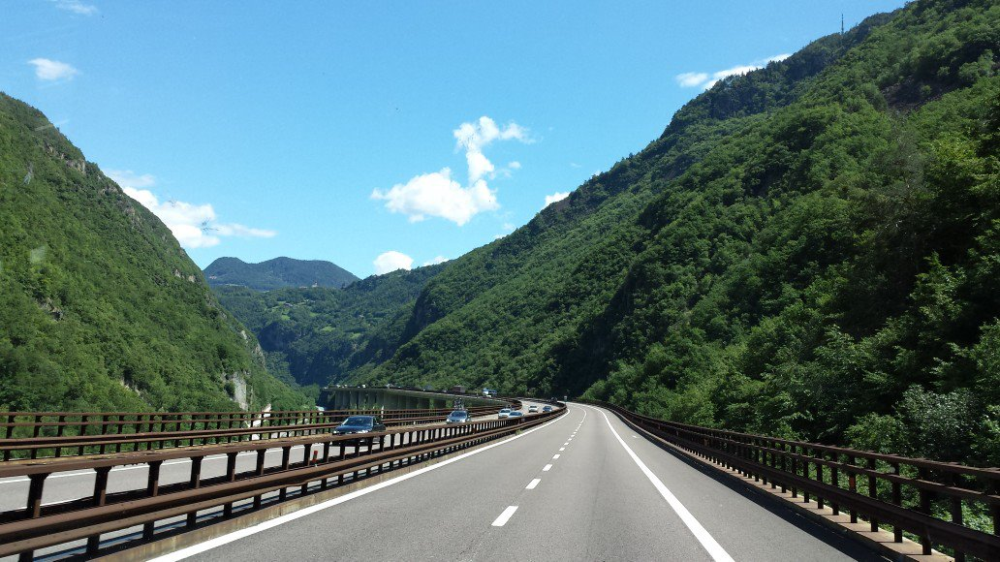
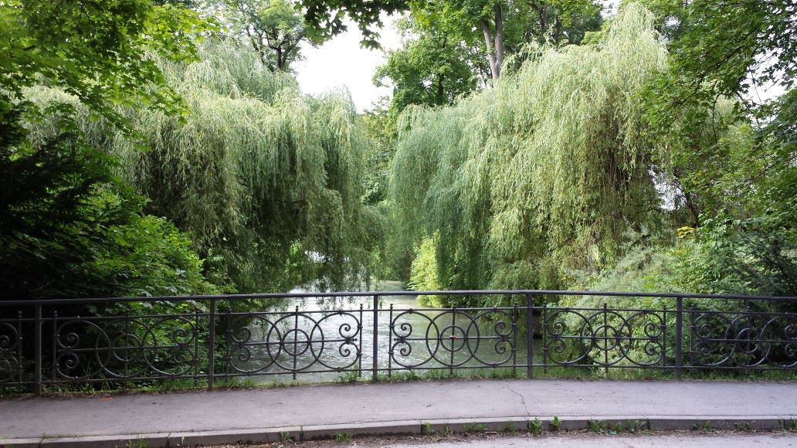
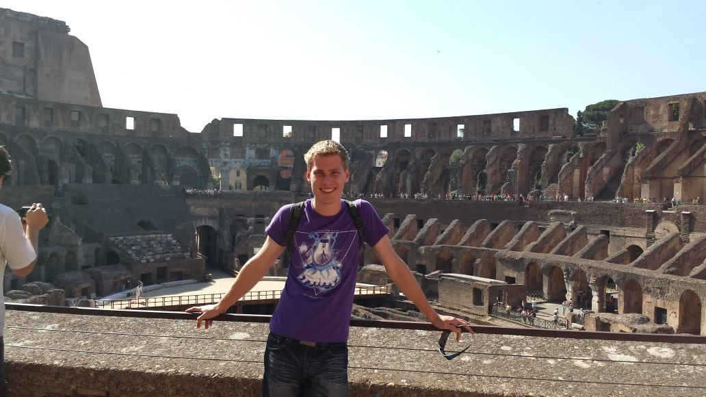
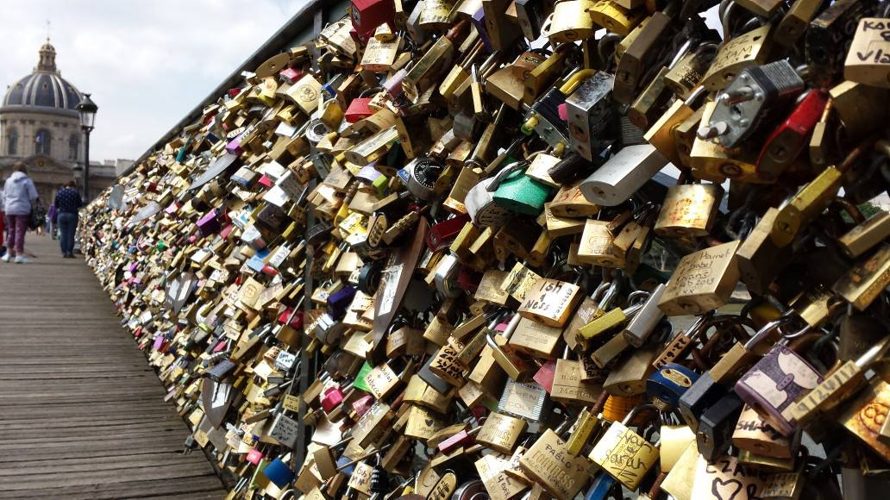

Its hard to condense down such a big trip into less than
a small book, but here goes. Started in London, went to Paris & Nice.
Travelled down to Rome, patted a lot of stray cats in the colosseum. 
Went to Monaco, and then to Munich (which was the best). Munich to the
Rhine valley, and form there to the Netherlands.

Definitely am going to go back, especially to Germany and the
Netherlands, once I have some time and money. Ha.

As an exercise for the reader, can you place the following images
with the right countries?

