# The Zurich Introduction

In a move which will surprise noone, we begin in Zurich. Unbeknown to us, it turns out that the 
very day we arrived in Zurich was the day they were hosting a gay pride march. Predictably, we found out about this at 5pm. 
After the march. Sigh.

But of course, once the official march ends, the real party begins, and there were concerts, a drag show, tons of food 
and general revelry. I want to say we partook and had a great time, but let's be honest - after a thirty hour plane trip
we were most of the way through our zombie transformation and we quickly hit the sack. A brief jaunt outside gave us some photos
though:

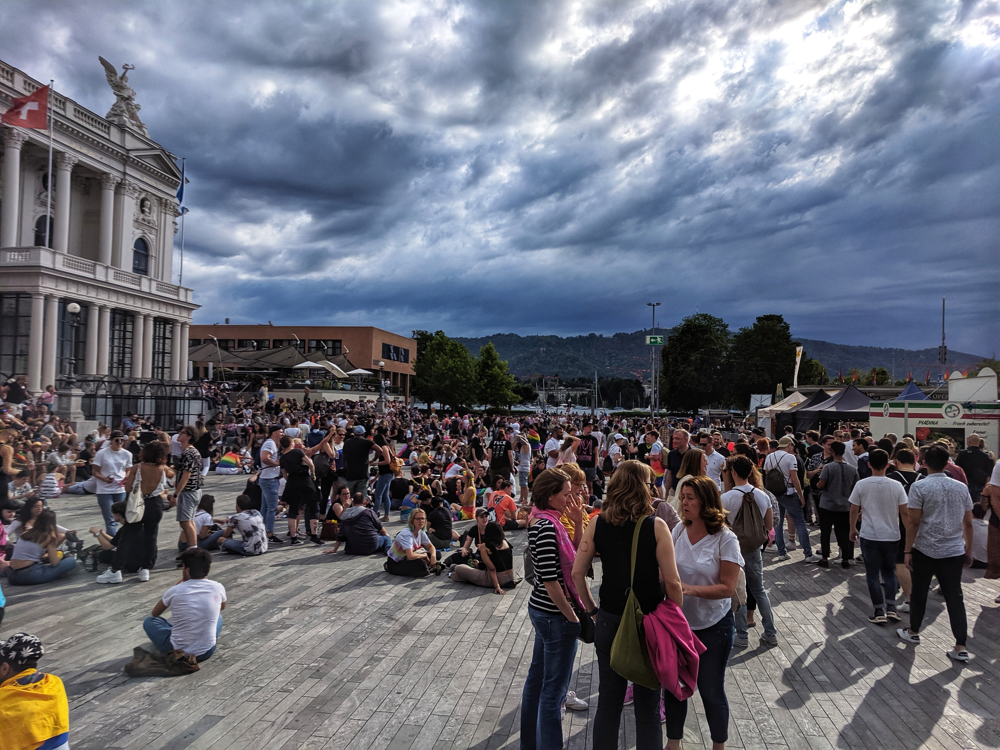
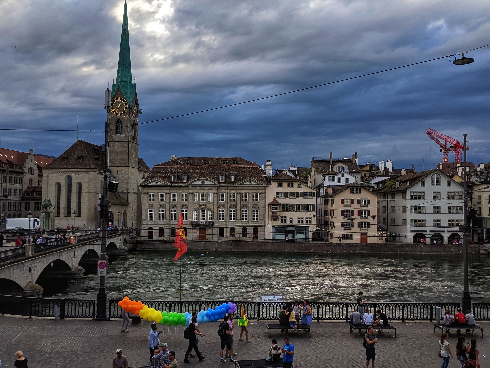

We spent the actual first proper day in Zurich walking through the city center, old town, the botanic gardens and (less enthusiastically)
checking out every old church in the city. I mean, I appreciate the art and architecture, but it just
seems to me that after the first five or so churches the others look preeeetttyyyy similar. Pews, pulpit, cross and crypt. 
It's hard to be dramatically different whilst keeping to that traditional formula. We did walk through ETH, which had
some amazing views, and my mate and I spent a while taking the piss of selfies. Only mostly hypocritically. 

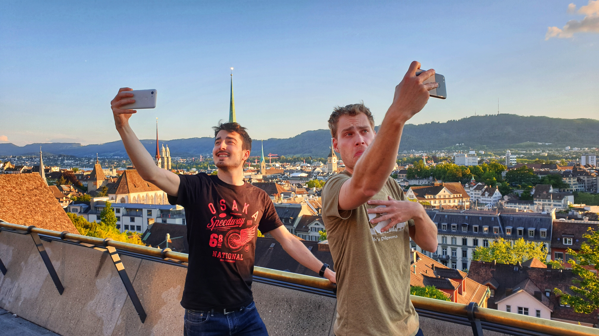

# Heading south - Lucerne

Okay so we went to more than just Lucerne, but got to be brief. Funnily, we all packed quite a lot of warm clothing, 
thinking Switzerland would be nice and cold. Alas, we managed to time our trip to coincide with the hottest
heat wave since 2003. What a waste of packing space, but also highlighted to us how hard it is to find tap/still/non-sparkling water.
Europe seems to love their bubbles.

And their pretzels. But this one I can get behind. Also the cats are super fluffy, which is great. They could be friendlier
though, just saying. So obviously we have all those classic pictures of us at [Kapellbrücke](https://en.wikipedia.org/wiki/Kapellbr%C3%BCcke),
that you can see below.

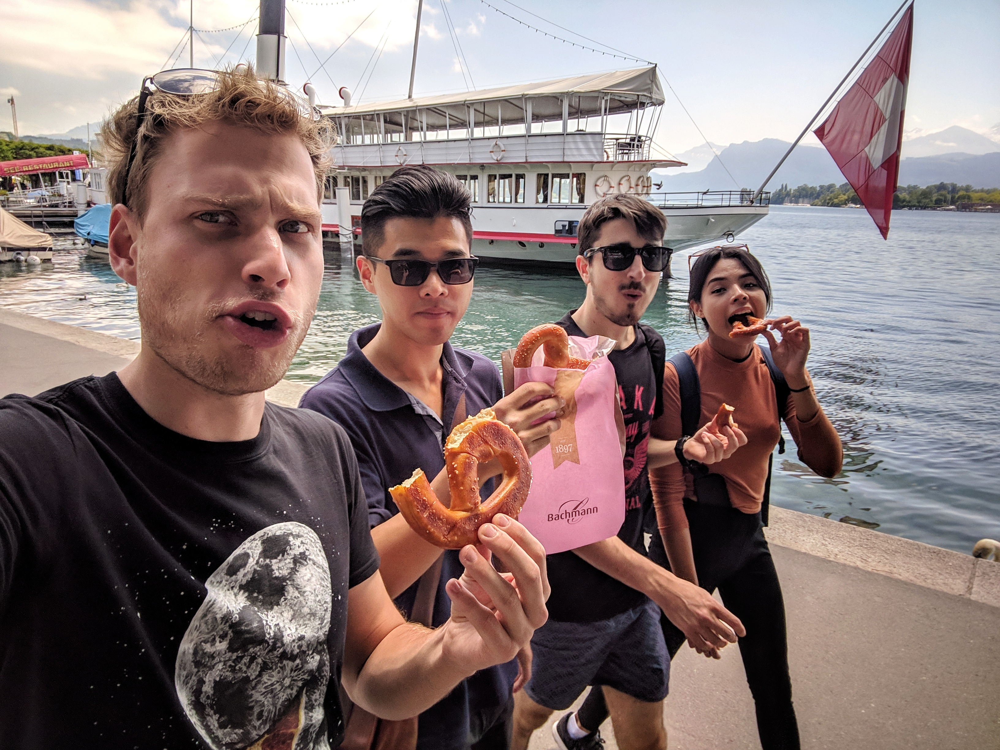
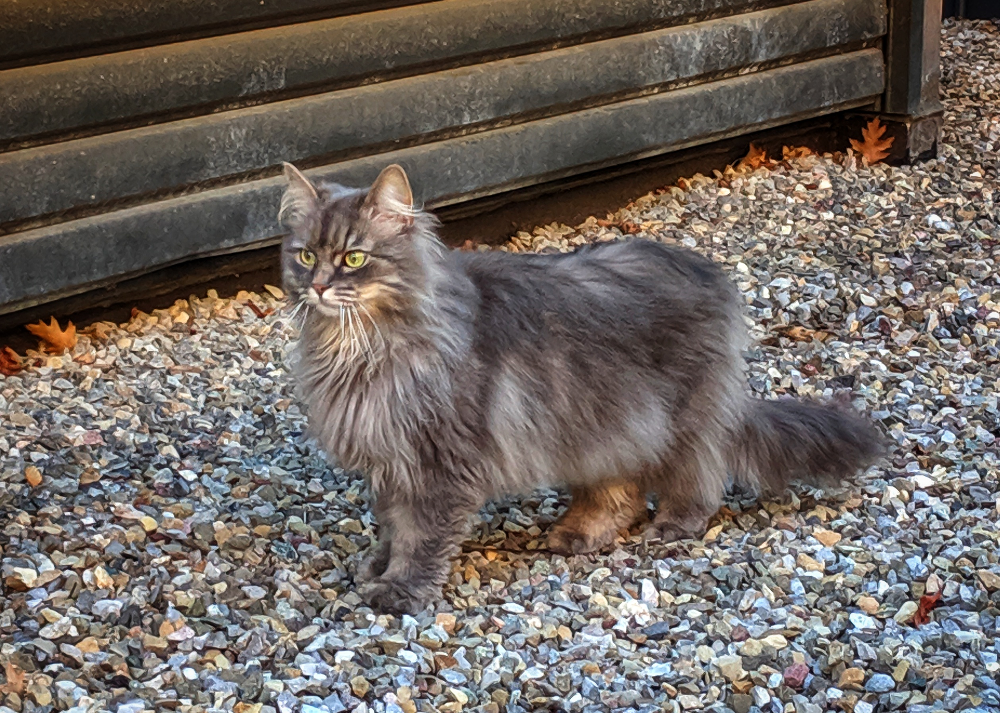
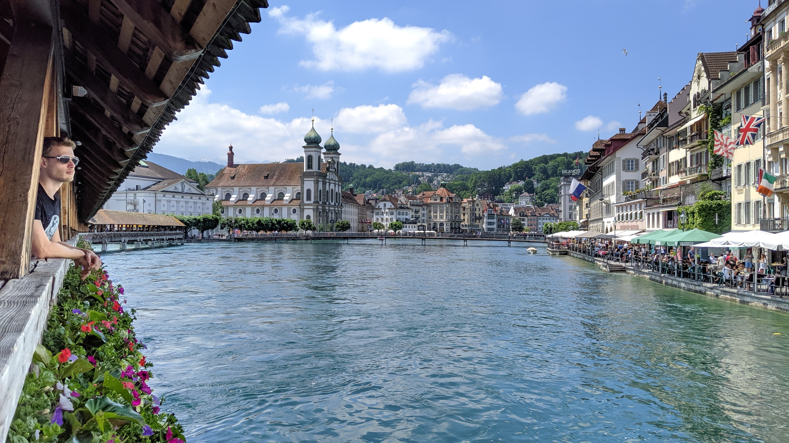

# Arriving in Grindelwald

Got to be honest - Grindelwald is amazing. Highlight of the trip. Amazing. 

Food is a touch pricey. Well no, everything is. But for a week, it was totally worth it. So many walks, so many valleys
 and mountains and forests and ahhhh, it was so nice. But the highlight of the highlight has to be the day we rented
 e-bikes and cycled all the way up to First. Thank god for e-bikes through, thats well over a kilometer in elevation gain,
 enough that at the top it was snow covered. Which is where we got this hilarious picture of me third-wheeling my mates.
 
And then the ride down the mountain, that was something else. I honestly think I almost broke something in my bike,
it was making such a ruckus and several times I had to stop and spray water on my disk brakes, which were at
an absolutely ridiculous temperature.

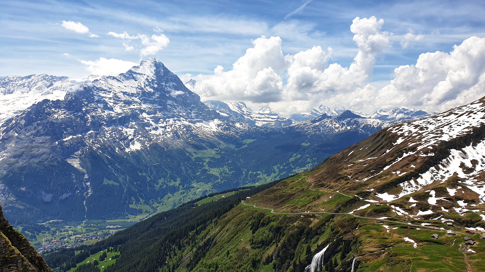
{% include image.html ?class="img-poster" url="main.jpg")
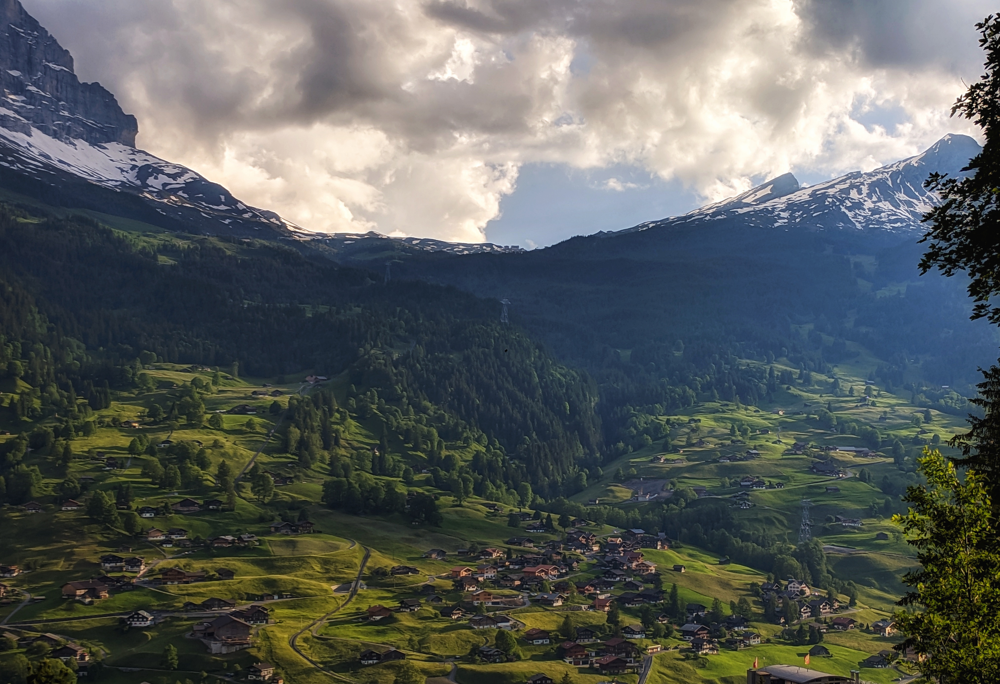
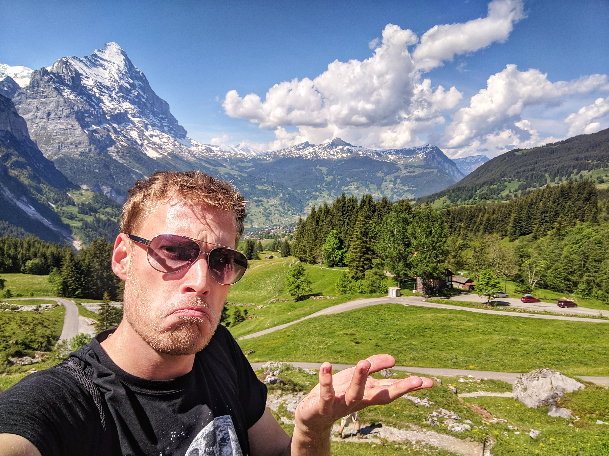
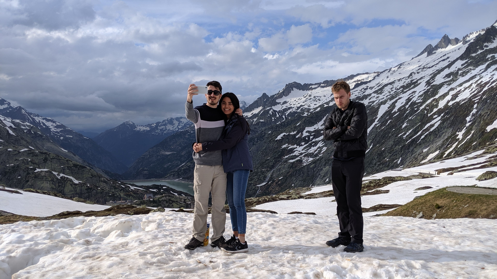

# Interlaken and Onwards

Of course on the way out from Grindelwald you have to visit the famous Interlaken, and we 
went up the side to get all the views. Was pretty nice, but couldn't beat First. No bikes, you see. 

From there, we headed up into Germany, hired a campervan, and then spent the week
slowly driving north through the Black Forest, doing tons of walks and slowly making our way to Amsterdam. One day I'll sort through the images
for that, I'm sure, but damn, why did I take so many?

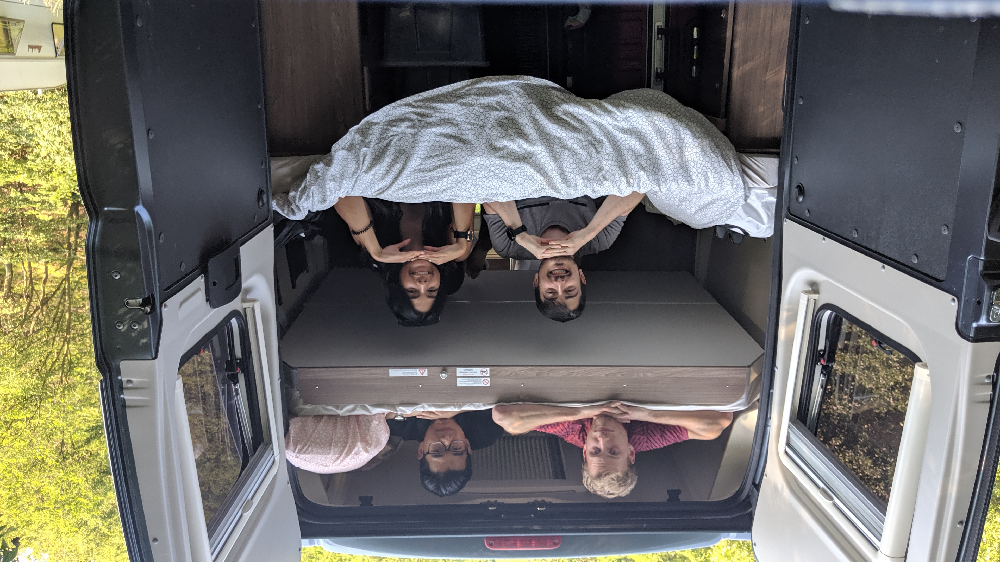
