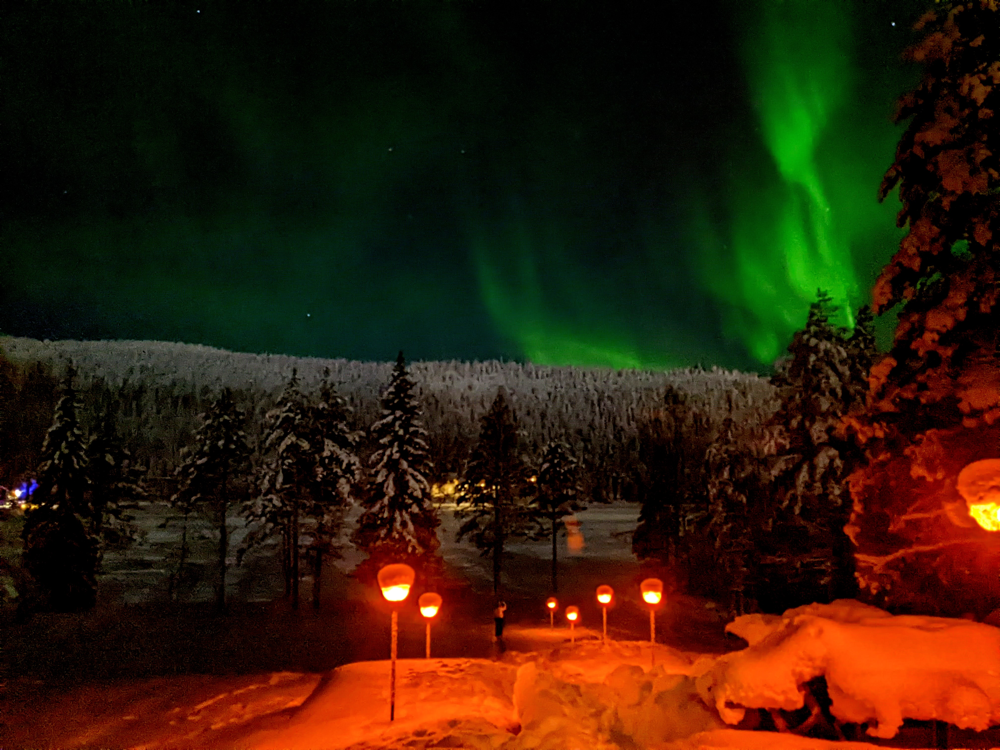
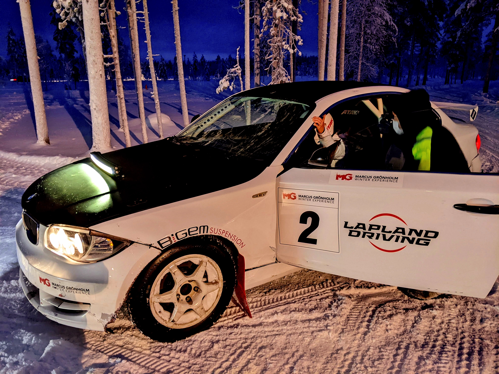
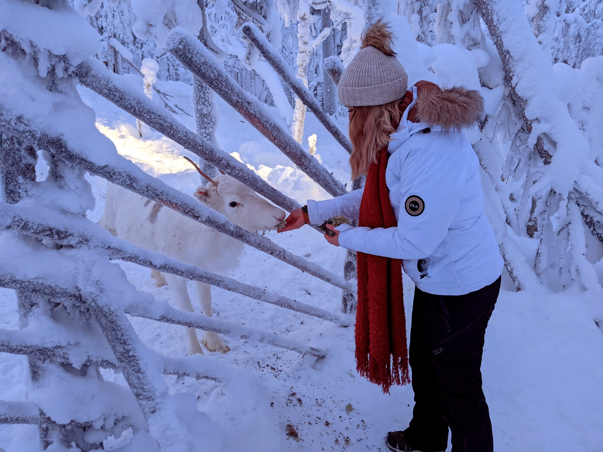
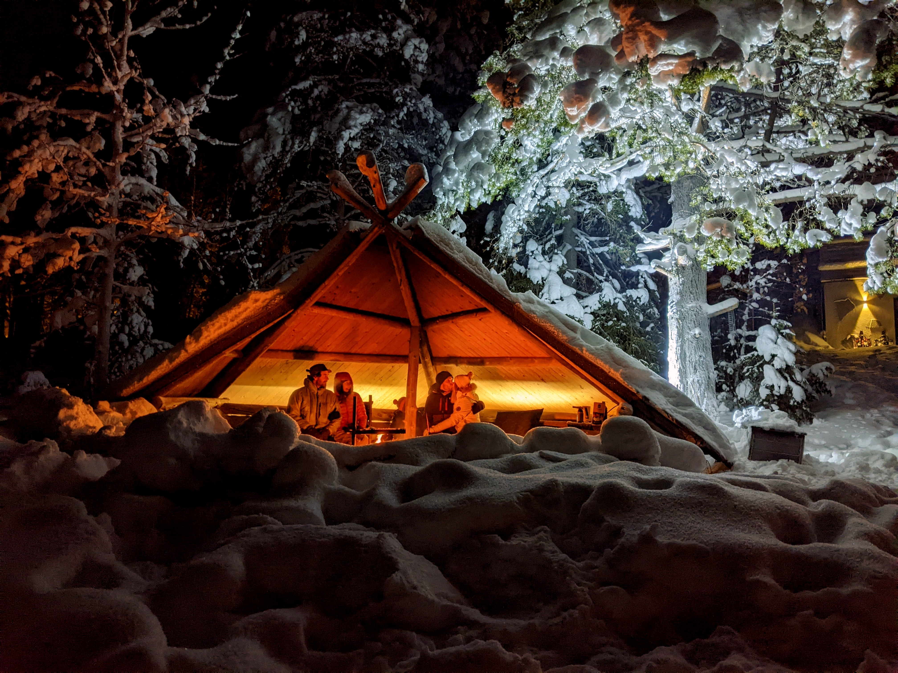
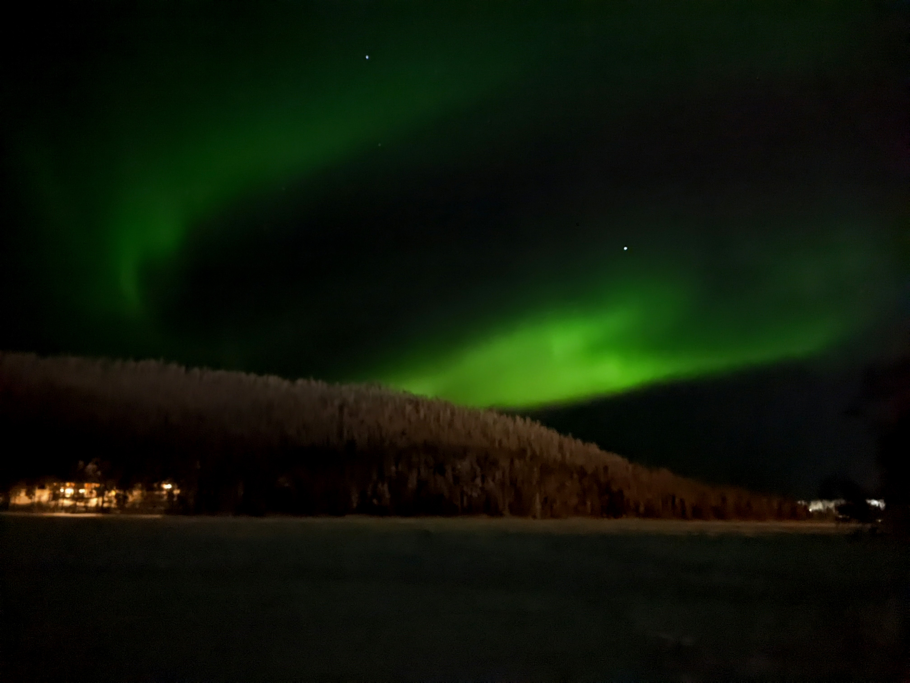

We had to relocate back to Australia so Kirrilee can pursue her studies at UQ. Instead of spending Christmas in the UK though, we appealed to Lydia and she was kind enough to let us stay with her for the break.

The view from her place is amazing. Dawn and sunset are so nice, plus the aurora at night.

We went rally car driving through an ice track. Kirrilee did much better than me, enough that she went straight into a snow drift.

And she fed some deer.

And then we had some glögi, which is **amazing.**

And just a couple days before we left, we got another light show. It was an amazing time.

