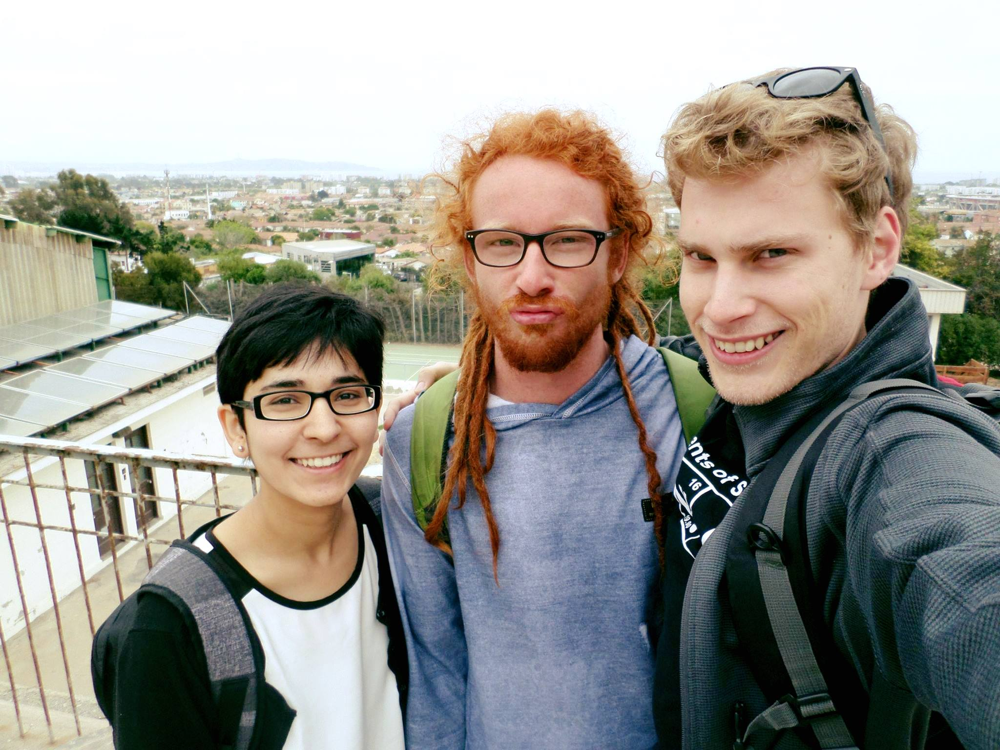
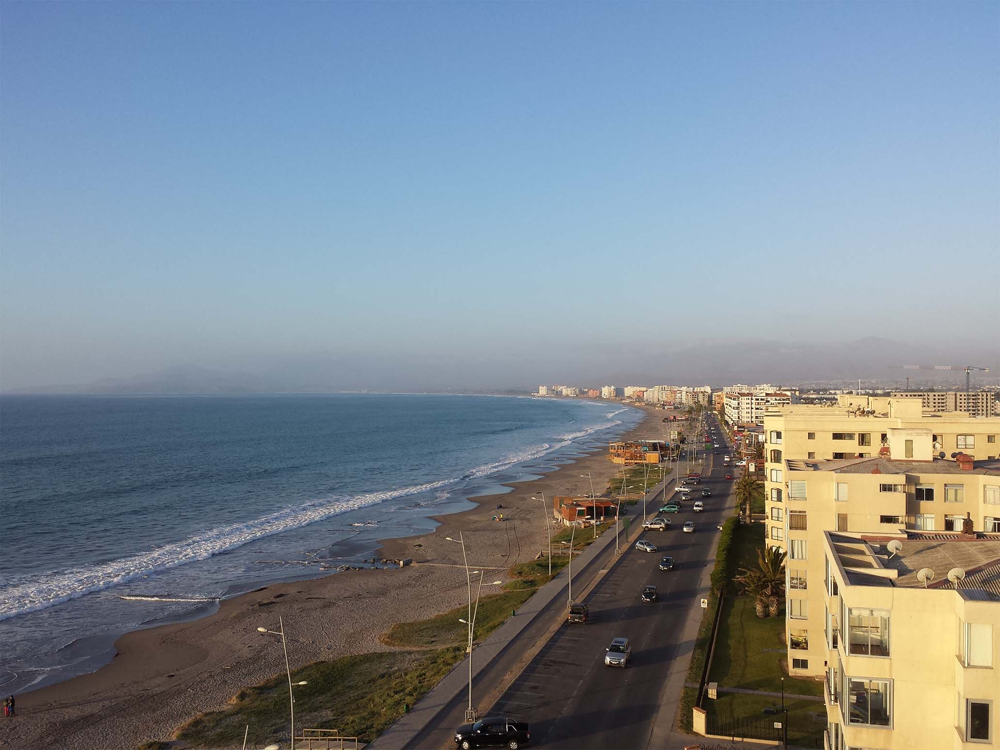
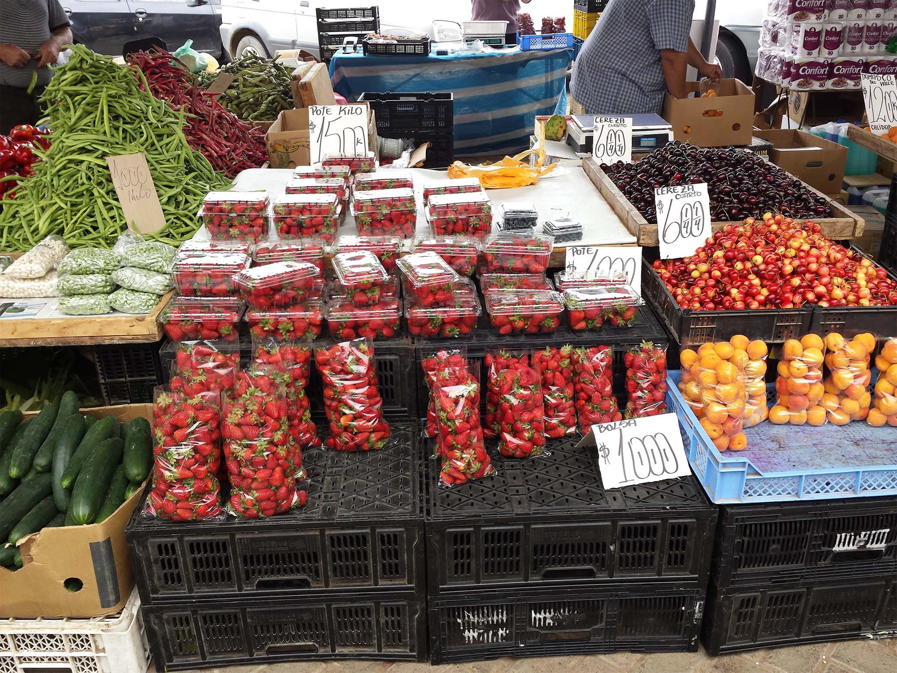
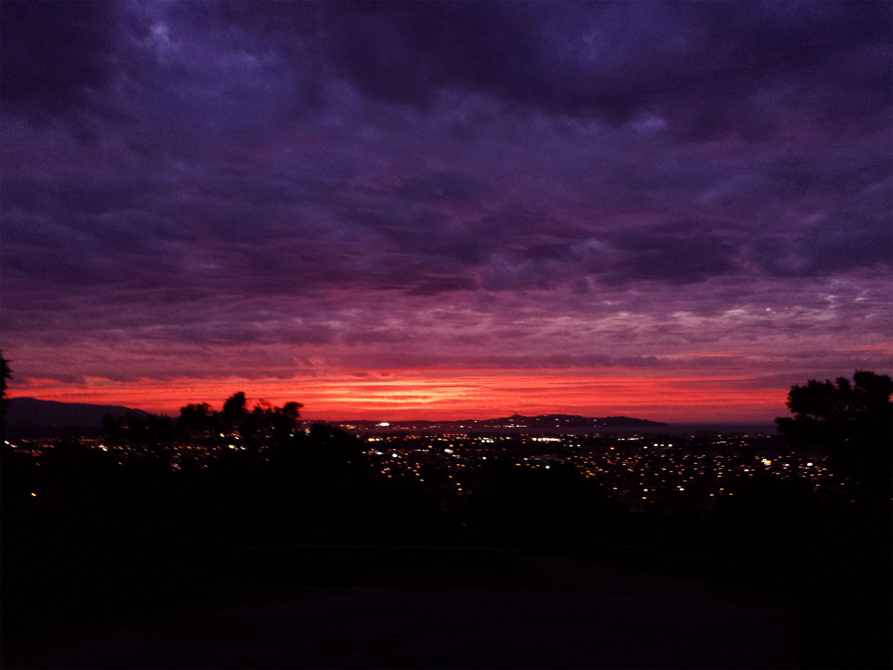
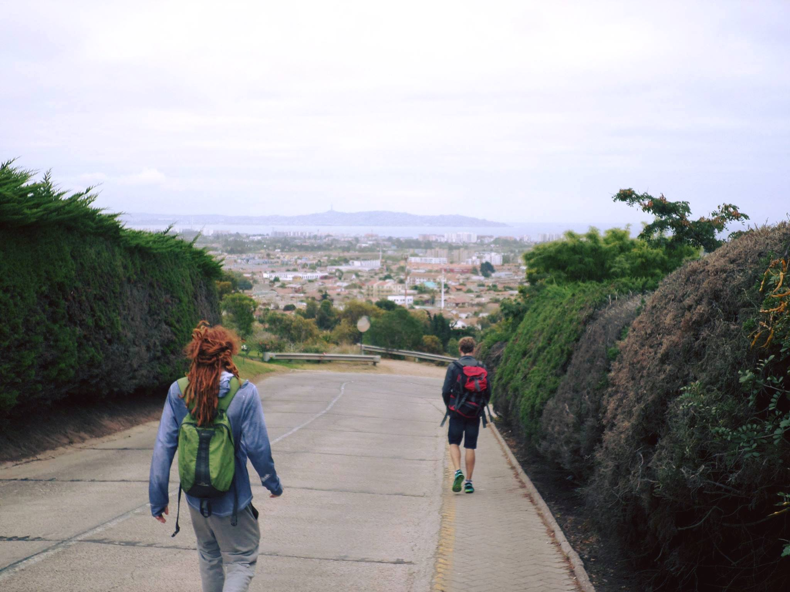
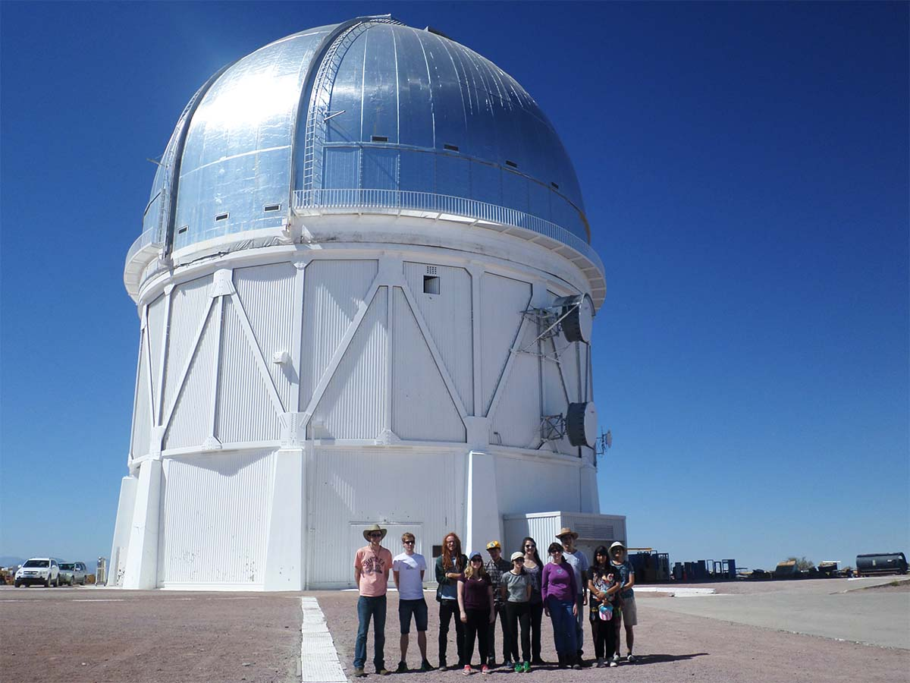
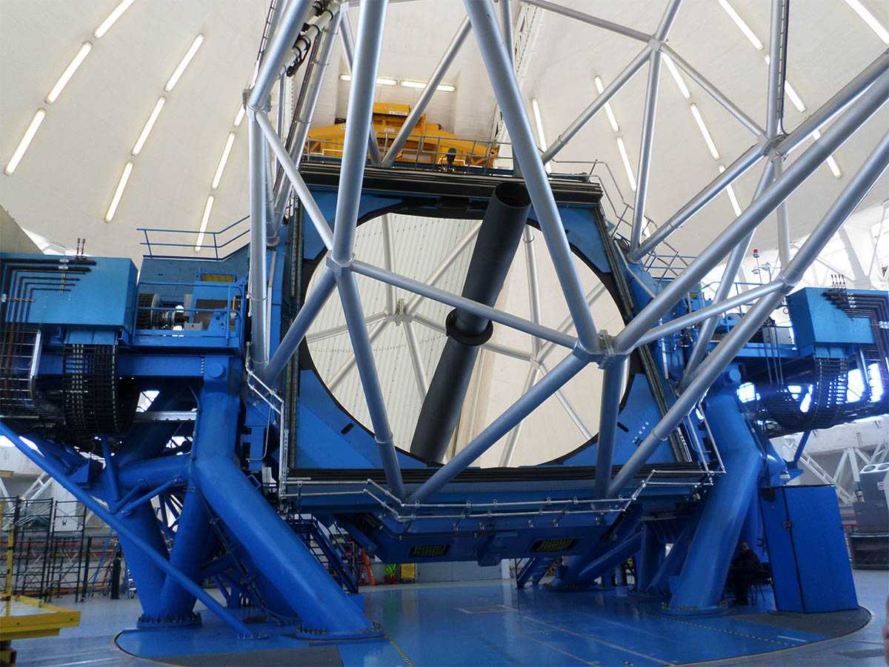
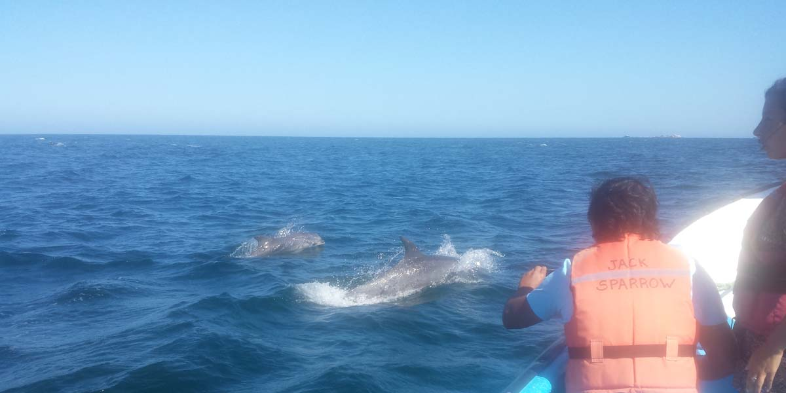
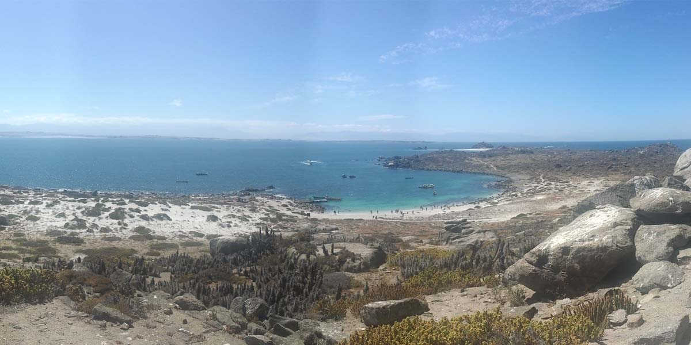

# Part One: The drafting

They shipped us off December 8th. Three students sent out to the Gemini telescope in La Serena, Chile,
to see what they could make of the situation. To see if they could *survive.*

I remember it like it was last just last month.

By some coincidence, it was. Exactly. I'm writing this on the 8th of January, at 5pm, after finishing a day of work.

This is us. Ben, Deeksha and myself, on the [hill of of Cerro-Tololo](https://www.google.com/maps?q=loc:-29.9160915,-71.2435773), early enough in our trip we are
still recovering from jet lag. We stayed up in the compound for the most part, alternating between our housing and our offices. Unsurprisingly,
our projects revolved around photometry. We went through the whole process... oversampling bias, flat fielding, sky subtraction, coordinate warping,
all the usual cleaning and sanitising of FITS files that I am sure should have been automated somewhere along the way.

Enough of work though. Two sentences, and its beyond time to move on.

Christmas here was surprisingly reminiscent of Australian Christmases, though to be fair Ben and I were almost the only ones in the water at the beach.
Beach going is big here. Swimming, not as much. It might have something to do with the Antarctic current that sweeps up Chile's coast, keeping the water
chilled and sucking water out of the atmosphere (and now you know why they built the telescopes here). After squealing like a stuck pig the first few minutes
in the water, I managed to actually enjoy myself.

Much closer to our house than the beach are the markets. There are a few scattered here and there, but our regular was the
[fruit market](https://www.google.com/maps/place/29%C2%B054'28.2%22S+71%C2%B014'35.7%22W/@-29.9079777,-71.2444879,468m).

Those that know me will be confused by this. Healthy food and I generally stay away from each other. Allow me to dispel any confusion:

Amazing, isn't it. The sunset's aren't half bad here either. If you can believe it, this was caught on my phone, which is horrific for low light photos,
so just imagine it roughly ten times more impressive, and that's fairly close to what I was seeing.

We're trying to get some touristy things done before we leave, I'll post an update here if we do so manage.

# Part Two: The telescopering

Five weeks into our stay, and we got to visit the observatories. 
Francesco was kind enough to take us up to [Las Campanas](https://en.wikipedia.org/wiki/Las_Campanas_Observatory)
 with him, and stayed there over night.
We got to visit the 40 inch Swope telescope, the 100 inch du Pont 
telescope, and the two massive 6.5m Magellan telescopes.
The view was fantastic, as one would hope it would be for an 
observatory site. The weather was fantastic, not a cloud in sight. 
As a result, I may have burned rather badly. Here's what the view 
looks like from the edge of the du Pont observatory, around 3pm 
in the afternoon.

{% include youtube.html url="https://www.youtube.com/embed/kSKv_OYdgt4)

We decided to catch the sunset from a comfortable jut of rock just 
below the Magellan telescopes. About half an hour before sunset, 
Ben snapped this of the surrounding hills.

I had set up my camera to take an image every eight seconds, and 
using an hour of capture, I created this view of the sunset. 
Unfortunately I wasn't able to fix ISO and exposure, so
the flickering you can see is the camera adjusting for the lowering 
brightness. It took roughly three hours for the afterglow to fade, 
which isn't captured in the video below.

{% include youtube.html url="https://www.youtube.com/embed/lSwGeVXESAM)

We came back from Las Campanas the following afternoon, Tuesday 
January 19. Then on Thursday, got to jump on a bus with the American 
students, and head up to the [Cerro Tololo observatoy](https://en.wikipedia.org/wiki/Cerro_Tololo_Inter-American_Observatory).
This is all of us in front of the Blanco telescope, which has 
DECam mounted inside. The Blanco is a big telescope. Sure, it's 
only 4m, but its an old telescope, and it is built like an
older telescope. Think big. DECam is 8 tons. The primary mirror 
in the Blanco is 15 tons. The support structure and systems clock 
in at over 500 tons. Here's everyone outside the Blanco.
Unfortunately I was unable to get a good photo inside - I'd need a 
wide angle lens to get the massive structure in one photo.

After that, it was a half hour bus up to the 8m Gemini telescope. 
It's hard to top this one. Just look at it go!

I apologise for the bad camera work, I didn't realise how much 
I'd have to speed it up,
and so some of the movements come across as jerky.

{% include youtube.html url="https://www.youtube.com/embed/RrYRq9Ta0cc)

It's just such a nice telescope.

It was a good day.

# Part Three: The Epilogue - Penguins and Presentation

Our last few weeks at La Serena were dominated by our projects.
There was so much to do, there wasn't much time left for being tourists.
We managed to get one trip in though: a tour to Isla Damas.
Much of the tour went over our heads (the English speaking tour guide 
couldn't come on the boat with us),
however one doesn't need to know the Spanish phrase for "Look over there, 
there are dolphins" to get the general picture.
On that note, we saw a large pod of Bottlenose dolphins, many sea lions, 
some penguins and some sea otters. Plus a good thousand birds.

Once we reached the island, we had an hour or so to wander ourselves 
through the two walking paths around the island.
We started to run out of time, so I ran ahead and up to the high point 
to grab an image of the island. Unfortunately, my phone did not handle
the levels of extreme sunlight as well as I wanted!

So, after tiring myself up running up a rocky hill, and then getting 
sunburnt, we headed back inland on the bus. After a nice lunch at a 
restaurant literally in the middle of nowhere, we were back in La 
Serena, and ready for another week of work.

So, let's fast forward a few weeks. So skip past more data reduction, 
more refinement to my machine learning algorithms,
improved artificial data creation and more documenting what I did in a 
draft paper.

So, rather than summarise it for you, here is my presentation-as-summary:

{% include presentation.html url="https://docs.google.com/presentation/d/1x4xm6cncCdiSzpdlAy8HEiFcOSH0zJPr_J99SKmXgXA/embed?start=false&loop=false&delayms=5000)

For a one sentence summary of what I did: I use machine learning 
techniques on artificially created data to classify potential globular 
clusters in Maffei 1 for spectroscopic follow-up.

And that seems like a good place to stop. To anyone considering 
applying for an AGUSS scholarship in 2016 or beyond, I recommend it!
