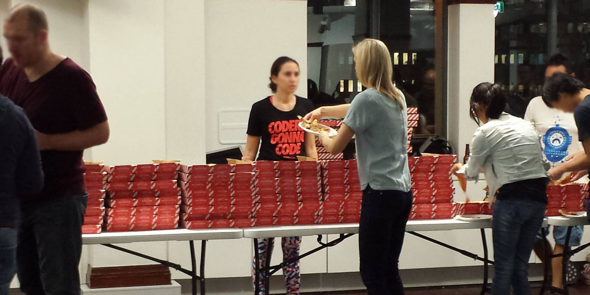
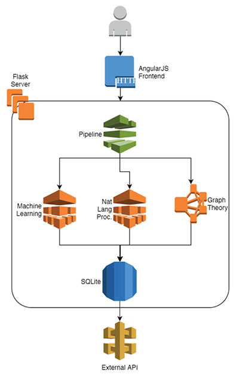
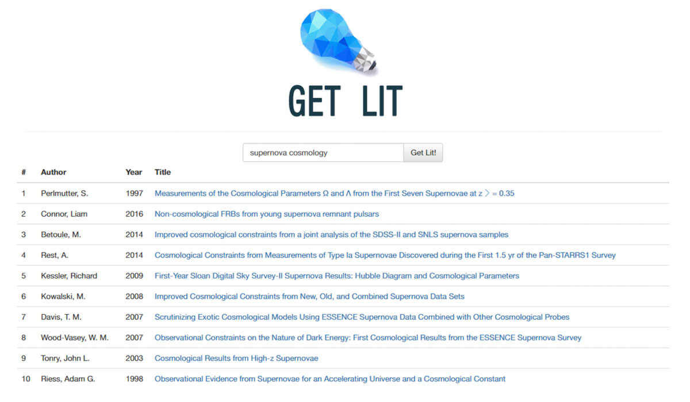
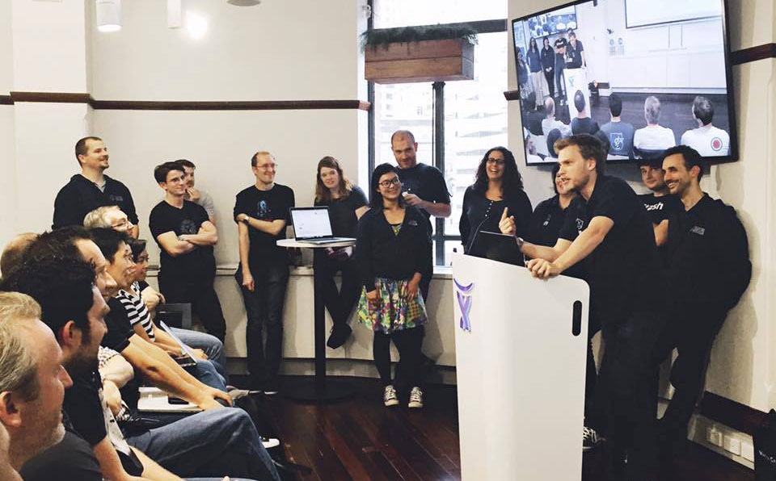

Thanks to the wonderful Kate Gunn, CAASTRO managed to participated in one of Atlassian's Ship-It hackathons. 
I joined the team, along with Bonnie, Steven, Anais, Richard to make the CAASTRO counterpart, with Atlassian
providing two staff members, Jason and Ivor in case we needed some heavy software lifting done. The project idea
and all the initial hard work was put in by Steven - we wanted to create a better way to search
for scientific papers, given that Google doesn't work, and NASA's ADS system is a bit... rough. Thus was
born *Get Lit*. Short of *Get Literature* of course. And for it to work, Steven had
trawled ADS for days beforehand, writing scripts and creating a small database of papers for us to use 
in the hackathon.

They set us up in nice meeting room, supplied vast quantities of drinks, chocolate, and candy.
And, in the evening, pizza. A lot of pizza!

So the general structure of what we came up with is described in the floawchart below. We slapped
up a quick AngularJS front-end and set up a small Flask server with a single REST endpoint, with said
REST method facilitating a search the user makes. 

The user request is then sent through three different algorithms. The first, and most basic of them,
is a simple search through using the paper's title and abstract using a natural language toolkit. The
second algorithm made use of the graph created using the citation network between papers, allowing
 us to determine topic similarity between papers. Finally, the third algorithm used was an unsupervised machine 
 learning approach, whereby we constructed a feature vector (using NLT again) for each paper and clustered
 papers into their own groups. We then combined these three algorithms (which are used to determine
 a paper's relevancy to the search query) with an importance metric (itself roughly based off citation rate)
 to create an ordered list of papers to read. The top ten results are then sent back, and displayed 
 to the user, like so.

In the morning we then got to present our work in the preliminary stages, and to our surprise 
the engineers at Atlassian liked it enough to send us through to the semi finals. To our even 
greater surprise, we made it through the semi-finals too, to present in the final round - and
it turns out we were the first external team ever to make it to the final round! So, after rebooking
my flight (as I said, no one expected to be in the finals), I gave one last three minute spiel 
about our project and thanked the staff for making us so welcome for the hackathon. I look
a bit angry in the image below, but I think I was making a joke about the approach astrophysicists
normally take to software engineering, so that's alright.

*Get Lit* remains in the form it was then, for whilst a small technical demo was within our
power, the technical and algorithmic challenges in upscaling the algorithm required a 
commitment of time and resources that none of us could afford to dedicate. Perhaps one day when
my project wraps up I'll knock heads with Steven and start expanding!

 