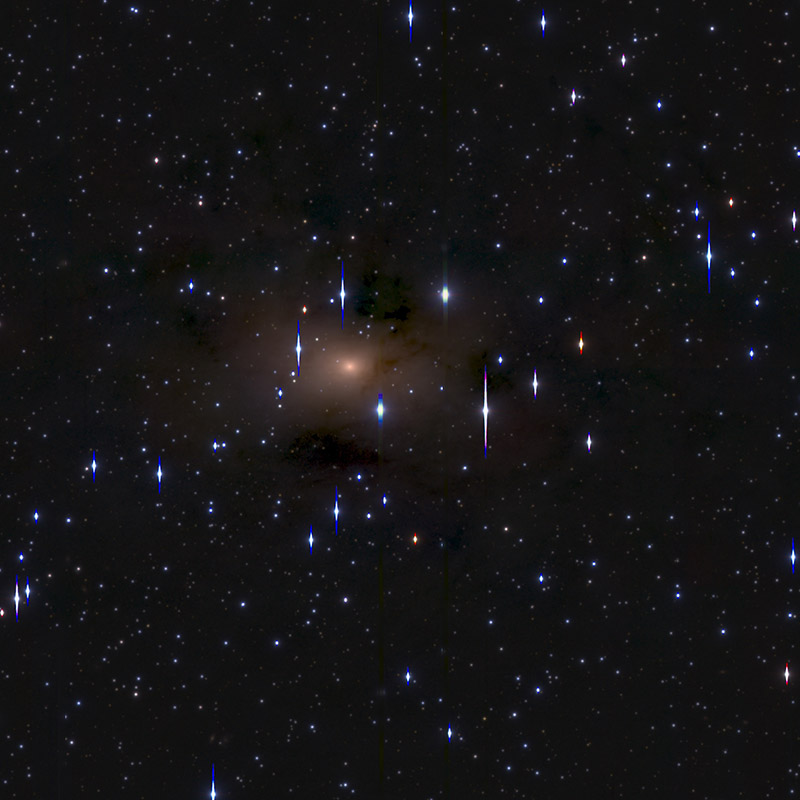

In my time over at Gemini in La Serena, I worked on a project
to distinguish globular clusters from stars. The globular clusters (GCs)
were located in the giant elliptical galaxy Maffei 1, which - whilst
being very close to us - requires looking through the middle of our 
galaxy.

You do not want this.

The dust extinction was through the roof. I used the SDFRED data
reduction pipeline to process images from the Subaru telescope, giving
me the output image below.

Classifying detected sources in the different bands was a
nice machine learning problem. Initially, I took the images, masked out
bad pixels, and subtracted the background by convolving the image with an annulus, such
that I get a non-functional sky background that is insensitive to the brightness of foreground objects.

I then take took this image and gave it to [SExtractor](http://www.astromatic.net/software/sextractor), 
which identified objects inside it,
and I astrometrically resolved those objects using [Scamp](http://www.astromatic.net/software/scamp). 
My pipeline then selected stars, which were used to determine the PSF. By then continually adding artifically
generated sources to the images (of globular clusters, stars and galaxies), I was able to train an initial
machine learning classifier to reduce the vast catalogue of objects to a few thousand potential globular clusters.

These potential clusters were then (slowly) analysed in iShape, and this more detailed set of information
was used to train a second classifier, thats purpose was to remove as many false positives as possible. Given 
we want spectroscopic follow up of the targets, and don't have many fibres to place on the sky, having a pure sample
is highly desirable! By adding in data on aperture photometry (as we expect globular clusters to be relatively
achromatic), I was able to further reduce the catalogue of potential globular clusters, which I passed to my
supervisor for follow up in the future.

Now instead of going into more detail in this post on any of, I still
have access to the presentation I gave at the end of my work there, so here it is:

{% include presentation.html url="https://docs.google.com/presentation/d/1x4xm6cncCdiSzpdlAy8HEiFcOSH0zJPr_J99SKmXgXA/embed?start=false&loop=false&delayms=5000)
