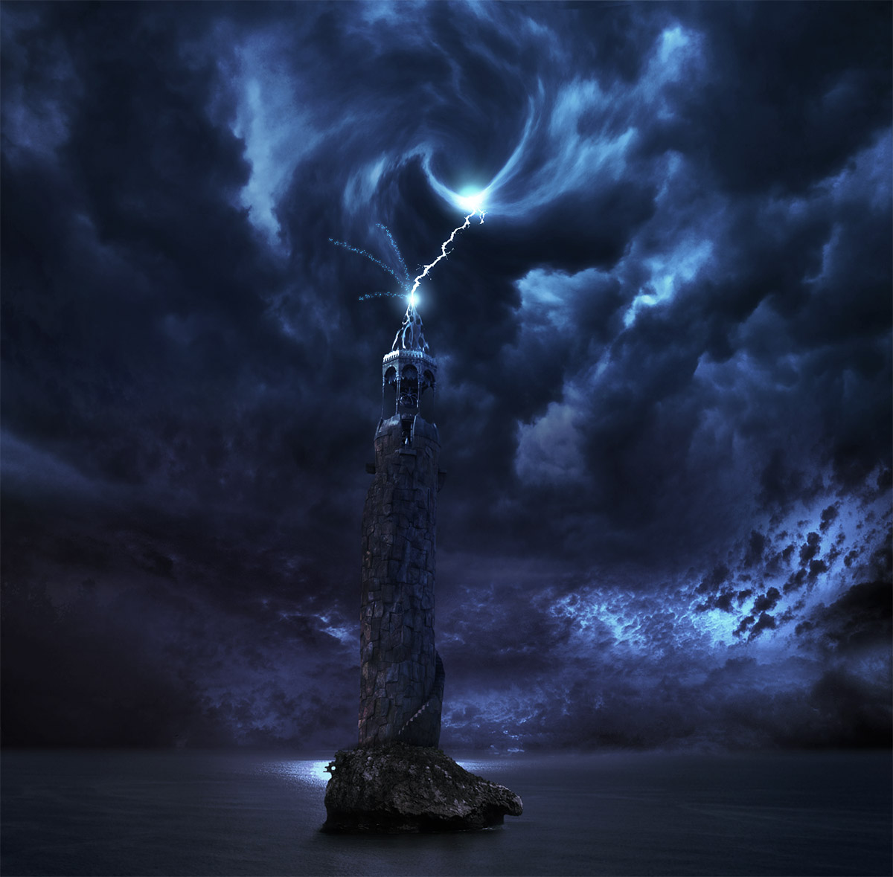

This photoshop challenge was for me to try and figure out the basics of photomanipulation.
    I started with a bunch of images and textures, and turned them into what you see below.
    

Stocks sourced from

* [Water](http://dianafernandes-stock.deviantart.com/art/sky-69580201)
* [Outcrop](http://bmjewell-stock.deviantart.com/art/Ocean-Rock-Stock-97445548)
* [Lightning](http://stock-by-kai.deviantart.com/art/Lightning-56774578)
* [Clouds](http://www.freeimages.com/photo/last-nights-storm-clouds-leaving-1343882)
* [Clouds](http://www.freeimages.com/photo/apocalypse-thunder-1153434)
* [Clouds](http://www.freeimages.com/photo/apocalypse-thunder-1153434)
* [Tower](http://fairiegoodmother.deviantart.com/art/Tower-106275249)

