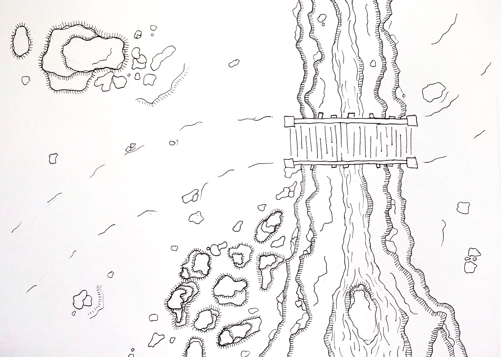
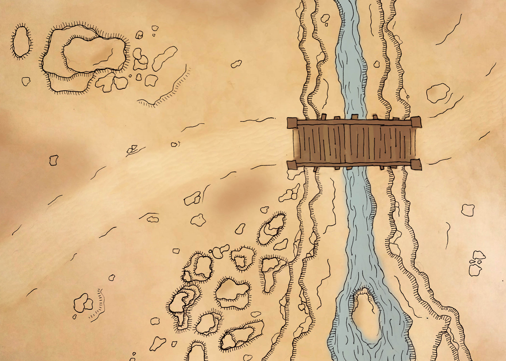
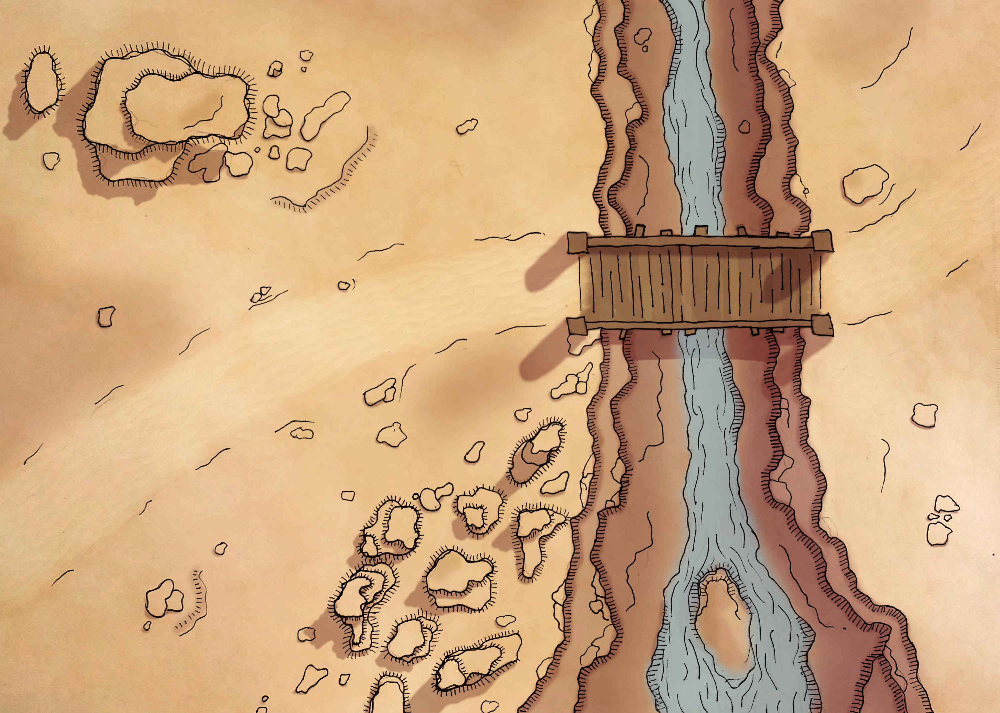
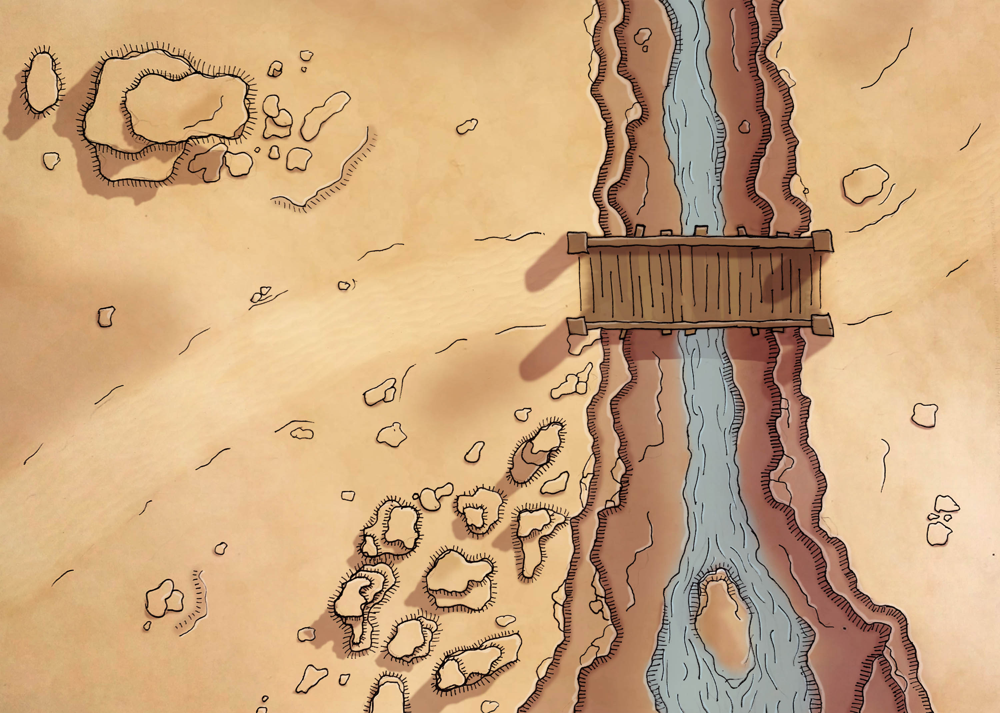
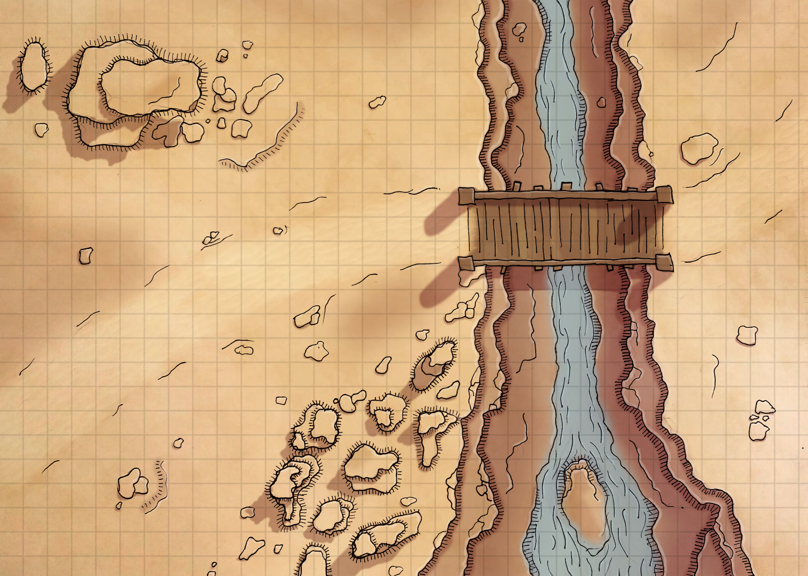

Presenting, a desert canyon, with included creek, small rock pillars, and larger
overhanging boulder, for your consideration! Feel free to use it, modify it, whatever you want.

I've recently been collecting maps for potential use in some upcoming campaign, and
I absolutely love the art style of Mark Bowen's maps over at [Blue Sword Games](https://www.patreon.com/blueswordgames).

I highly recommend checking it out!

So I've been following his map making progress, and decided that - given I want more maps
than are available - I should make some to fill in the blanks for the current scaffold. I've tried
to keep the art style consistent so that my additions will blend in (apart from the drop in quality when I pull
one of mine out, ha!).

Following Mark's outline, I sketched out an outline, and scanned it (with my phone) onto my desktop.

Then, I spent a fun time adding a base colour and texture:

Then shadows:

And then finally the highlights:

I need to get better at the small details, and figure out what a wood bridge is supposed
to actually look like! But for a first attempt for three hours of map making, it's not too bad.

I hope!

