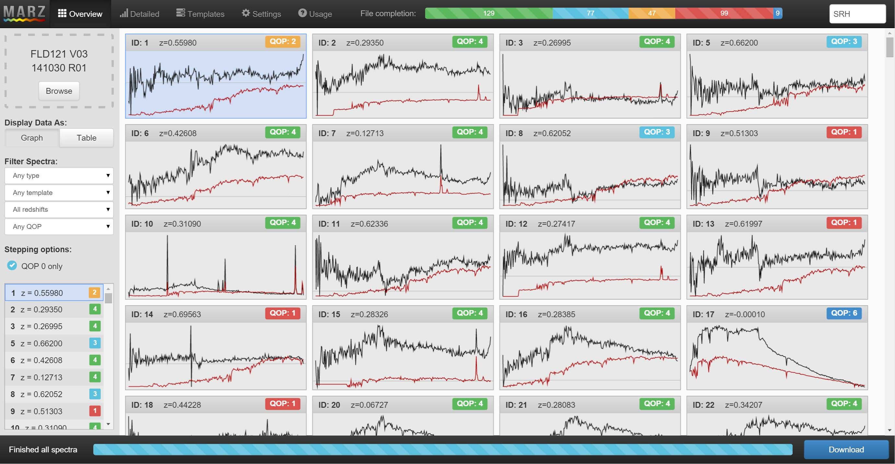
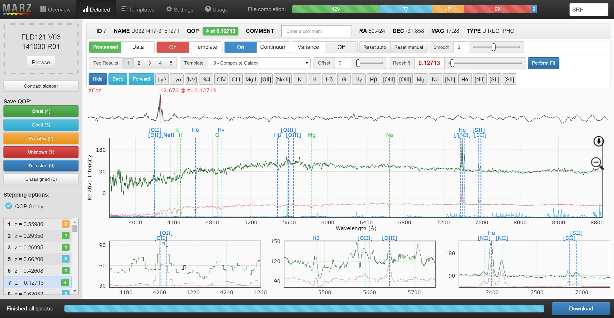
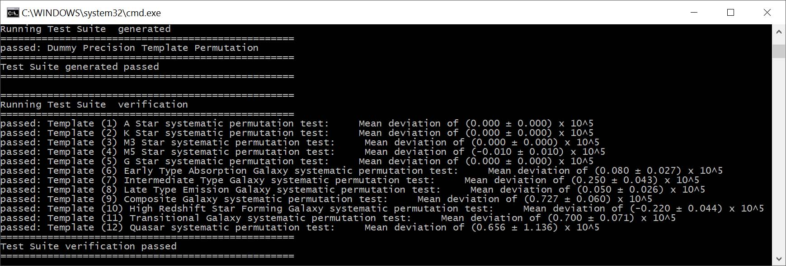

[Marz](https://samreay.github.io/Marz) was a program I first started coding for my undergraduate software engineering thesis.
The OzDES team was spending too much time manually redshifting spectra and wanted some improvements to the workflow done.
I could either improve Runz (the software used at the time), or create something from scratch.

Guess which one I picked?

After lots of work, hassle and one side arguments with my computer, I managed to actually get something usable!
Without going into too much detail, [Marz](https://samreay.github.io/Marz) works by making
[web workers](http://www.tutorialspoint.com/html5/html5_web_workers.htm) crunch of a modified version of the
[Autoz](http://arxiv.org/abs/1404.2626) matching algorithm,
all wrapped in an [AngularJS](https://angularjs.org/) powered interface.

I wanted it to be easy to use, so all the user has to do is drag and drop a correctly formatted FITS file the application,
and [Marz](https://samreay.github.io/Marz)  will extract the spectra,
display them in an overview screen, and get to work redshifting them. You can see what the Overview looks like below.

You can see the spectra in black, redshifted templates in red, and the confidence of the redshift (QOP) shown above the match.
There's a tabular view as well, but its not nearly as interesting to display.
OzDES is a deep survey, and their signal to noise will often be very low.
Because of this, they get someone to review all redshifts before accepting them, to correct mistakes in the algorithm or to provide a redshift
in the case the algorithm missed it. This is what I built the Detailed screen for, shown below.

You can see it provides a more informative view of an individual spectrum, showing templates, sky, intensity and variance at the push of a button.
Spectral features are shown, and I provide detailed callout windows around commonly found spectral features.
The interface on this screen took by far the most amount of effort to code (the plotting canvas is implemented from scratch as I couldn't find an
external library fast enough), and yet the entire purpose of the matching algorithm is to make this screen redundant!

Now, no software package would be complete if it did not provide its own set of test cases.
I've built these into [Marz](https://samreay.github.io/Marz) by
using [node.js](https://nodejs.org/en/).

Many of the tests are simply checks to make sure the IDL functions I've translated to Javascript are working as expected.
Others insure my basic algorithms are correct (such as median filtering via a linked list).
But the most important tests are the scientific verification tests. The longest test is that to guard against systematics:
I take each template, manually redshift many times in its allowed redshift range, match each shift, and ensure that the distribution of difference between
the manual redshift amount and determined redshift is below a certain threshold. For galactic templates, this is $$10^{-5}$$.

And whilst there are always more tests to write, these tests are what calm me down when I consider the possibility that I may have
blundered somewhere in my implementation.

For a final point, I am not too unhappy with the performance of [Marz](https://samreay.github.io/Marz).
You can see its Autoz roots when comparing performance using standard
galactic targets (left hand plot). The quasar matching is the area of greatest improvement,
and you can see this in the performance increase in the
quasar rich targets of the OzDES survey (right hand plot). Of course, it can always be better,
so I hope these plots become outdated in the future.

If you've got some good ideas for me, feel free to head over to the project's [Github page](https://github.com/samreay/Marz)
and contact me there!

{% include image.html ?class="img-poster"  url="poster.jpg")
