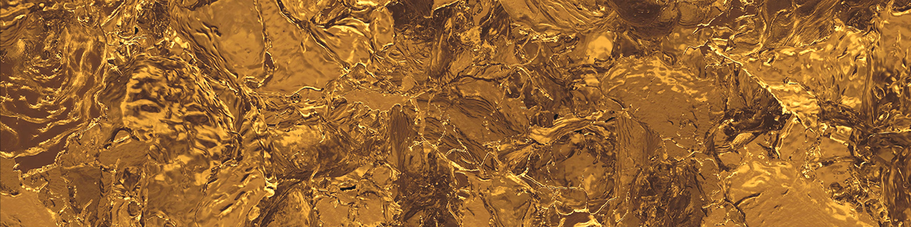
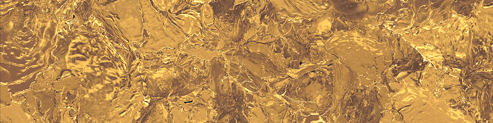
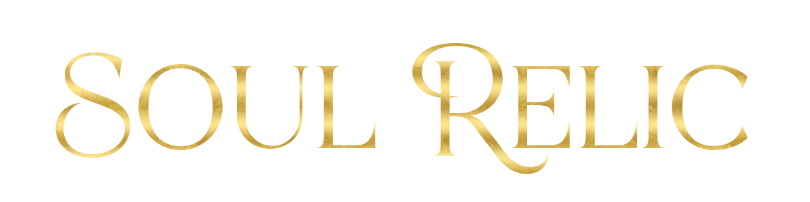
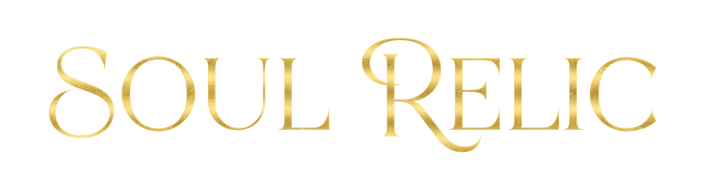
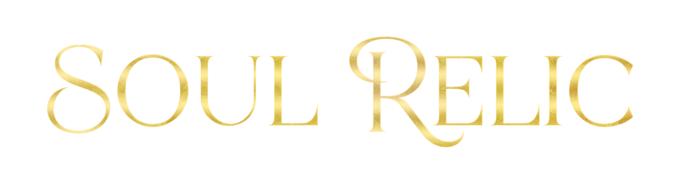

I do a fair amount of (very amateur) typography for friends publishing on Royal Road, and one of the very common requests is for some metallic gold text to help make the title pop. So here's a super quick write-up going over how I normally go about it.

[Here's the PS file if that's all you want](example.psd)

### 1. Pick a font

First, pick a font. Most fonts are available for free for personal use, and are 10-40 USD to purchase properly, though there are plenty to pick from even if you want to keep to a completely free font. For titles, it's common to go blackletter display fonts because you need them to be legible and impactful even on a tiny thumbnail, but going a thinner font is still fine if it's not competing in the visual hierarchy. The super common fantasy cover font is Cinzel, in the example below I've used Archane. The site I use to select my font (from those I've installed locally) is [wordmark.it](https://wordmark.it/), and it's super handy.

So here's just the name of my book in regular old Archane, no special effects:

### 2. Add a gradient

Who needs to pick base colours when you have the internet? There are *tons* of metallic gradient brush packs for photoshop/procreate/etc out there. I downloaded [Heatherlly's Precious Metals Gradients](https://www.deviantart.com/heatherlly/art/Precious-Metals-Gradients-76987494) and slapped it on like so:

Which gives me the following look:

Honestly, if I set the base colour of the text from white to a gold tone and decreased the opacity of the gradient to about 50%, you could stop right there, so consider everything after this to be optional.

### 3. Colour Correction

As just mentioned, this could be done using the base colour or, as I'm going to do it now, throw this gradient-overlaid text into a group, and slap a colour overlay on that group. This will *not* work if you try and combine a gradient and colour overlay on the same layer (don't ask me why).

Here I want to get more of the classic yellow-gold colour, so I'm just adding it in via a hard light.

Again, feel free to stop here.

### 3. Texture

Adding some scratches, surface texture, brushed metal texture, tarnish, etc, is all very common. So head to deviant art or unsplash or some other free texture resource to grab *something*. 

Without thinking much about it, I grabbed [this texture from unsplash](https://unsplash.com/photos/brown-and-black-abstract-painting-Ax6ggq8cSxw), which looks like:

Now textures are a great way to accidentally change the colour of your composition, so its common to grayscale + apply a colour ramp or colour overlay on them before using. As this one looks pretty close to my text colour already, I'm not going to bother. Instead, I'll just apply a `levels` adjustment layer to make the thing brighter and call it a day.

Throw your texture above the folder with the colour overlay applied, enable the clipping mask so it applies only to your text, and see whether `screen`, `overlay`, `hard light`, etc, looks the best. Here's what it looks like on screen for me at 50% opacity.

You'd have to zoom in to see the difference easily, because we're definitely in the point of diminishing returns. But hey, maybe you want more??

### 4. Bevel and Stroking

Put everything in a folder. Add two effects to the folder. First, a bevel.

Then, a stroke.

I generally go very small with my bevels, but if you want more 3D looking text, feel free to increase it. If you want even more metallic shininess, change the `Gloss Contour` to something that looks more like a wave instead of a straight line.

The width of your stroke will also depend on the size of your text.

Surely we're done? Yeah, of course. But we *can* do more. The only thing I don't like about the current text is that the gradient is a bit too same-same. So normally I'd come in at the end and add a few overlay brush strokes or similar just to help break up the gradient pattern.

For this example, I'm extra lazy, so I threw down a new layer with a radial gradient like so:

And then applied it above the other (texture) clipping mask as *another* clipping mask, set it to `Linear Dodge (Add)`, and got this:

The example here is being used to lighten the '**R**' and drawn attention to it. Doesn't make much difference without background art and a visual hierarchy, but you get the idea.

The final layer layout looks like so:

### Stepwise comparison

And I threw all the steps into ffmpeg so you can see them properly.

