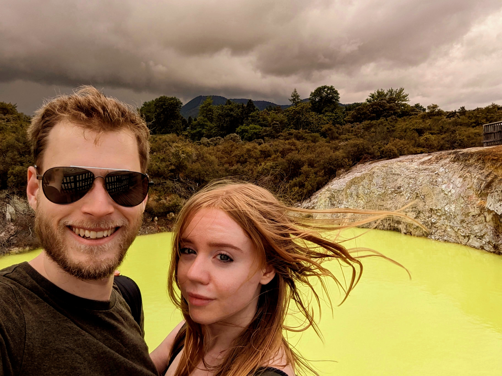
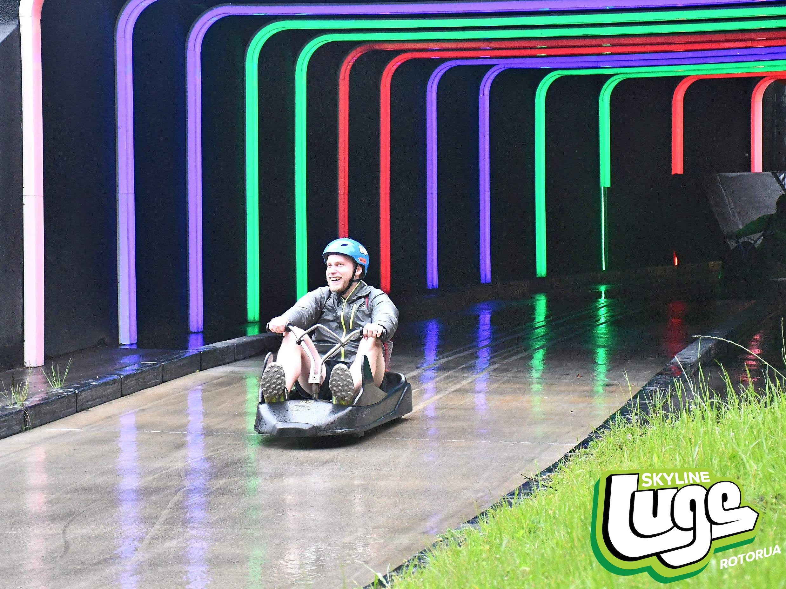

Ale, Crystal, Kirrilee and I spent two weeks driving around New Zealand. It rained a lot, enough some things got cancelled, but we still got some great pics.

From the sulphur vents and ponds...

The hikes and bike rides...

Went on a tree walk

We went on a luge. Yes, I won.

Visited the glow worms and some llamas.

And, of course, Hobbiton.

