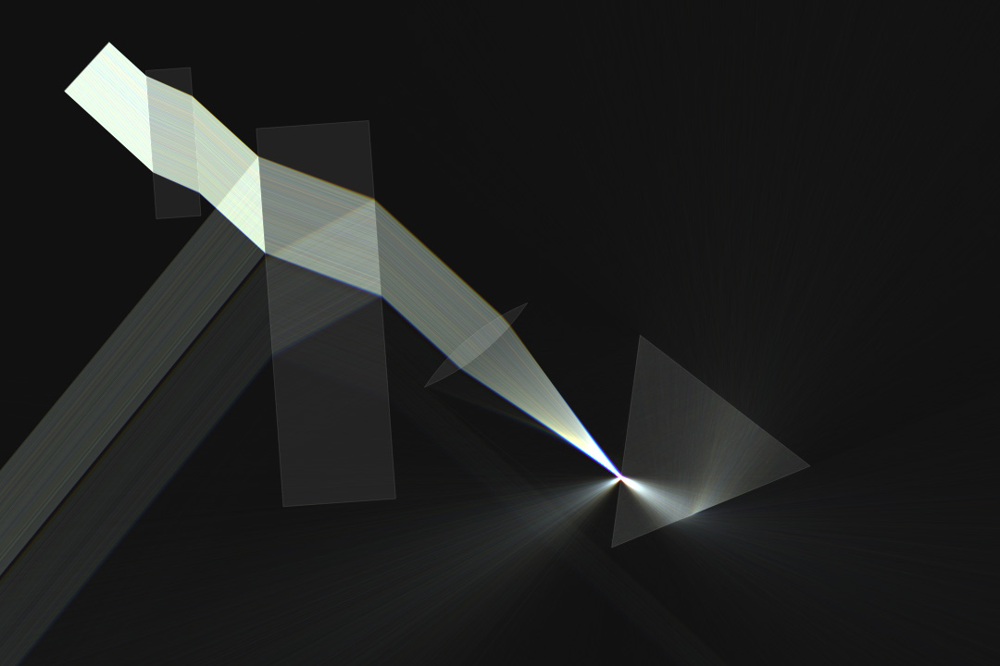
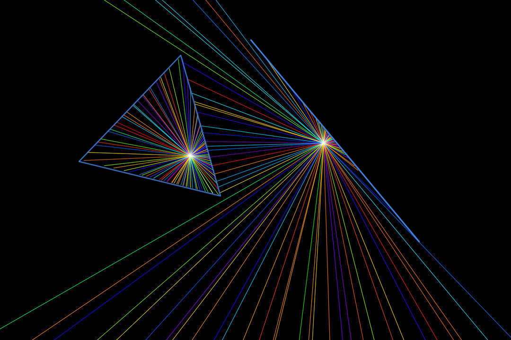

<h2 style="font-weight: 800; text-align: center; margin-bottom: 50px;">
    <a href="https://samreay.github.io/Refractorium/" target="_blank">Click here to run the simulator in your browser.</a>
</h2>

I was browsing [Reddit's Simulated subreddit](http://reddit.com/r/Simulated) one afternoon and came across a nice GPU voxel fluid
animation. Whilst reading up [how it was engineered](https://benedikt-bitterli.me/vorton-fluid.html), I stumbled
onto a project by [Benedikt Bitterli](https://benedikt-bitterli.me/index.html) called [Tantalum](https://benedikt-bitterli.me/tantalum/tantalum.html).

It was a GPU accelerated 2D light transport simulator, and I spent at least an hour playing around with it 
and producing some beautiful caustics. But with Tantalum, you can only control the position and angle of the
light source - the rest of the scene was static. And so, obviously, the solution was for me to build my
own light transport simulator with a dynamic scene. The staticness of Tantalum make's sense as a dynamic
scene would require painful dynamic shader compilation. Difficult, and definitely over my head as I have
no experience with WebGL. And so a completely CPU based javascript project was born.

On the most basic level, scenes are composed of objects. Some objects have a brightness set, and these
objects emit light. Others are objects that light interacts with - either lines or solids. Lines can three optical
properties - absorption (how much of the light is absorbed in the material), reflection (how much bounces instead
of penetrating the object) and roughness. In my implementation, roughness is implemented as Gaussian noise on
the expected output angle, bound to within 90 degrees of the normal using rejection sampling. An example
of different styles of lines are shown below. The first line the beam of light hits is a perfect mirror: 
0% absorption, 100% reflection, 0 roughness. The second line is a beam splitter, which has a reflectance of 30%.
The top line is then a generic wall - some absorption and a medium roughness. The bottom right line is essentially
an event horizon - 100% absorption.

Solid objects have another property - refractive index. Now here I've had to take some liberties with 
the refractive index's dependence on wavelength. In order to get nice diffraction of light I essentially made
up a strong relationship. It's not physical, at all, but it looks alright... and isn't that what's important in
a light simulator? The image below shows four different solids. The first has no 0% reflection, and
we can see all the light transferring through it. The second object has around 30% reflection, and we
can see some internal reflection going on. The convex lens then focuses light onto a roughened prism with
high refractive index, so we can see extra reflection from the refractive index and the dispersion of light on
interacting with the object.

At this point in the project I had the scene's set up, but no interactivity. I knew I wanted objects
to be directly selectable on the canvas, and so the question became how to determine if the user
had clicked on an object. However, all objects already had methods used to check if a light ray intersected
them (returning the distance to intersection, coordinate of intersection, resultant angle of reflection, etc).
And so detecting object clicks became extremely simple. In the case of a solid object, illustrated on the left 
hand side of the image below, we can see that all case rays intersect with the object. For a line, all we have to do
is case a bunch of rays, and check the distance of closest intersection. Combining those with object information such as
the object size we can produce a metric that (after applying a threshold) that is not only reliable, but able to easily 
select edge cases (light objects inside objects).

Slapping a bit of CSS around everything and providing some basic tools to control renderer settings, I put
it online, and I'm fairly happy with how it turned out. I'd like to see if I can parcel light ray
simulation out to web workers, but I'm happy with the results so far!

{% include image.html ?class="img-poster" url="main.jpg")
{% include image.html ?class="img-poster" url="mixed.jpg")
{% include image.html ?class="img-poster" url="cylinder.jpg")

