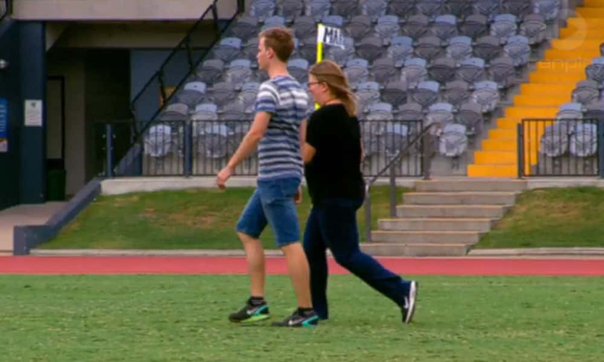
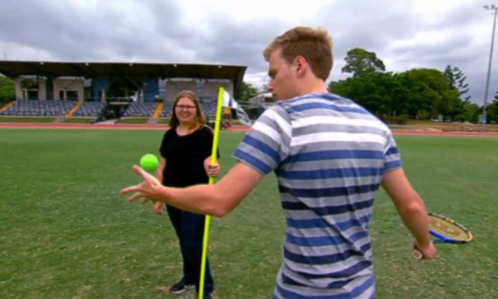
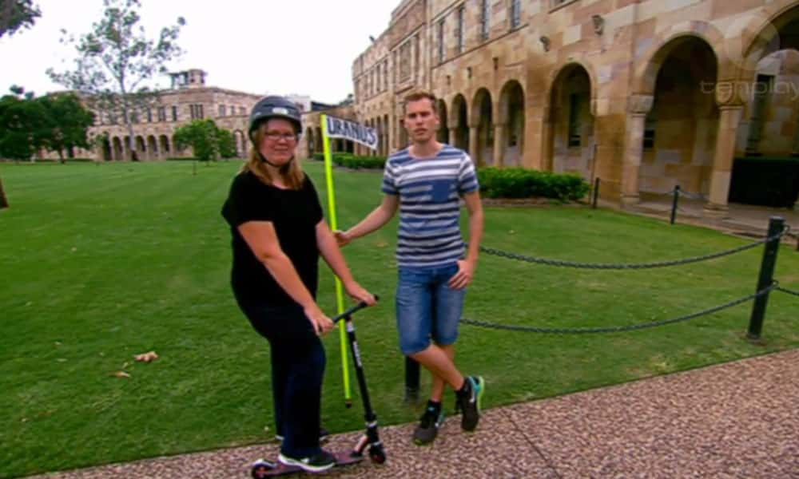

Every now and then ScopeTV has a space focused episode, and they look up some local scientists 
to help present the content for one of their episodes. Janie and I were asked if we wanted to
participate in an episode focused on the size and scale of the solar system, and obviously
we thought it was a great idea, so we jumped on it!

I'm sure you've seen similar demonstrations - start with the sun a huge ball that you can barely 
carry, and work your way down to the other planets at physically accurate (albeit scaled down) distances.

The first part of filming was unfortunate - there was construction in the background and we had to time
our sentences to get them in before the high-pitched beeping of the bobcat reversing ruined the audio! But as we 
walked further away from our chosen starting position at the UQ netball courts, things got better.

We used the football field to measure off the distance to Earth and Mars.

And then I got to put all those tennis skills to test hitting a tennis ball to the location of Jupiter. And then
we stepped it up to golf to get even more distance.

Other shenanigans included a scooter trip through the Great Court and setting out in a car to 'find' Pluto. I
didn't expect Pluto to be part of it any more, but guess it hasn't quite been forgotten yet!

