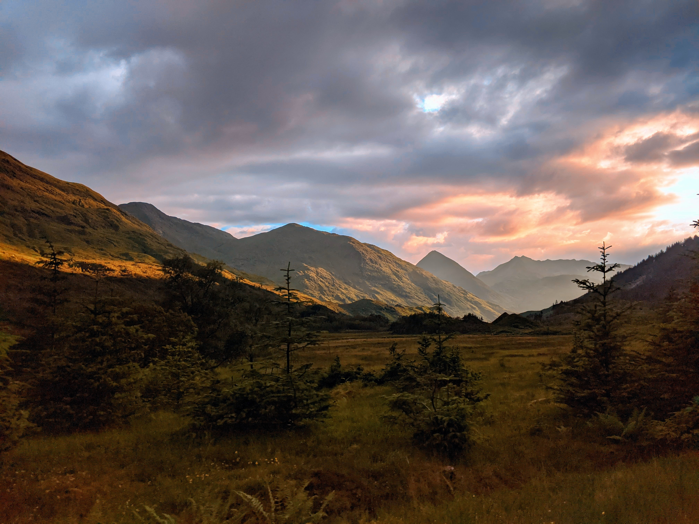
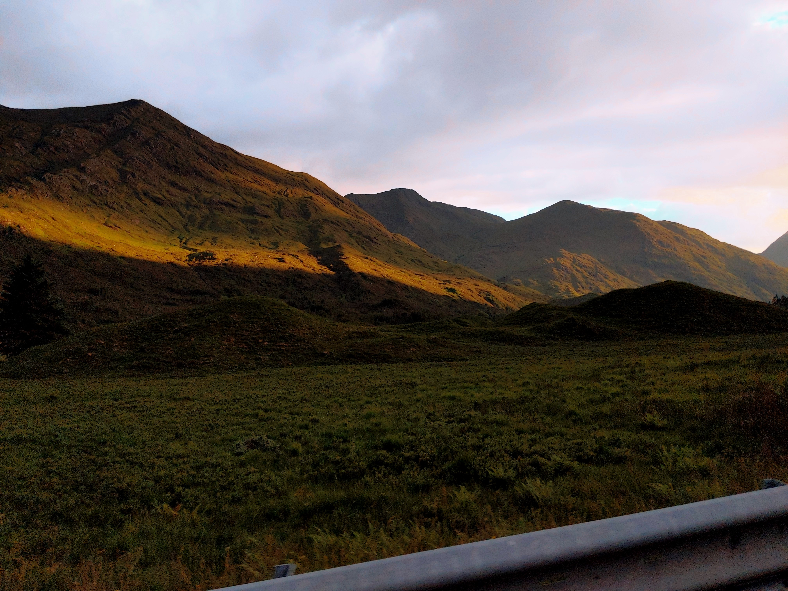
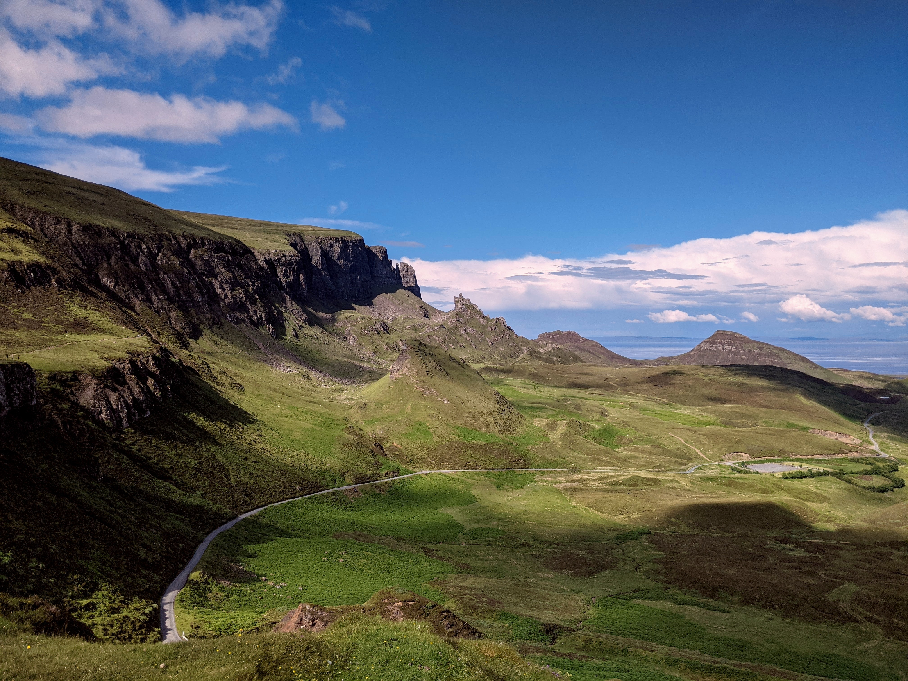
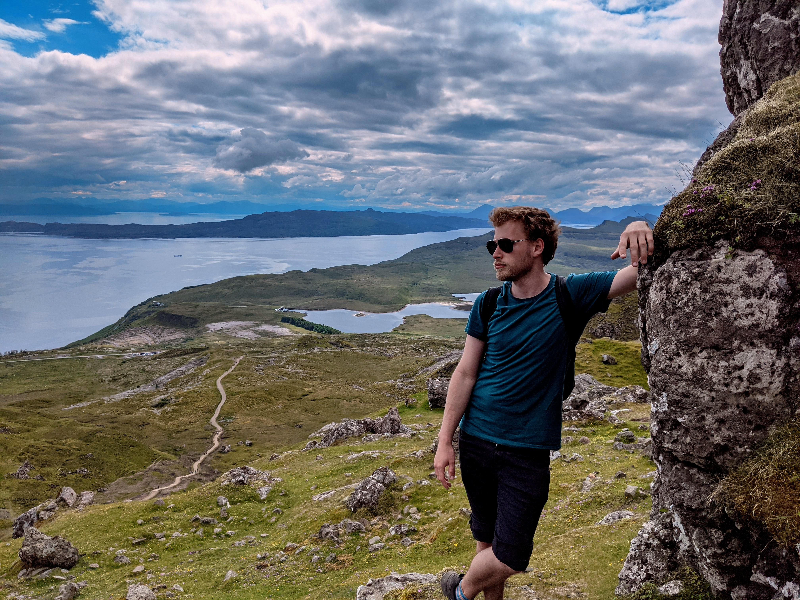
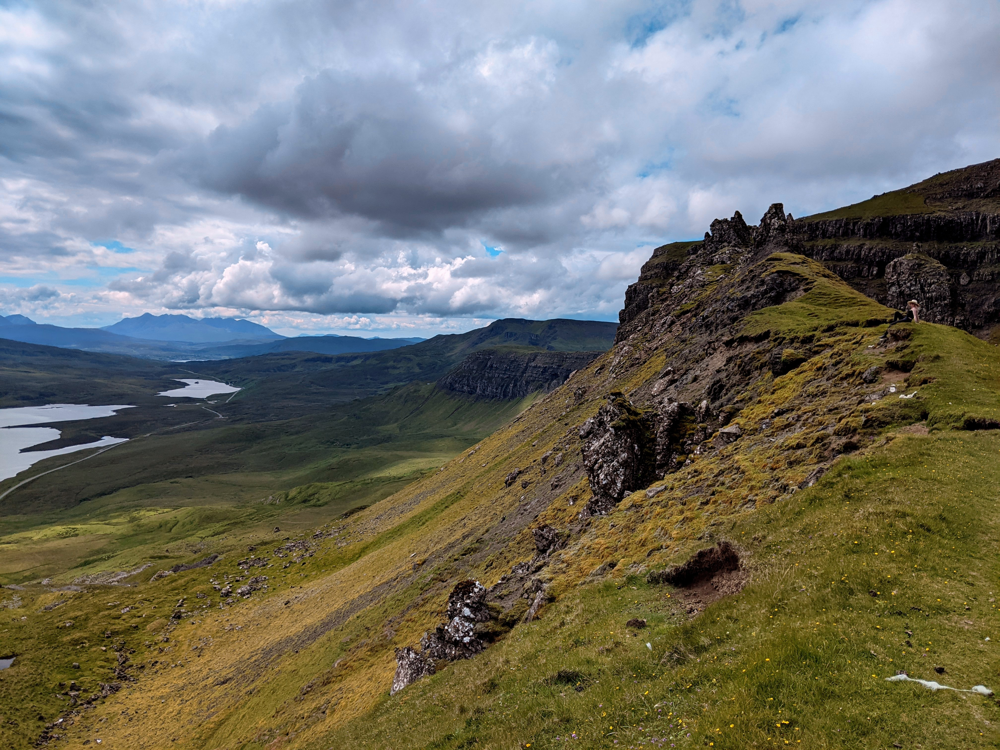
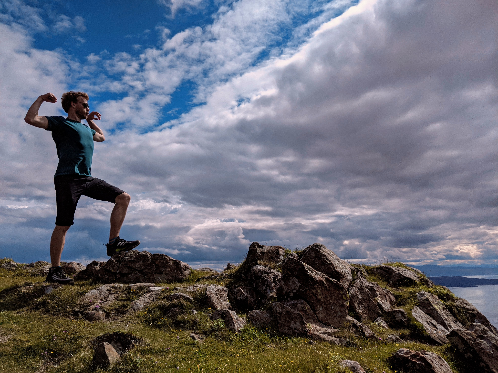
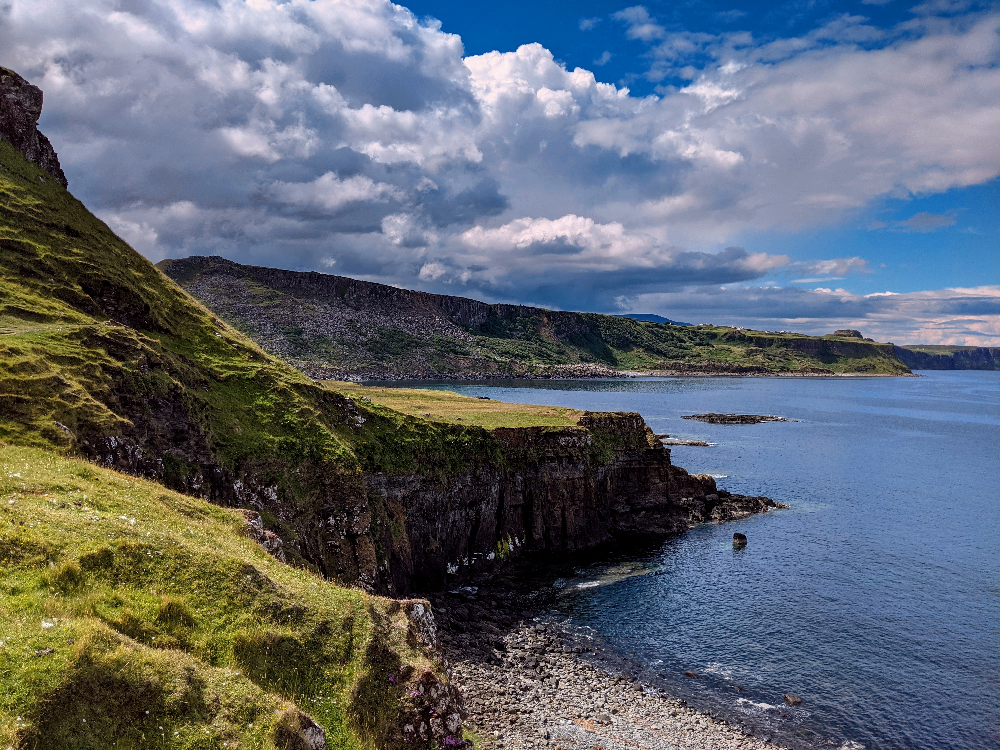
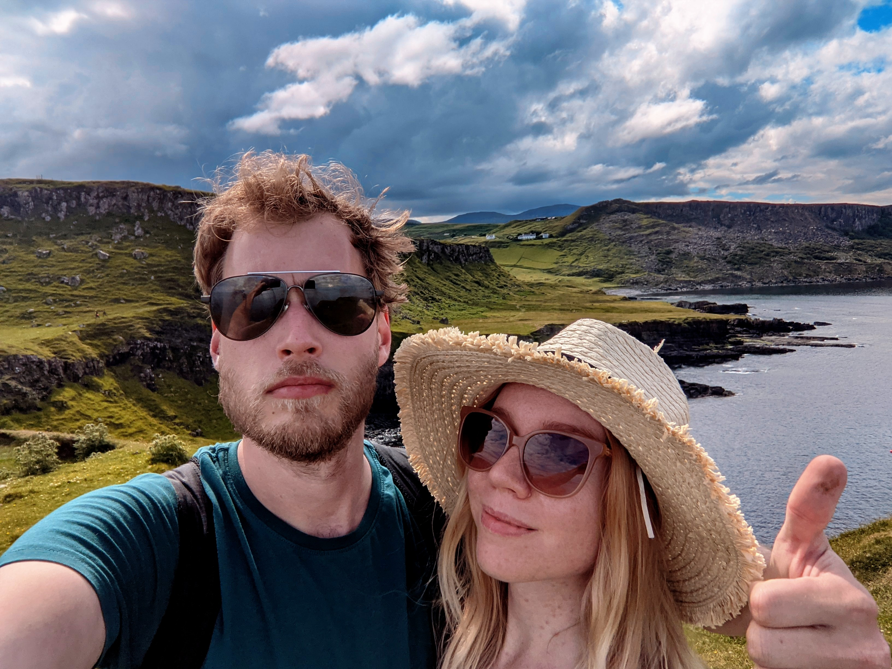

After many, many months in lockdown, Kirrilee and I managed to finally get away for a short break.

Given that country borders are still closed (and at this point we're still waiting for a vaccine) the options were fairly limited. However, Scotland has been on both of our lists for a long time, so we decided to head up North and visit the Isle of Skye.

After a long train to Edinburg we picked up a rental car and start the rush to our AirBnB before it got completely dark. This actually meant travelling as the sun was setting, which it turns out is a fantastic idea to get some quick snaps and beautiful scenery.

The next few days we toured around the Isle, from the Fairy Isles on one side up to the Old Man of Storr on the other side, all ducking in and out of Portree (where we stayed).

Just driving around was amazing.

But nothing can quite beat hiking. The two big highlights from our trip would have to be visiting [Old Man of Storr](https://goo.gl/maps/SkYPXztmnWDUQZSv5) and the [Brother's Point](https://goo.gl/maps/ZT2mnmS9z9KAFxtKA). First, highlights from the Storr:

And then after that we went down to Brother's Point.

All in all, highly recommend. We could have spent another week to do the walks properly. If they had high speed rail to the place I'd even consider moving. Depends on how fast their internet was.

