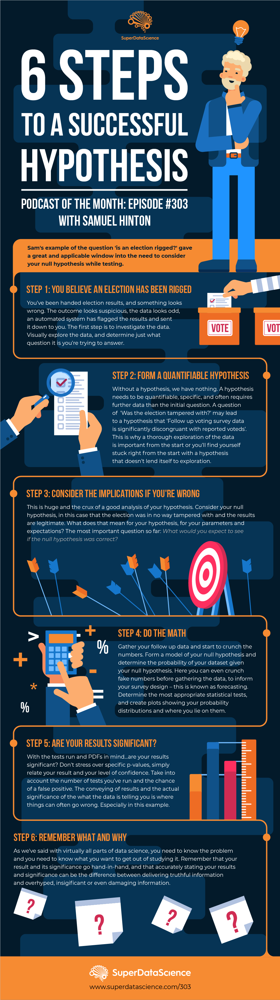

I like to rant about a lot of things. Many of those things include abuses of statistics, p-hacking, 
improper hypotheses and sensationalist media. [Listen to the entire rant here](https://www.superdatascience.com/podcast/proper-hypothesis-testing-for-every-field),
or grab the summary of how to formulate a proper hypothesis from the pretty infographic below! 

