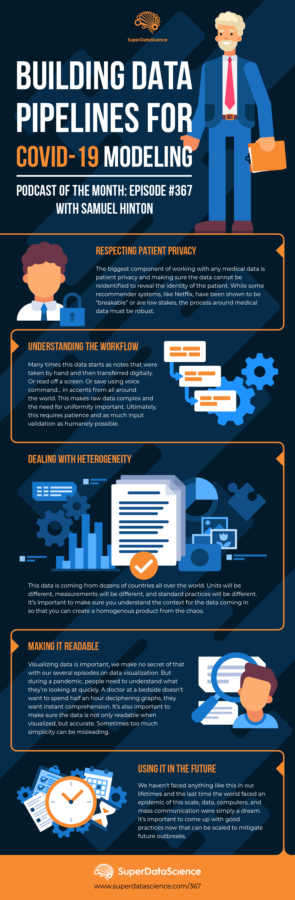

Shifting away from astrophysics briefly, I talk about my experience as a lead data analyst for the COVID-19 
 Critical Care Consortium, and my role with them to create a data pipeline to unify, standardise and merge
 data from a billion different forms across multiple research projects into something that actually has value 
 for statistical analysis and machine learning.
 
 [Listen to the entire chat here](https://www.superdatascience.com/podcast/building-data-pipelines-for-covid-19-modeling),
or grab the summary on pipelines from the (yet another) super pretty infographic below from the SDS team! 

