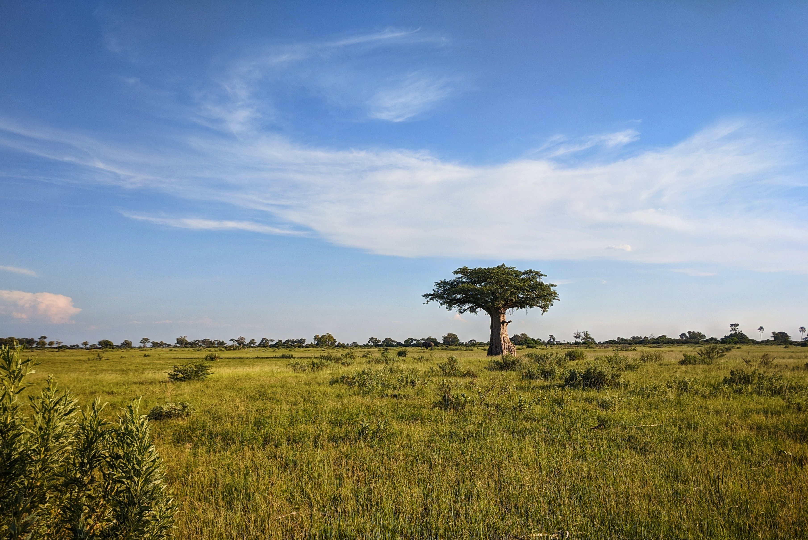
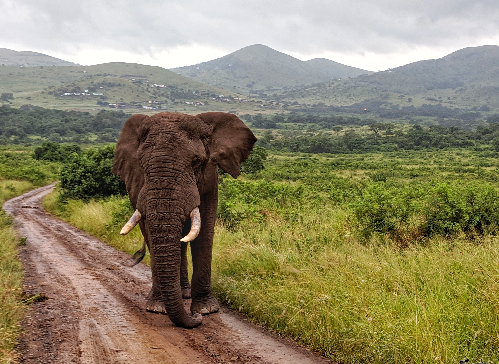
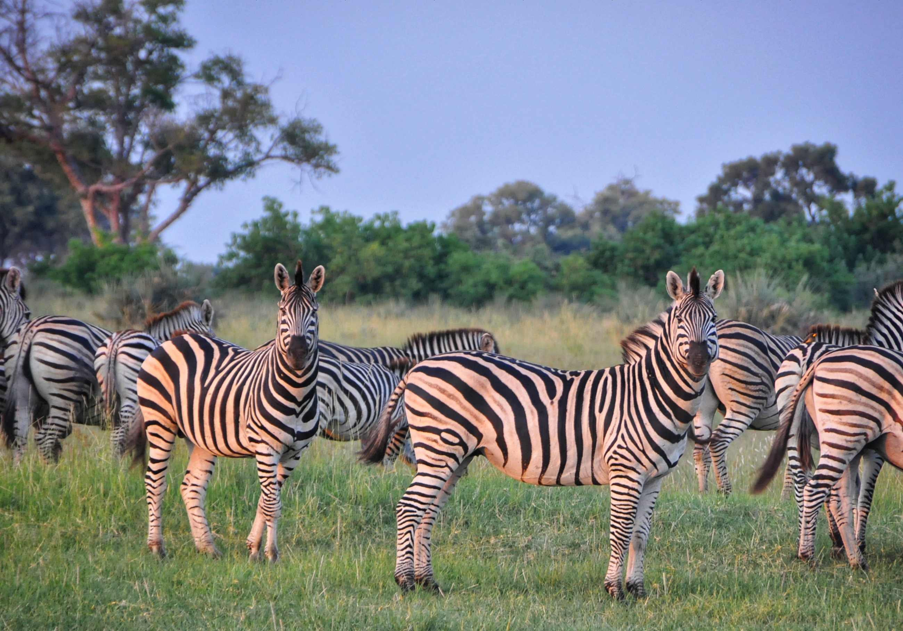
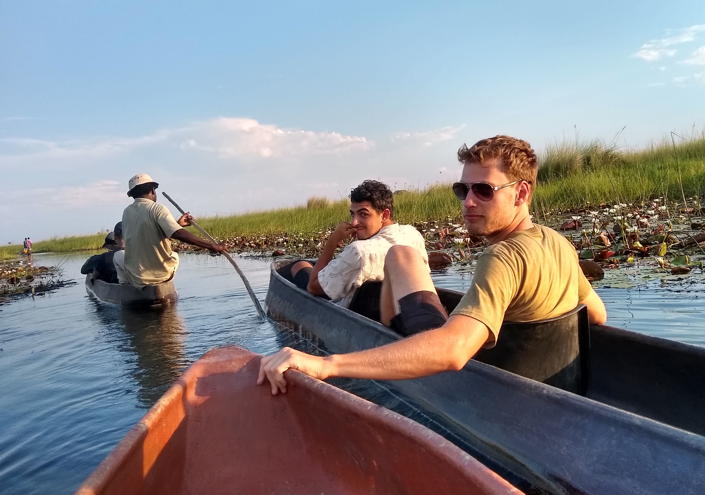
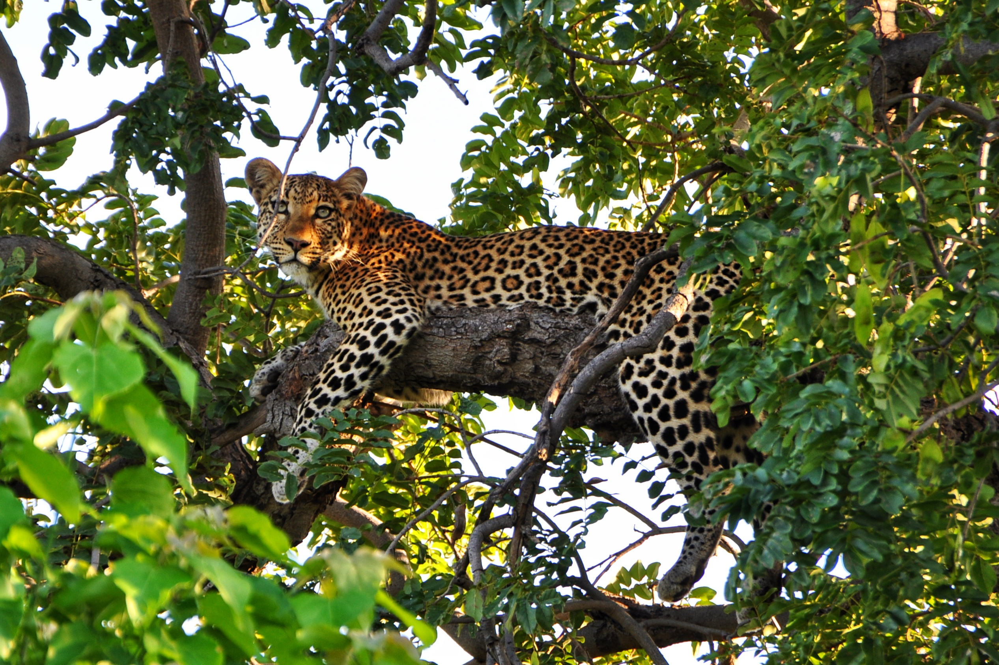
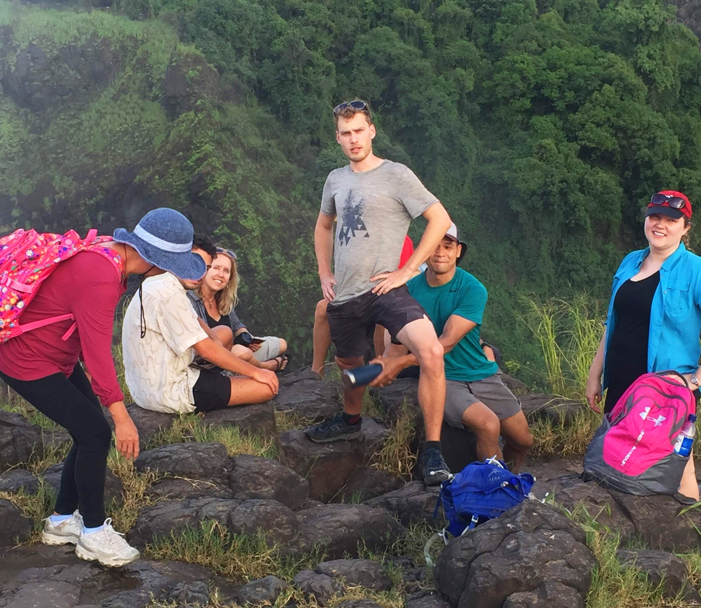

Every two years the amazing [Cosmology on Safari](https://acru.ukzn.ac.za/~cosmosafari2019/) conference is held.

And in 2019 I was lucky enough to not only go, but present a topic clear to my heart. My own research!

Not to miss out on the opportunity to see a bit more of Africa given I was flying over anyway, I also did a small camping trip through South Africa. And Botswana. And Zimbabwe. Only dipped my toes into Namibia though. 

Through it we went to the Okavango Delta, polled out there for us to walk between the islands searching for wildlife.

And up through rhino sancturaries, national parks, local towns and villages. Chobe was amazing.

And of course, Victoria falls, which my phone didn't like as it wasn't waterproof. So all I have is this... taken moments before disaster, as you can so aptly see. 

It was an amazing trip, so shout out to Intrepid the tour staff for being fantastic.

