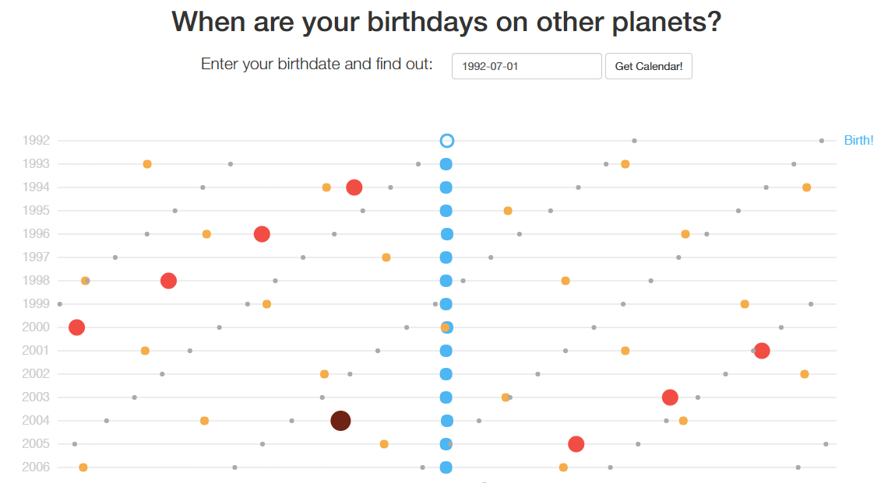

###  [Click here to demo it.](https://samreay.github.io/SpaceBirthdays)

The [Python in Astronomy 2019](http://openastronomy.org/pyastro/2019/) conference was I 
think the best I've ever been to. Not because of the food or location, but because
of the 'unconference' sessions and the hacking that we get to do.

I wandered around during a lot of the hacks, spread between the code review hack,
the MCMC exploration hack, attempting to get PRISM to run, and then also 
working with a group on getting a website to look at your space birthdays. You can [see their initial prototype here](http://cakedays.space/),
and I decided to intrude and throw it up on a boostrapped site and write some javascript to make it all fancy.

I've attached a screenshot of it below in case the main demo site comes down, but really, don't 
look at the screenshot, go to the site. And then save the events to a new calendar so that you 
can pester your friends for extra birthday gifts. 

