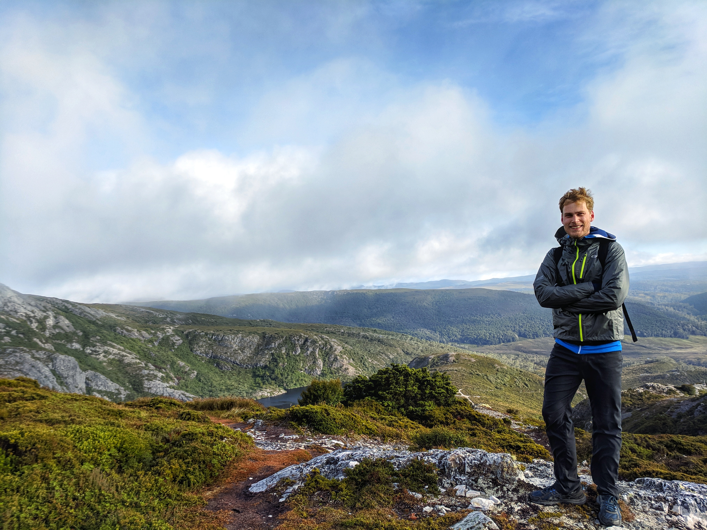
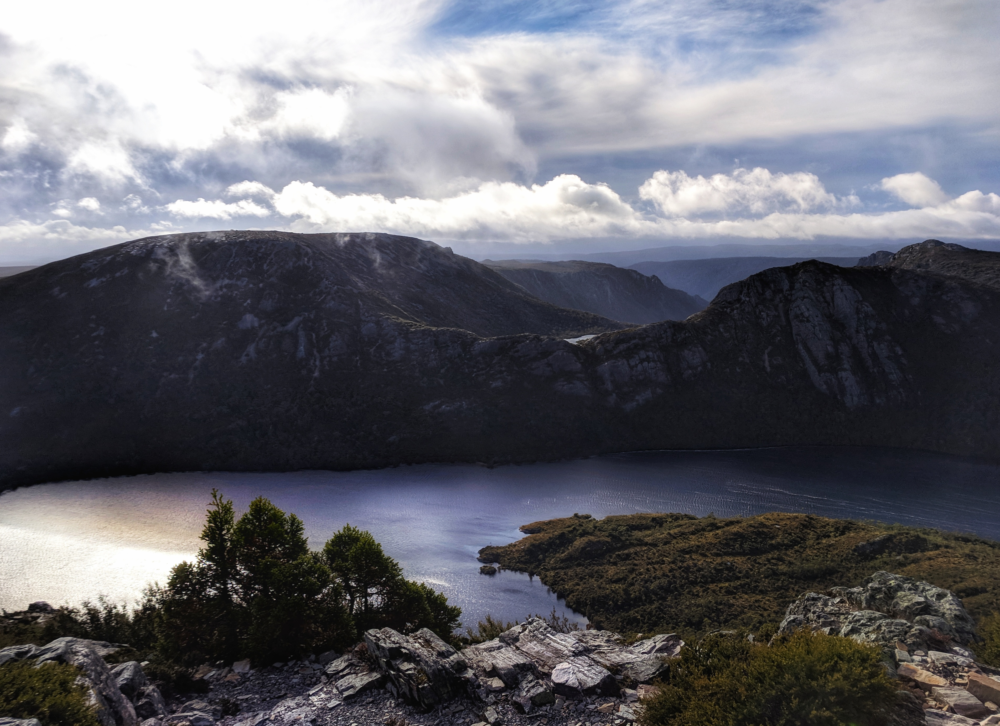
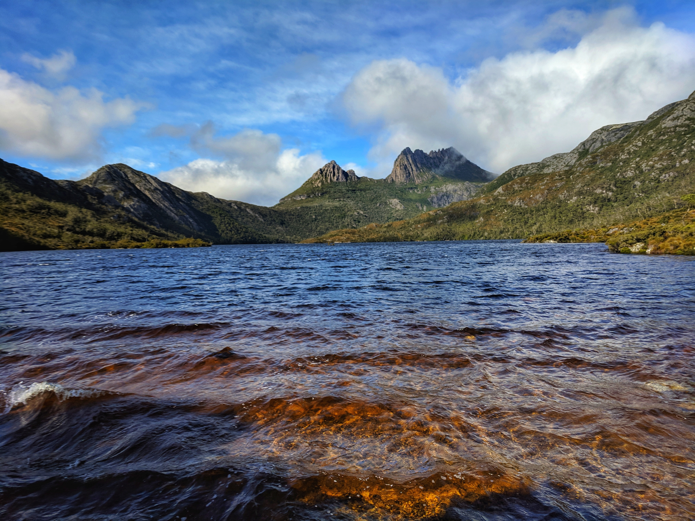

The last time I went to Tasmania I did the Overland track. 

And I was not prepared. No water-proof gear, no thick jackets, just my stubbornness. Which, as it turns out, cannot keep you warm.

So this time I cam *prepared*. Totally waterproof jacket. A down jacket. A merinio wool jacket! All the stops. And it was worth it. From Hobart we drove to Wineglass bay, whic was a series of ups and down designed to swell your thighs to impressive sizes. For the view though, worth it.

And then, to Cradle Mountain. A 5am drive to catch the sunrise was thwarted by cloud cover and rain. Oh, and snow, once we got high enough. But it doesn't matter, it cleared up eventually and we snapped these beauties.

