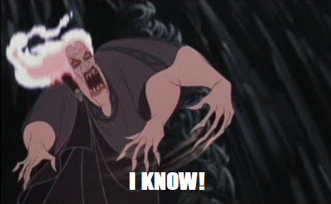

---

title:  "A Review of 'Defiance of the Fall', a system-apocalypse LitRPG / cultivation hybrid."
short_title: "The Path of Ascension"
description: "System apocalypse LitRPG. A multiverse spanning series with great hooks, even if there's some deus ex machina."
long_description: "This is a cultivation/LitRPG crossover you'll probably enjoy. It even has likeable secondary characters, and millions of words to read, so if you want something long, here it is."
date: 2022-03-25
categories: [reviews]
review: C
weight: 36
name: "Defiance of the Fall"
amazon: https://www.amazon.com/Defiance-Fall-LitRPG-Adventure-TheFirstDefier-ebook/dp/B09168R29M
goodreads: https://www.goodreads.com/en/book/show/57866482-defiance-of-the-fall
tags: [in-progress, system-apocalypse, litrpg]
sentence: "Zac was alone in the middle of the forest when the world changed..."
---

*As of the time of writing this review, I have read all four books on KU, and a further 200 chapters on RR, up to and including the time skip.*

So *Defiance of the Fall* did hook me in, and the author is *great* at leaving each chapter with a teaser, cliffhanger, or something to get you thinking "Okay, just one more." It had the same vibes as when I'm playing Civilisation, and it's why I ended up reading several million words before I put the story down.

So, minimal spoiler plot outline: Zac is out in the forest when a typical system apocalypse happens. All his friends are gone, he is alone, and---oh no---there's an alien incursion on his little island that he has to stop!

The opening chapters are a great battle for survival, but they do suffer from the fact that it's literally just Zac, and there's no one else to talk to. I have never before gone scores of thousands of words before a single line of dialogue is spoken between two characters. But when you do get that second character, Ogras, he is great. Cunning, political, pragmatic, and ruthless, he serves as a great counterpoint to the MC.

The plot widens out eventually to more than Zac's island, to other alien incursions, political problems, and even some off-world adventures. You're kept reading because Zac always has some new upgrade, new skills, new item, new enemy, or a new challenge to face. In that, I love it. The author has put a ton of effort into making things go places you don't expect and has included a wide variety of different problems for the MC to solve.

This leads me to the two things I dislike about the series. The first, and obvious one, is that the series could *really* have benefited from a good edit. Not just stripping out the many sections of unnecessary pages-long exposition (which I always just skimmed over), but more so the clunky prose. Now, I'm guilty of this too sometimes, wherein you use a word and so your brain keeps suggesting it to you as you write. Hopefully, you go back and change things, or an editor picks up things you've missed. This has not been done, so here's an example from early on in the work, and a second example from book four:

> ...he quickly circulated his Cosmic Energy and activated his defensive skill. An earthen layer quickly covered his arms and torso and stabilized him. Thanks to his quick reaction...

> ...a sudden sense of danger made Zac immediately perk up and infuse himself with the Dao of Hardness. His eyes immediately found the demon leader, who had gripped his sword and swung it in a massive arc that seemed to make the air itself crackle. Zac’s eyes widened, and he immediately changed his tactic...

Hmm.

The sheer number of "slowly," "without hesitation," "immediately," and "quickly" that get abused a dozen times on the same page does my head in. But this is just text and something I can forgive.

The main issue for me is a lack of critical agency in the MC. Zac is *reactionary*. Something goes wrong, and Zac now has to fix it because the System gave him a quest. Zac is struggling to complete his quest because he is a meathead who just hits things with an axe. So the System rewards him, and it's a power-up to his class, his skills, his weapon, or his race. Zac's problem-solving skills amount to "run at it and hit it," and every time there's an insurmountable challenge, some item or quest or reward conveniently falls in his lap that lets him solve it.

By the end of chapter 600-ish, I just kept waiting for it. "Ah, Zac's in trouble now, I wonder what random bullshit he'll get to help him out now? Oh, a hidden node called *Purity of the Void*, how convenient." I like creative problem solving, intelligent protagonists, and well-earned rewards. Zac is none of these things, and while there is an in-universe explanation (his Luck stat is through the roof") that doesn't make it fulfilling to read, it just makes the universe logically consistent.

Even with that said, it *was* fun to see how those rewards were used to brutally destroy various opponents in the series. I put down the book after a three-year time skip (which is super weird given how much happened in the first year, to then have three years of effectively nothing happening made me scratch my head). Maybe I'll pick up the remaining once I read some reviews myself to see if any of the above issues are addressed.

To be fair, I put the series down after several million words. I've spent dozens of hours reading it, and it was a guilty pleasure that I'm not ashamed to say I enjoyed.