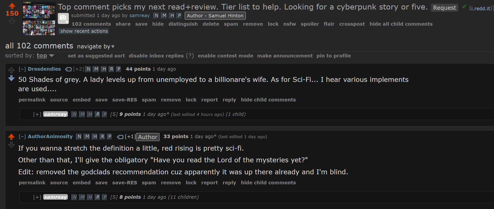

## Blurb

**"And in this quiet moment as I close my eyes, spent and sated, I think I'm in the eye of the storm. And in spite of all he's said, and what he hasn't said, I don't think I have ever been so happy."**

When literature student Anastasia Steele goes to interview young entrepreneur Christian Grey, she encounters a man who is beautiful, brilliant, and intimidating. The unworldly, innocent Ana is startled to realize she wants this man and, despite his enigmatic reserve, finds she is desperate to get close to him. Unable to resist Ana's quiet beauty, wit, and independent spirit, Grey admits he wants her, too—but on his own terms.

Shocked yet thrilled by Grey's singular erotic tastes, Ana hesitates. For all the trappings of success—his multinational businesses, his vast wealth, his loving family—Grey is a man tormented by demons and consumed by the need to control. When the couple embarks on a daring, passionately physical affair, Ana discovers Christian Grey's secrets and explores her own dark desires.

## This isn't PF or LitRPG!

*I know. As of writing this review, I have begrudgingly read the first book. To everyone that voted to make this my next read, I hope your favourite series goes on hiatus.*

Yeah, I fucked up. [Right here, I said I'd read whatever the top comment said.](https://www.reddit.com/r/ProgressionFantasy/comments/1fvp1z1/top_comment_picks_my_next_readreview_tier_list_to/)

My single downvote was not enough to stem the tide, thanks /u/Dresdenies.

So here are my thoughts that you all forced me to offer.

## Thoughts

We begin our journey with Anastasia, poor Anastasia, who just wants to study for her exams. Unfortunately, she's born with vision impairment,  an inability to say no and three left feet, so we quickly end up in a different city and with her tripping over a rogue molecule of oxygen as she falls into Christian Grey's window-backed office.

I've sourced an illustration what Ana sees when she falls into his office.

Unlike the Illusive Man, Christian is only too happy to help Ana up instead of kicking her while she was done, because that comes later, of course. You have to work up to these things. He smirks a few times, quirks a few eyebrows, and Ana blushes, flushes, and mushes over the attention.

They sit down for an interview in which Christian tells her how much of a hyper-rational psychic savant he is, and that he just loves to control everything and everyone. At this point, Ana should probably have been decorating the Chinese embassy with all the red flags Christian was handing out, but remember that she's colourblind, which is where the books name "Fifty Shades of Grey" comes from. Even if she wasn't, she's too distracted looking at his lip---the lower one specifically. Anastasia makes a right mess of the interview questions and leaves with a "pounding heart", which is pounding for the wrong reasons after bombing an interview.

There's a photoshoot, in which Christian strokes his lip some more, and Ana falls over nothing again almost into a vehicles path. Thankfully a strong man is there to save the day, stealing her heart. For the first time in twenty-one years, she wants to be kissed. Ah, nothing like a bit of authentic American puritan values to really get things going. As a complete non-book aside, men who make a big deal out of wanting first kisses or virgins for their partners should probably be pepper-sprayed if they get too close.

Anyway, where were we? Ah yes, Christian pulls the whole "I'm no good for you," and it's the most honest line so far. Not a single smirk (of which there are 39 in total), and yet Anastasia simply disagrees. Dammit, Ana.

And here we have the perfect storm of bad decisions. Ana, self-conscious, wondering how Mr. Smoulder could want her. Ana, naive and unwittingly self-destructive, thinking about how she can change him and bleach all of his greys into a nice holy white. And Christian Grey, narcissist, who emotionally manipulates Ana at every situation to try and force her into a contract she explicitly is happy with, because of course if he can just get her to consent in writing, abuse stops being abuse. That's the law.

The story then races to its first real sex scene, and I'm dreading virgin fetishisation, but in a small, positive surprise, this doesn't happen. Immediately after thinking "okay, that's good," I am forced to eat my words as Grey claims Ana's virginity "slamming" into her and "ripping through her virginity." Given how popular this book is, I feel like there must be a collection of poor women out there who perhaps tried to emulate this approach and probably traumatised themselves. For a second non-book aside, this is not probably *not* how you want to do a first time, especially when a woman has acknowledged they're entirely unfamiliar with sex, masturbation, and holding hands. If any man reading this thinks that's a strange statement, I invite you to, one year when you get a partner, flip the role, gift them a strap-on and just say "Go to town." Let me know how much you love it.

At this point I'm really struggling to read, but a promise is a promise. Christian continues his abusive controlling behaviour, and fun things like "communication" are swiftly categorised as "defiance" and result in punishment like spanking. Though, as Ana points out, that's not quite the word, is it? Spanking is one thing, but when your partner is crying, needs medical treatment afterward, can't sit down without severe pain, and has a meltdown afterward, let's just refer to this by its real term: abuse.

Christian, of course, feels momentarily sad that he deliberately beat his girlfriend. In a classic power play matching the DSM criteria for borderline personality disorder, he's oh so sweet and remorseful and contrite. Then he takes a few deep breaths, and threatens to punish Ana again about a dozen times in the rest of the story when he discovers concepts that make him angry, like not respond to emails fast enough, a strange thing called "consent" and requests from Ana to "please don't hurt me".

Thankfully all this abuse isn't even hidden away. Christian admits on many occasions he likes to hurt people, he likes to control them, and it gets him off. At some point though, big reveal, we find out Christian was abused as a child too. And suddenly its all alright. Continuing the cycle of abuse is only natural, after all. We definitely shouldn't feed Christian into the engine of his private jet, oh no.

There are a few more highlights I don't have the energy to get into. At least Christian didn't remove the tampon with his teeth, I guess?

Book one ends on a surprisingly good note (spoilers): Ana leaves Christian after he beats her, because that was the straw the broke the camel's back and Ana realises that the man isn't just a clown, he's a Stephen King clown, and that can't be fixed.

To make sure we're all on the same page about this: I am all for people enjoying their kinks, whether that's dom/sub, free use, BDSM, CNC, or any other flavour. My gripe is about the stalking, coercive control, emotional manipulation, abuse, and physical beatings that seem to come with it in this fiction.

So let's pretend, for my sanity, that the sequel books do not exist and this is how the story ends. I was going to try and frame this review in terms of progression fantasy, but fuck, I just want it to be done. This is me, tapping out.

I am now going to try and find the most uplifting and wholesome serial to read to try and get this lingering disgust out of my head. Maybe one of Ravensdaggers stories, probably Kittypunk, because he always writes wholesome stuff. Screw everyone that upvoted that comment, I want those hours of life back.