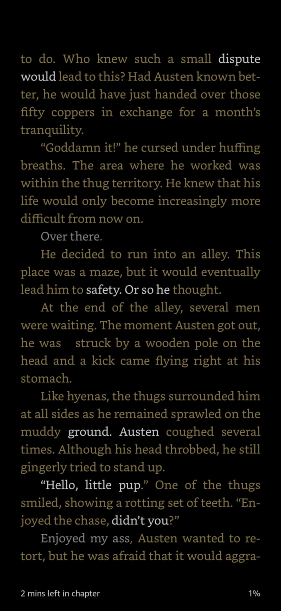

## Blurb

An Arch Magus dies, only to find himself in the body of a young man in a medieval Kingdom. He finds out that he is the second son of a Duke, exiled to a desolated town by his own family. Shackled by the notorious reputation of his new shell, he tries his best to develop his domain, implementing new policies and innovations, leading his subjects to prosperity. In this world where magic is undeveloped, he shall once again pave a new path.

## Thoughts

*As of writing this review, I've read the first two books and a smidge into the third.*

I picked up this series from a reddit recommendation right after finishing Industrial Strength Magic, and so the bar for me was set very high. I didn't quite click with book one, but for anyone that's seen the infinite Cradle recommendations, having the first book in a series be the weakest is super common. So onto book two. And then book three, I started, but I had to put down. I didn't expect this to happen, for Legend of the Arch Magus has more reviews than the vast majority of books I've ready, and its got a high rating, so maybe this just comes down to personal taste.

Let's dig in, and to start with positives: if you just want power fantasy and wish fulfillment, you'll enjoy this. If you like frequent PoV swaps so show characters in awe of the MC (akin to Solo Leveling's novelisation), you'll enjoy this. If you like rapid kingdom building, you'll like this.

So... why *did* I bounce off this?

After thinking about this for a solid minute, I think there are three things that didn't gel with me. These may be deal-breakers for others. Some might find it totally fine. This is, after all, objectively subjective.

First, how easy everything is. Sure, the MC is an arch mage from a previous time with incredible knowledge to apply, but every problem the MC solves is done in such a simplistic way with no complications it feels like it trivialises the problem itself. Need farmland? Here's a magic plough and the knowledge of fertilise, you now have crops. Need housing? Make some tools for people and suddenly they're making bulk townhouse complexes and your homelessness problem is solved. Need large scale construction? Produce an entire concrete processing pipeline in a couple of days and suddenly you're creating concrete irrigation channels with zero issues. Like damn, for anyone that's ever worked in project management, shit does *not* go smoothly, especially when the timeframes is days instead of years. The initial problem the MC solved (famine) could have been a deep and explored arc, instead of the MC solving it in a single paragraph by explaining if they cook the weeks around turn really well they can turn it into food right then and there.

Second, people. The characters, by and large, exist only to highlight how awesome the MC is. Most of them are caricatures. We cut to some side character with their own motiviations, are we made to empathise or understand the side character? Nope. If they're set to be at odds with the MC down the line, their portrayal is 'evil'. Torture a character, torture his daughter, kill his family in front of his eyes for no reason style of evil. Or pick out a female wolf-person to kill and eat as a guilty pleasure evil. There is no subtelty, no shades of grey, and also no real culture. We have PoV shifts into some beastmen characters, but do they have their own dialect, sayings, pattern of speech? No.

> The shamans protested, “But, General! We can’t possibly make enough medicine for ten thousand beastmen! In a week, we could probably concoct enough for five hundred at most. The herbs we’ve brought with us are limited.”

Characters all speak the same, and they speak in full sentence, exposition heavy dialogue rather than leaving anything between the lines or having a natural back-and-forth conversation. This leads into the third thing which is very common in the genre...

Telling instead of showing. It's absolutely rampant in this series. Example:

> Since these soldiers were originally from Lion City, most of them had experience subjugating monsters. Almost all of them had experienced war. The beastmen knew if they were to clash now, they would be unable to save the thousands trapped in the forest. Those who survived the forest fire must be too weak to move. Even with the help of the pouring rain, they would be unable to escape.

The author continuously swaps to generic semi-onscient perspectives (PoV hopping is also a large issue, also similar to Solo Leveling's novelisation) to tell us all the things that these characters or vague groups of characters 'know'. I just... sigh. It feels like the world could be so much richer, the emotions so much closer to the camera, so to speak, if this was all conveyed from limited perspectives instead of the constant zooming out and narration in generic knowledge.

There are more than a dozen books out, so I was going to continue reading to see if this gets better over time, but the third book is formatted... annoyingly. The first 90% of the book (so pretty much all of it) looks like so on my Kindle app, with the text colour constantly changing between gold, white, and grey. It feels like some failure of docx conversion, but why has it not been fixed? It's so painful to read I decided it was time to call it quits.

I understand this review is fairly... not positive, especially with how popular this story seems to be. Please let me know if I'm missing something, if it improves, or if this is just a classic difference of opinion.