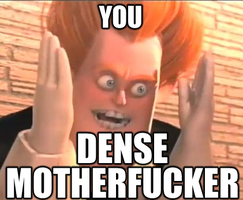

*As of writing this, the released book and the chapters which will cover the second kindle volume (chapter 105 or so).*

## Blurb

**Grant wishes. Gain stats and skills. Outpace the competition.**

In Unity territory, power and public perception go hand-in-hand, empowering an elite class of cultivators. For most, becoming a cultivator – a superhero or supervillain – is impossible.

On his 18th birthday, Shane receives a cryptic message from his absentee father that puts everything he’s known into question. Shane learns that he has the bloodline of the Wishmaster, the most powerful criminal in the universe... and that he has the ability to grant people’s wishes.

The more Shane experiments with his wish granting ability, the more incredible it seems. The road of cultivation is difficult, requiring time and resources. By granting wishes, Shane can gain skills, items, and stat points. His growth potential seems limitless.

The Wishmaster has many descendants, so the competition to succeed him is steep. Until Shane is strong enough, staying hidden is imperative. But Shane is determined to get strong – fast.

His plan?

**Progress through the ranks of heroes while concealing the true source of his powers.**

## Thoughts

I'm glad I've ventured a bit deeper down the superhero genre to get some space from Standard Fantasy Setting 101. *Wish upon the Stars* (WUTS from here on out) is an impressive hybrid of pretty much everything.

Characters have stats, like Might and Perception. They have cultivation ranks, from I-rank to S-rank and beyond. Their backwater planet has a capital of 100 *billion* residents. The scales are vast, and our MC, Shane, starts out in a backwater town on a backwater planet, with all the space in the universe to grow.

The setting is great, and the flexibility of Shane's power opens so many doors. You can tell the author is a massive fan of long-running cultivation stories, because all the hallmarks of those series are here. Pills to add stat points? Check. Enchanting items with runes? Check. Different grade magical herbs? Check. Random tournaments, scavenger hunts, monster kill quests, underground markets, check them all. 

The variety and sheer breadth of activities in the story is both a draw and a pitfall. There's *so much* to do, our MC is almost torn between them. What is just pure fun, and what is actually part of the wider plot about the Wishmaster and the politics of the setting? You won't always know, because sometimes the character's just have fun for its own sake. Not everything need be a rush towards the central conflict. I like this, because I'm a voracious reader and I love side-quests. Others who want a really *focused* journey may find those side-quests not relevant. To them, I say to enjoy the ride.

And that's a pretty good summary of what I've read so far, actually. Enjoy the ride. There's constantly a new setting, person, skill, facet to the system, etc, to explore. What's constant are our characters.

Shane is our MC, the candidate Wishmaster. He can grant wishes, provided they're in his limited power. Benny, Shane's best friend, is obsessed with inventing (which is a mad-scientist-like skill) and is slowly becoming a mix of Ironman and Inspector Gadget. Callie, the romantic interest, likes shadows and creative uses of them. On this note, the romance is done well, zero cringe, and you can feel how earnest the characters are. Finally, Jessie, the botanist who grows plants. Don't worry, it's far more impressive than how I just made it sound. The group has a fun dynamic, which only improves after Shane *finally* comes to his senses and decides to let his friends all know he can grant wishes.

Wishes. This is the unique premise of the story, what hooked me in, and ultimately the thing I want to see *more* exploration of. I *know* this is probably coming in the next hundred chapters or so, but let me explain using just the first two books content without spoiling things.

Shane can grant *Wishes.* He can make physical things, grant stat points, skills, memories, experience, and conceptual things like luck. People can pay in cold hard cash, stat points, or pretty much whatever they want (conceptual stuff as well). Benny even figures out early on that you can word things in optimal ways, like "Give me the best X you can currently grant," which gets around the fact Shane has limited power.

Which leads me to the question: Why, on god's green earth, is this not the *primary* thing Benny and the other characters turn to for their needs?

Tracking a killer or stalker or trying to find a kidnapped person?

*Wish* for as much knowledge as possible about them.

Having trouble advancing a skill from minor to beginner?

*Wish* for the most impactful experiences and memories to progress the skill.

Are you a crafter that's missing a specific bit of material to make some great gear?

*Wish* for the best possible materials to get the desired item abilities!

I was *pulling my hair out* when for almost all of the first hundred chapters, wishing was primarily used to just trade stat points. I wanted to pick Benny up, Syndrome style, and shout:

Because so early on he seemed to figure out the exploit with his "Give me the best skill in X you can safely give me right now," and then... failed to capitalise on this insight. In the end fight of book two, the MC and his friends get a bit more creative, and I read an author note saying the next arc has a lot more exploration of the wish system, which is great. It's the thing which sets the story apart, and the more it's used and exploited the happier I will be!

Apart from that frustration with characters not min-maxing like I expect, I had a really good time. I'm going to keep reading on Royal Road, just to see what crazy wish shenanigans the team gets up to.

Also so I can see if Zeke (the OP uncle) ever gets to smack someone through the face of the planet just because he wants to. If you read this, Malcolm, I want me an OP smackdown.

