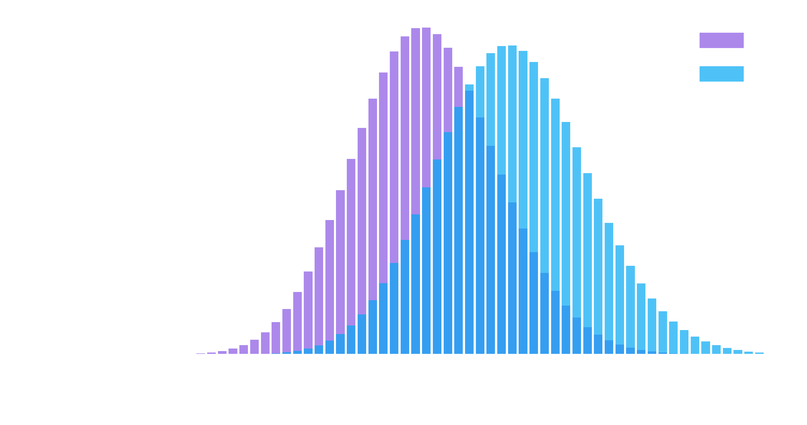
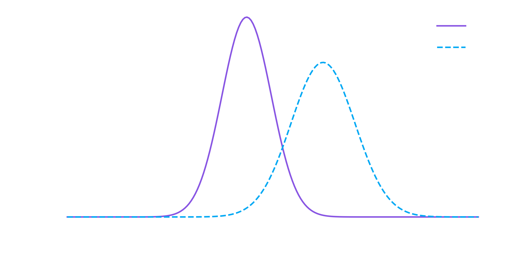
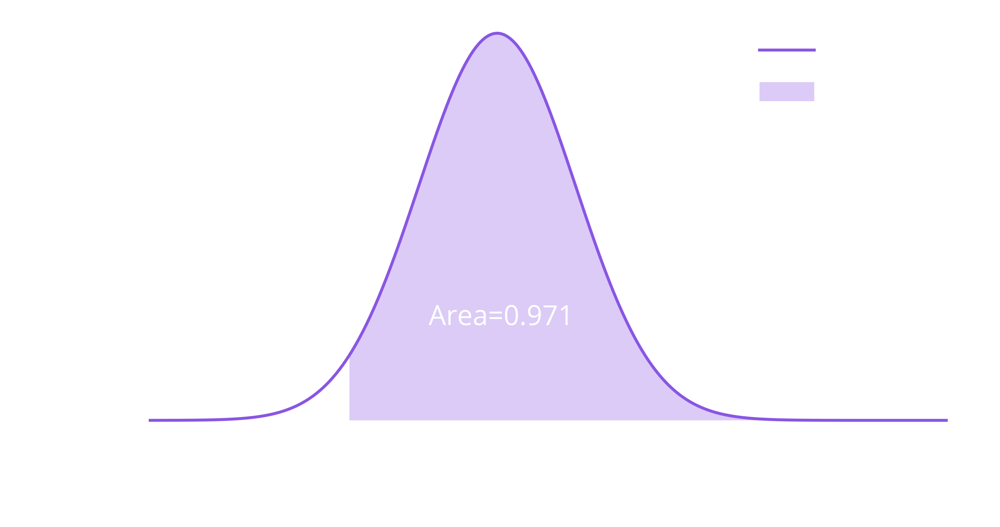
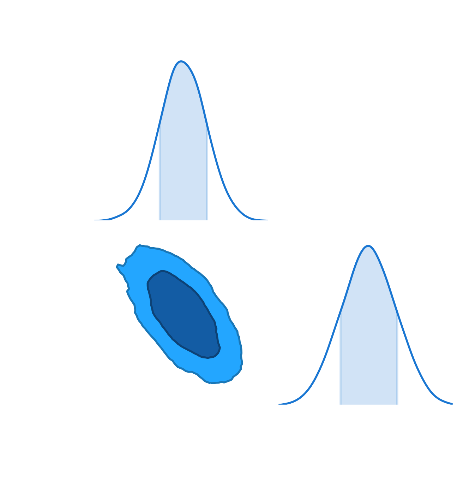

Recently I was asked to talk about A/B tests for my [Python for Statistical Analysis course](https://www.udemy.com/course/python-for-statistical-analysis/?referralCode=76158B46FA5EB57C38EB). Given my travel schedule, leaving me bereft of my microphone, I thought it would be better to condense down A/B tests into a tutorial or two.

In this little write up, we'll cover what an A/B test is, run through it in first principles with frequentist hypothesis testing, apply some existing scipy tests to speed the process up, and then at the end we'll approach the problem in a Bayesian framework.

## What is an AB test?

Imagine you're in charge of a website to optimise sales. You have the current version of the website, but aren't happy with it. The "Buy now" button is not obvious to the user, it's hidden away, so you want to try making it bigger and brighter, maybe that will increase conversion. But you also care about statistical rigour (an odd combination to be sure). So you set up your website so that half the people are directed to the old website, and half to one where you've made your change. You have data from both, and want to know, with confidence, *"Does the change I made increase conversion?"*.


    

    


This is an A/B test. Often this is used interchangably with the term "split testing", though in general A/B tests test small changes, and split testing might be when you present two entirely different websites to the user.

**Why not just change the website and monitor it for a week?** Good question - by having two sites active at once and randomly directing users to one or the other, you control for all other variables. If one week later puts you the week before Christmas, this will impact sales, and you might draw the wrong conclusion because of these confounding effects.

**Why is it not an A/B/C test?** Well, you can have as many perturbations running as you want, but got to keep the name simple. The more perturbations you try though, the smaller a number of samples you'll have for each case, and the harder it will be to draw statistically significant conclusions.

Now, A/B tests can test anything you want, but common ones are click through/conversion, bounce rate, and how long you spend on the page. For this example, let us assume we want to optimise conversion, which in our case is clicking the "Add to cart" button above. 

Let us assume you have 1000 users, 550 were directed to site A, 450 to site B. In site A, 48 users converted. In site B, 56 users converted. **Is this a statistically significant result?**


<div class="reduced-code width-49" markdown=1>

```python
num_a, num_b = 550, 450
click_a, click_b = 48, 56
rate_a, rate_b = click_a / num_a, click_b / num_b
```

</div>


For a TL;DR - "just give me the answer", if you want to test the hypothesis the click-through-rate (CTR) of B > A, then [jump to the Mann-Whitney U test](#Mann-Whitney-U-test).

## Modelling click through

You can click a button, or not. Two discrete options are available, so this is a textbook binomial distribution, with some unknown rate for site A and site B. We don't know the true click rate, but we can estimate it using our small sample.


<div class="reduced-code width-55" markdown=1>

```python
import matplotlib.pyplot as plt
from scipy.stats import binom
import numpy as np

# Determine the probability of having x click throughs
clicks = np.arange(20, 80)
prob_a = binom(num_a, rate_a).pmf(clicks)
prob_b = binom(num_b, rate_b).pmf(clicks)

# Make the bar plots.
plt.bar(clicks, prob_a, label="A", alpha=0.7)
plt.bar(clicks, prob_b, label="B", alpha=0.7)
plt.xlabel("Num converted"); plt.ylabel("Probability");
```

</div>


    

    


So we can see here that B has an edge when looking at the number of users, but its certaintly possible if we pick two random points according to the histograms for A and B, that A might actually be higher than B! But of course, we fundamentally **do not care** about the number of users, we need to move from the number of users to looking at the click through rate.

# Let's get normal

Sure, we *can* work with binomial distributions in this case. And Poisson distributions in the "How long were you on the site" case. We could swap distributions for every question... or we can invoke the Central Limit Theorem. As we're interested in the **average** conversion, or **average** time spent on the site, this averaging of an underlying distribution means our final estimate will be well approximated by a normal distribution.

So let's reformulate, [using the normal approximation here](https://en.wikipedia.org/wiki/Binomial_distribution#Normal_approximation):


<div class="reduced-code width-57" markdown=1>

```python
from scipy.stats import norm

# Where does this come from? See the link above.
std_a = np.sqrt(rate_a * (1 - rate_a) / num_a)
std_b = np.sqrt(rate_b * (1 - rate_b) / num_b)

click_rate = np.linspace(0, 0.2, 200)
prob_a = norm(rate_a, std_a).pdf(click_rate)
prob_b = norm(rate_b, std_b).pdf(click_rate)

# Make the bar plots.
plt.plot(click_rate, prob_a, label="A")
plt.plot(click_rate, prob_b, label="B")
plt.xlabel("Conversion rate"); plt.ylabel("Probability");
```

</div>


    

    


This is also a better plot than the first one, because we've removed the confusing effect of site A and site B having a slightly different number of visitors had. 

To restate what the plot above is showing - it is showing, given the data we collected, the probability that the *actual* conversion rate for A and B was a certain value.

So our question is still the same: What is the chance that the *actual* CTR from B is higher than the CTR of A. Ie, the chance a draw from the B distribution above is greater than a draw from the A distribution. And is that significant?

To answer this, let us utilise the handy fact that the sum (or difference) of normally distributed random numbers is also a normal. [See here for the proof](https://en.wikipedia.org/wiki/Sum_of_normally_distributed_random_variables#Independent_random_variables), but the math is as follows:

$$ P(b-a) = \mathcal{N}(\mu_B - \mu_A, \sqrt{\sigma_A^2 + \sigma_B^2}) $$

This is simple - take the difference in the means and sum the variance. We'll do two things below: First, get the z-score, and second, plot the proper distribution.


<div class=" width-75" markdown=1>

```python
# The z-score is really all we need if we want a number
z_score = (rate_b - rate_a) / np.sqrt(std_a**2 + std_b**2)
print(f"z-score is {z_score:0.3f}, with p-value {norm().sf(z_score):0.3f}")

# But I want a plot as well
p = norm(rate_b - rate_a, np.sqrt(std_a**2 + std_b**2))
x = np.linspace(-0.05, 0.15, 1000)
y = p.pdf(x)
area_under_curve = p.sf(0)
plt.plot(x, y, label="PDF")
plt.fill_between(x, 0, y, where=x>0, label="Prob(b>a)", alpha=0.3)
plt.annotate(f"Area={area_under_curve:0.3f}", (0.02, 5))
```

</div>


    z-score is 1.890, with p-value 0.029
    


    

    


Great! So, how to phrase this result? Using our frequentist approach so far, we would say that given the null hypothesis is true (that B is less then or equal to A), we would expect to get this result or a result more extreme only 2.9% of the time. As that is a significant result (typically p < 5%), we reject the null hypothesis, and state that we have evidence that B > A.

We should explicitly note here that this is a one-tailed test - the question we've asked is if B > A. An alterative is the two-tailed test, where we just want to discriminate that B is *different* to A. In that case, our p-value is actually $2 \times 2.9 = 5.8$ percent (as we have two tails, not one), and we would want more samples before rejecting the null hypothesis if we stick to the p-value of 0.05 threshold.

However, we've made a lot of plots for this to try and explain the concept. You can easily write a tiny function to simplify all of this. Whether you want the confidence or the p-value just means changing the final `norm.cdf` to `norm.sf`.


<div class=" width-62" markdown=1>

```python
def get_confidence_ab_test(click_a, num_a, click_b, num_b):
    rate_a = click_a / num_a
    rate_b = click_b / num_b
    std_a = np.sqrt(rate_a * (1 - rate_a) / num_a)
    std_b = np.sqrt(rate_b * (1 - rate_b) / num_b)
    z_score = (rate_b - rate_a) / np.sqrt(std_a**2 + std_b**2)
    return norm.cdf(z_score)

print(get_confidence_ab_test(click_a, num_a, click_b, num_b))
```

</div>


    0.9705973498275782
    

# Can we check we've done the right thing?

So what if we're not confident that we've done the math perfectly? Is there a way we can brute force a check? Turns out, there is, and its simplest to start from the rates and our normal approximation.


<div class="reduced-code width-56" markdown=1>

```python
# Draw 10000 samples of possible rates for a and b
n = 10000
rates_a = norm(rate_a, std_a).rvs(n)
rates_b = norm(rate_b, std_b).rvs(n)
b_better = (rates_b > rates_a).mean()
print(f"B is better than A {b_better:0.1%} of the time")
```

</div>


    B is better than A 97.1% of the time
    

Which, rephrased to the language of before, is that A > B only ~3% of the time, which is statistically significant such that we can reject our hypothesis (that A <= B).

Often this is the way we would actually do more complicated analyses, when there isn't an analytic solution and its easiest to just simulate the process. The power of modern computing opens many doors!

# Can we do this test even faster?

We've done some math ourselves, taking things down to a normal distribution and doing a basic difference of means test. But `scipy` has lots of stuff hidden inside it to make our lives easier. Here imagine we have the raw results of click through, 0 or 1, as our distribution, and we want to use an inbuild t-test.

For example, if we had 5 users for site A, we might have `[1, 0, 1, 0, 0]` if only two users clicked through.

## Welsch's t-test


<div class="expanded-code width-98" markdown=1>

```python
from scipy.stats import ttest_ind
a_dist = np.zeros(num_a)
a_dist[:click_a] = 1
b_dist = np.zeros(num_b)
b_dist[:click_b] = 1
zscore, prob = ttest_ind(a_dist, b_dist, equal_var=False)
print(f"Zscore is {zscore:0.2f}, p-value is {prob:0.3f} (two tailed), {prob/2:0.3f} (one tailed)")
```

</div>


    Zscore is -1.89, p-value is 0.059 (two tailed), 0.030 (one tailed)
    

Note here that the p-value by default is using the two-tailed test. We can see these values are almost identical to the ones we computed ourselves... but they're not exactly the same. Why is this? Well, the ttest_ind (with `equal_var=False`) is running Welch's t-test. The t-test has degrees-of-freedom which will induce subtle differences with the normal approximation. Additionally, Welsch's t-test is meant for continuous data, we have discrete 0 and 1 options. A better option for discrete data is the Mann-Whitney U statistic.

## Mann-Whitney U test


<div class=" width-74" markdown=1>

```python
from scipy.stats import mannwhitneyu
stat, p_value = mannwhitneyu(a_dist, b_dist, alternative="less")
print(f"Mann-Whitney U test for null hypothesis B <= A is {p_value:0.3f}")
```

</div>


    Mann-Whitney U test for null hypothesis B <= A is 0.028
    

So you can see that our p-value is low and we can reject the null hypthesis. Noticed too that we have `alternative="less"`, which is the null hypothesis that we are testing so that we can investigate if B > A. 

Again we can see a super similar answer to what we got before. For cases when we have hundreds of data points, these answers quickly converge, and you can pick the flavour you like.

# A Bayesian Approach

Everything up to now has been standard frequentist hypothesis testing. But we can formulate a model and fit it in A Bayesian approach. For a Bayesian approach, we need to contruct a model of our posterior that includes our prior and our likelihood. [For more detail on those, see this example](https://cosmiccoding.com.au/tutorials/bayes_lin_reg).

**NOTE: Whilst I enjoy Bayesian approaches, for a simple model like this I would say this is vastly overkill for a real world analysis. I include it here simply for fun.**

### Model Parameters:
* $P_A$: Actual probability of conversion for A
* $\delta_P$: Delta probability such that $P_B$ = $P_A$ + $\delta_P$

### Model Data:
* $N_A$, $R_A$: number of total visits and conversion ratio for A
* $N_B$, $R_B$: number of total visits and conversion ratio for B

We will give $P_A$ a flat prior between 0 and 1. And for $\delta_P$, we will also give a flat prior. We might also consider another prior like a half-Cauchy, but I want to keep this as simple as humanely possible. For simplicity, we will also utilise the normal approximation for our Bernoulli distritubion, as working with continuous numbers is easier than discrete. That means our posterior is given by:

$$ P(\theta|data) = N\left(  \frac{P_A - R_A}{\sqrt{R_A(1-R_A)/N_A}} \right) N \left( \frac{P_A + \delta_P - R_B}{\sqrt{R_B(1-R_B)/N_B}} \right) $$

When we implement it, we work with log probabilities.


<div class="expanded-code width-92" markdown=1>

```python
import numpy as np

def get_prior(x):
    p, delta = x
    if not 0 < p < 1:
        return -np.inf
    if not 0 < p + delta < 1:
        return -np.inf
    if not -0.1 < delta < 0.1:
        return -np.inf
    return 0

def get_likelihood(x):
    p, delta = x
    return norm().logpdf((p - rate_a) / std_a) + norm().logpdf((p + delta - rate_b) / std_b)

def get_posterior(x):
    prior = get_prior(x)
    if np.isfinite(prior):
        return prior + get_likelihood(x)
    return prior
```

</div>


So that's our model defined. Let's fit it using [`emcee`](https://emcee.readthedocs.io/en/stable/). As a note, this model is simple enough that we could actually do this analytically, but this is a more useful example if don't. This may take a while to run.


<div class=" width-78" markdown=1>

```python
import emcee
ndim = 2  # How many parameters we are fitting. This is our dimensionality.
nwalkers = 30  # Keep this well above your dimensionality.
p0 = np.random.uniform(low=0, high=0.1, size=(nwalkers, ndim))  # Start points
sampler = emcee.EnsembleSampler(nwalkers, ndim, get_posterior)
state = sampler.run_mcmc(p0, 2000)  # Tell each walker to take some steps

chain = sampler.chain[:, 200:, :]  # Throw out the first 200 steps
flat_chain = chain.reshape((-1, ndim))  # Stack the steps from each walker
print(flat_chain)
```

</div>


    [[0.0660124  0.04519312]
     [0.06044587 0.05760786]
     [0.05904935 0.0586979 ]
     ...
     [0.07143426 0.0553055 ]
     [0.0747643  0.04823904]
     [0.0747643  0.04823904]]
    

Great, so we have samples from the posterior, but this doesn't mean much. Lets throw them into [`ChainConsumer`](https://samreay.github.io/ChainConsumer/), a library of mine to digest MCMC samples from model fitting algorithms.


<div class=" width-68" markdown=1>

```python
from chainconsumer import ChainConsumer
c = ChainConsumer()
c.add_chain(flat_chain, parameters=["$P_A$", "$\delta_P$"], kde=1.0)
c.plotter.plot();
```

</div>


    


    

    


What we're interested in most of all are the constraints on $\delta_P$, which is $\delta_P = 0.037^{+0.021}_{-0.019}$ (this is the 68% confidence level). This means that we rule out $\delta_P=0$ at the $2\sigma$ confidence level (aka 95% confidence level), allowing us to say that B does in indeed produce a statistically significant increase in conversion rate.