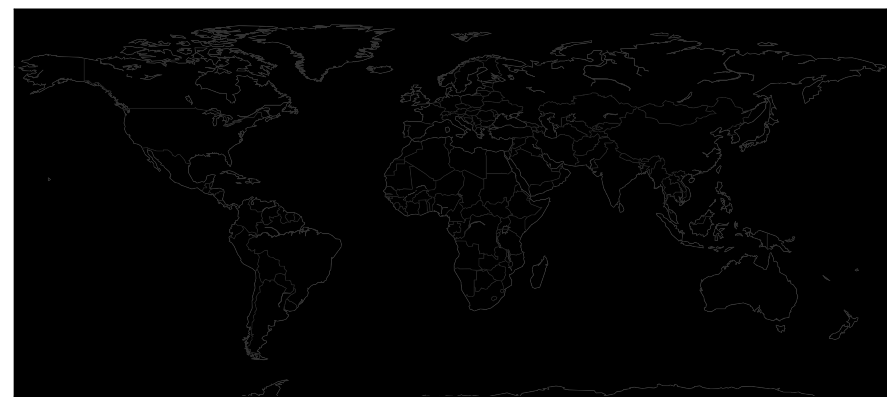
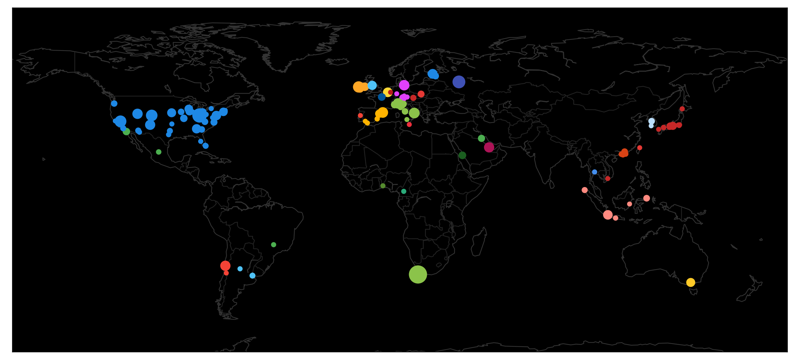

The COVID-19 Critical Care Consortium is an international collaboration of hundreds of hospital sites from dozens of countries around the world. Our sites have been slowly but steadily gathering data for critical cases of COVID-19 since earlier in the year, and we thought it would be good to show just how international the collaboration is.

To that end, in my role as one of the technical leads (responsible for the data pipeline and ingestion), I created out a simple (and no-risk) data product simply containing a list of our participant sites, and how many patients they have enrolled in our study at a given date. The details for those patients are - of course - not contained in this data product in any way.

This is what we're going to be making.


# Basic Dataset Prep

So let's start things up, and load in the enrolment data.


<div class="expanded-code width-85" markdown=1>

```python
import pandas as pd
import numpy as np
data = pd.read_csv("cccc_enrolment/enrolment_site.csv", parse_dates=[0], index_col=0)
data = data.fillna(0).astype(int)
data.iloc[-5:, :5]
```

</div>


<div>

<table class="table-auto table dataframe">
  <thead>
    <tr style="text-align: right;">
      <th></th>
      <th>00543-Medical University of Vienna</th>
      <th>00544-Lancaster General Health</th>
      <th>00546-Penn Medicine</th>
      <th>00547-Oklahoma Heart Institute</th>
      <th>00548-UH Cleveland Hospital</th>
    </tr>
    <tr>
      <th>date_enrolment</th>
      <th></th>
      <th></th>
      <th></th>
      <th></th>
      <th></th>
    </tr>
  </thead>
  <tbody>
    <tr>
      <th>2020-09-24</th>
      <td>9</td>
      <td>39</td>
      <td>42</td>
      <td>2</td>
      <td>26</td>
    </tr>
    <tr>
      <th>2020-09-25</th>
      <td>9</td>
      <td>39</td>
      <td>42</td>
      <td>2</td>
      <td>26</td>
    </tr>
    <tr>
      <th>2020-09-26</th>
      <td>9</td>
      <td>39</td>
      <td>42</td>
      <td>2</td>
      <td>26</td>
    </tr>
    <tr>
      <th>2020-09-27</th>
      <td>9</td>
      <td>39</td>
      <td>42</td>
      <td>2</td>
      <td>26</td>
    </tr>
    <tr>
      <th>2020-09-28</th>
      <td>9</td>
      <td>39</td>
      <td>42</td>
      <td>2</td>
      <td>26</td>
    </tr>
  </tbody>
</table>
</div>


Great, so you can see we have the vetical axis representing the date, and each site is a column, with its numeric identifier first. Lets remove those IDs, because they are useful in a database, but not for us.


<div class=" width-69" markdown=1>

```python
sites = [c.split("-", 1)[1] if "-" in c else c for c in data.columns]
print(sites[60:70])
```

</div>


    ['Fukuoka University', 'Mater Dei Hospital', 'Yokohama City University Medical Center', 'Nagoya University Hospital', 'PICU Saiful Anwar Hospital', 'Adult ICU Saiful Anwar Hospital', 'KourituTouseiHospital', 'HokkaidoUniversityHospital', 'ChibaUniversityHospital', 'UniversityofAlabamaatBirminghamHospital']


Looking good so far. However, I know that some of the sites have - for some reason - had all whitespace removed. So lets write a small parser to go from CamelCase to normal words.


<div class="expanded-code width-81" markdown=1>

```python
# Some of the sites are missing spaces for some reason
def fix_site(site):
    if " " not in site:
        # Dont fix a sitename which is an acryonym
        if site != site.upper():
            site = ''.join(map(lambda x: x if x.islower() else " " + x, site))   
    return site.strip()

sites_fixed = [fix_site(s) for s in sites]
print(sites_fixed[60:70])
```

</div>


    ['Fukuoka University', 'Mater Dei Hospital', 'Yokohama City University Medical Center', 'Nagoya University Hospital', 'PICU Saiful Anwar Hospital', 'Adult ICU Saiful Anwar Hospital', 'Kouritu Tousei Hospital', 'Hokkaido University Hospital', 'Chiba University Hospital', 'Universityof Alabamaat Birmingham Hospital']


This is probably as good as we can get it right now. So lets copy the dataframe so we don't clobber the original, and update the columns.


<div class="reduced-code width-32" markdown=1>

```python
data_fixed = data.copy()
data_fixed.columns = sites_fixed
data_fixed.iloc[-5:, :5]
```

</div>


<div>

<table class="table-auto table dataframe">
  <thead>
    <tr style="text-align: right;">
      <th></th>
      <th>Medical University of Vienna</th>
      <th>Lancaster General Health</th>
      <th>Penn Medicine</th>
      <th>Oklahoma Heart Institute</th>
      <th>UH Cleveland Hospital</th>
    </tr>
    <tr>
      <th>date_enrolment</th>
      <th></th>
      <th></th>
      <th></th>
      <th></th>
      <th></th>
    </tr>
  </thead>
  <tbody>
    <tr>
      <th>2020-09-24</th>
      <td>9</td>
      <td>39</td>
      <td>42</td>
      <td>2</td>
      <td>26</td>
    </tr>
    <tr>
      <th>2020-09-25</th>
      <td>9</td>
      <td>39</td>
      <td>42</td>
      <td>2</td>
      <td>26</td>
    </tr>
    <tr>
      <th>2020-09-26</th>
      <td>9</td>
      <td>39</td>
      <td>42</td>
      <td>2</td>
      <td>26</td>
    </tr>
    <tr>
      <th>2020-09-27</th>
      <td>9</td>
      <td>39</td>
      <td>42</td>
      <td>2</td>
      <td>26</td>
    </tr>
    <tr>
      <th>2020-09-28</th>
      <td>9</td>
      <td>39</td>
      <td>42</td>
      <td>2</td>
      <td>26</td>
    </tr>
  </tbody>
</table>
</div>


Now, I do want to make an animation out of this, with more frames than days, so we'll just do a super simple interpolation to add extra evenly spaced datetimes that will correspond to each frame. In addition, I'll start the clock ticking from February first.


<div class="expanded-code width-90" markdown=1>

```python
# Interpolation
fr = 30  # frame rate
t = 12  # seconds
new_index = pd.date_range("2020-02-01", data_fixed.index.max(), fr * t)

# Combine index, interp, remove original index
data_fixed = data_fixed.reindex(new_index | data_fixed.index).interpolate().loc[new_index]
```

</div>


And I also want to have the animation flash or brighten a bit when sites add new patients, so to get a feel for that, we'll simply take the difference in rows (and fillna to put zero in the first row).


<div class="reduced-code width-47" markdown=1>

```python
data_fixed_change = data_fixed.diff().fillna(0)
```

</div>


# Getting coordinates

Each site obviously represents a specific physical location on the planet. Alas, I do not know this - all I have is a name. So, lets use `opencage` to do a search for each site name, and extract the latitude and longitude for each site if we can find it. I don't expect this to work for them all, but I'd rather manually look up ten sites than a hundred.

Let's set up the library with our token to start with:


<div class=" width-60" markdown=1>

```python
from opencage.geocoder import OpenCageGeocode
key = "" # The trial version allows you do this all for free
geocoder = OpenCageGeocode(key)
```

</div>


And then write a little function that - when given a query - will try and find the latitude, longitude and country. If it can't find anything, we'll return None and I'll do it myself.


<div class="reduced-code width-49" markdown=1>

```python
def get_lat_long_from_site(query):
    results = geocoder.geocode(query)
    if not len(results):
        print(f"{query} unable to be located")
        return None
    lat = results[0]['geometry']['lat']
    long = results[0]['geometry']['lng']
    country = results[0]["components"]["country"]
    return (lat, long, country)
```

</div>


And to make sure I don't spam this API over and over, we'll run this once, save it out to JSON, and when I run this again in the future we can just read the file in.


<div class="expanded-code width-101" markdown=1>

```python
import os
import json

filename = "cccc_enrolment/site_locations.json"

# Check if file exists
if os.path.exists(filename):
    with open(filename) as f:
        coords = json.load(f)

# Add manual ones that I know wont be found
coords["Uniklinik (University Hospital Frankfurt)"] = 50.0936204, 8.6506709, "Germany"
coords["Prof Dr R. D. Kandou Central Hospital - Paediatric"] = 1.453734, 124.8056623, "Indonesia"
coords["Prof Dr R. D. Kandou Central Hospital - Adult"] = 1.45, 124.80, "Indonesia"
coords["Kyoto Prefectural University of Medicine"] = 35.0243414, 135.7682285, "Japan"
coords["ISMETT"] = 38.1084401, 13.3613329, "Italy"
coords["Kuwait ECLS program, Al-Amiri & Jaber Al-Ahmed Hospitals"] = 29.3876968, 47.9881274, "Kuwait"
coords["Dr Sardjito Government Hospital - Paediatric"] = -7.768611, 110.3712855, "Indonesia"
coords["Hospitaldel Torax"] = 41.594067, 2.007054, "Spain"

# Check we have all the sites we need
save = False
for s in sites_fixed:
    if s not in coords:
        coords[s] = get_lat_long_from_site(s)
        save = True
        
    # If we've updated, save it out
    if save:
        with open(filename, "w") as f:
            json.dump(coords, f)

print(f"We now have {len(coords.keys())} sites ready to go!")
```

</div>


    We now have 148 sites ready to go!


Great! Onto the next part...

# Plotting a specific datetime

Our dataframe is broken up into a lot of rows, where each row now represents a frame in the animation. Lets write a function to extract a row and put it into something easier to work with when plotting.


<div class=" width-69" markdown=1>

```python
def get_row(date):
    row = data_fixed.loc[date].to_frame().reset_index()
    change = data_fixed_change.loc[date].to_frame().reset_index()
    row.columns = ["site", "enrolment"]
    change.columns = ["site", "change"]
    row = row.merge(change, on="site")
    row["date"] = date
    row["coord"] = row["site"].map(coords)
    row["lat"] = row["coord"].str[0]
    row["long"] = row["coord"].str[1]
    row["country"] = row["coord"].str[2]
    row = row.drop(columns="coord")

    # Manually fix up the issues to separate HK and China
    hk = np.abs(row.lat - 22.3) < 0.2
    row.loc[hk, "country"] = "Hong Kong"
    np.random.seed(1)
    row.loc[hk, "lat"] += np.random.normal(scale=0.5, size=hk.sum())
    row.loc[hk, "long"] += np.random.normal(scale=0.5, size=hk.sum())

    
    return row

test_row = get_row(data_fixed.index.max())
test_row
```

</div>


<div>

<table class="table-auto table dataframe">
  <thead>
    <tr style="text-align: right;">
      <th></th>
      <th>site</th>
      <th>enrolment</th>
      <th>change</th>
      <th>date</th>
      <th>lat</th>
      <th>long</th>
      <th>country</th>
    </tr>
  </thead>
  <tbody>
    <tr>
      <th>0</th>
      <td>Medical University of Vienna</td>
      <td>9.0</td>
      <td>0.0</td>
      <td>2020-09-28</td>
      <td>48.208490</td>
      <td>16.372080</td>
      <td>Austria</td>
    </tr>
    <tr>
      <th>1</th>
      <td>Lancaster General Health</td>
      <td>39.0</td>
      <td>0.0</td>
      <td>2020-09-28</td>
      <td>54.016293</td>
      <td>-2.793612</td>
      <td>United Kingdom</td>
    </tr>
    <tr>
      <th>2</th>
      <td>Penn Medicine</td>
      <td>42.0</td>
      <td>0.0</td>
      <td>2020-09-28</td>
      <td>39.957043</td>
      <td>-75.197520</td>
      <td>United States of America</td>
    </tr>
    <tr>
      <th>3</th>
      <td>Oklahoma Heart Institute</td>
      <td>2.0</td>
      <td>0.0</td>
      <td>2020-09-28</td>
      <td>36.029075</td>
      <td>-95.869532</td>
      <td>United States of America</td>
    </tr>
    <tr>
      <th>4</th>
      <td>UH Cleveland Hospital</td>
      <td>26.0</td>
      <td>0.0</td>
      <td>2020-09-28</td>
      <td>41.504861</td>
      <td>-81.605748</td>
      <td>United States of America</td>
    </tr>
    <tr>
      <th>5</th>
      <td>Ohio State University</td>
      <td>121.0</td>
      <td>0.0</td>
      <td>2020-09-28</td>
      <td>40.005709</td>
      <td>-83.028663</td>
      <td>United States of America</td>
    </tr>
    <tr>
      <th>6</th>
      <td>North Estonia Medical Centre, Tallin</td>
      <td>20.0</td>
      <td>0.0</td>
      <td>2020-09-28</td>
      <td>59.396168</td>
      <td>24.698524</td>
      <td>Estonia</td>
    </tr>
    <tr>
      <th>7</th>
      <td>Tartu University Hospital, Tartu</td>
      <td>14.0</td>
      <td>0.0</td>
      <td>2020-09-28</td>
      <td>58.369456</td>
      <td>26.700090</td>
      <td>Estonia</td>
    </tr>
    <tr>
      <th>8</th>
      <td>National Taiwan University Hospital</td>
      <td>1.0</td>
      <td>0.0</td>
      <td>2020-09-28</td>
      <td>25.016828</td>
      <td>121.538469</td>
      <td>Taiwan</td>
    </tr>
    <tr>
      <th>9</th>
      <td>Hospital for Tropical Diseases, Vietnam</td>
      <td>1.0</td>
      <td>0.0</td>
      <td>2020-09-28</td>
      <td>10.753047</td>
      <td>106.678478</td>
      <td>Vietnam</td>
    </tr>
    <tr>
      <th>10</th>
      <td>Keimyung University Dong San Hospital</td>
      <td>2.0</td>
      <td>0.0</td>
      <td>2020-09-28</td>
      <td>52.473060</td>
      <td>-8.430560</td>
      <td>Ireland</td>
    </tr>
    <tr>
      <th>11</th>
      <td>Groote Schuur Hospital</td>
      <td>207.0</td>
      <td>0.0</td>
      <td>2020-09-28</td>
      <td>-33.941170</td>
      <td>18.462639</td>
      <td>South Africa</td>
    </tr>
    <tr>
      <th>12</th>
      <td>The Heart Hospital Baylor Plano</td>
      <td>1.0</td>
      <td>0.0</td>
      <td>2020-09-28</td>
      <td>33.014781</td>
      <td>-96.789958</td>
      <td>United States of America</td>
    </tr>
    <tr>
      <th>13</th>
      <td>Baylor University Medical Centre</td>
      <td>8.0</td>
      <td>0.0</td>
      <td>2020-09-28</td>
      <td>32.786683</td>
      <td>-96.781894</td>
      <td>United States of America</td>
    </tr>
    <tr>
      <th>14</th>
      <td>Baylor Scott</td>
      <td>3.0</td>
      <td>0.0</td>
      <td>2020-09-28</td>
      <td>31.077858</td>
      <td>-97.362730</td>
      <td>United States of America</td>
    </tr>
    <tr>
      <th>15</th>
      <td>Hospital Nuestra Señora de Gracia Zaragoza</td>
      <td>20.0</td>
      <td>0.0</td>
      <td>2020-09-28</td>
      <td>32.502700</td>
      <td>-117.003710</td>
      <td>Mexico</td>
    </tr>
    <tr>
      <th>16</th>
      <td>São João Hospital Centre, Portugal</td>
      <td>1.0</td>
      <td>0.0</td>
      <td>2020-09-28</td>
      <td>39.980168</td>
      <td>-8.318848</td>
      <td>Portugal</td>
    </tr>
    <tr>
      <th>17</th>
      <td>Piedmont Atlanta Hospital, USA</td>
      <td>40.0</td>
      <td>0.0</td>
      <td>2020-09-28</td>
      <td>33.789048</td>
      <td>-84.371886</td>
      <td>United States of America</td>
    </tr>
    <tr>
      <th>18</th>
      <td>Washington University in St. Louis, USA</td>
      <td>20.0</td>
      <td>0.0</td>
      <td>2020-09-28</td>
      <td>38.647240</td>
      <td>-90.308402</td>
      <td>United States of America</td>
    </tr>
    <tr>
      <th>19</th>
      <td>Medical College of Wisconsin, USA</td>
      <td>31.0</td>
      <td>0.0</td>
      <td>2020-09-28</td>
      <td>43.043867</td>
      <td>-88.022453</td>
      <td>United States of America</td>
    </tr>
    <tr>
      <th>20</th>
      <td>Policlinico di S. Orsola, Università di Bologn...</td>
      <td>5.0</td>
      <td>0.0</td>
      <td>2020-09-28</td>
      <td>44.496530</td>
      <td>11.353080</td>
      <td>Italy</td>
    </tr>
    <tr>
      <th>21</th>
      <td>Fundación Cardiovascular de Colombia, Colombia</td>
      <td>2.0</td>
      <td>0.0</td>
      <td>2020-09-28</td>
      <td>-20.175830</td>
      <td>-48.688890</td>
      <td>Brazil</td>
    </tr>
    <tr>
      <th>22</th>
      <td>INOVA Fairfax Medical Center, USA</td>
      <td>3.0</td>
      <td>0.0</td>
      <td>2020-09-28</td>
      <td>41.620447</td>
      <td>-86.228800</td>
      <td>United States of America</td>
    </tr>
    <tr>
      <th>23</th>
      <td>Hospital de Clínicas, Argentina</td>
      <td>7.0</td>
      <td>0.0</td>
      <td>2020-09-28</td>
      <td>-34.599502</td>
      <td>-58.400386</td>
      <td>Argentina</td>
    </tr>
    <tr>
      <th>24</th>
      <td>Allegheny General Hospital</td>
      <td>4.0</td>
      <td>0.0</td>
      <td>2020-09-28</td>
      <td>40.456969</td>
      <td>-80.003311</td>
      <td>United States of America</td>
    </tr>
    <tr>
      <th>25</th>
      <td>Clinica Alemana De Santiago</td>
      <td>1.0</td>
      <td>0.0</td>
      <td>2020-09-28</td>
      <td>-33.391999</td>
      <td>-70.572619</td>
      <td>Chile</td>
    </tr>
    <tr>
      <th>26</th>
      <td>Kyoto Medical Centre</td>
      <td>1.0</td>
      <td>0.0</td>
      <td>2020-09-28</td>
      <td>-1.246694</td>
      <td>116.862195</td>
      <td>Indonesia</td>
    </tr>
    <tr>
      <th>27</th>
      <td>Hiroshima University</td>
      <td>4.0</td>
      <td>0.0</td>
      <td>2020-09-28</td>
      <td>34.401977</td>
      <td>132.712320</td>
      <td>Japan</td>
    </tr>
    <tr>
      <th>28</th>
      <td>Stanford University</td>
      <td>1.0</td>
      <td>0.0</td>
      <td>2020-09-28</td>
      <td>37.431314</td>
      <td>-122.169365</td>
      <td>United States of America</td>
    </tr>
    <tr>
      <th>29</th>
      <td>Tufts Medical Centre</td>
      <td>1.0</td>
      <td>0.0</td>
      <td>2020-09-28</td>
      <td>42.349559</td>
      <td>-71.063411</td>
      <td>United States of America</td>
    </tr>
    <tr>
      <th>30</th>
      <td>Carilion Clinic</td>
      <td>13.0</td>
      <td>0.0</td>
      <td>2020-09-28</td>
      <td>37.088584</td>
      <td>-80.505764</td>
      <td>United States of America</td>
    </tr>
    <tr>
      <th>31</th>
      <td>Beth Israel Deaconess Medical Center</td>
      <td>11.0</td>
      <td>0.0</td>
      <td>2020-09-28</td>
      <td>36.858403</td>
      <td>-76.305431</td>
      <td>United States of America</td>
    </tr>
    <tr>
      <th>32</th>
      <td>Clinica Las Condez, Chile</td>
      <td>52.0</td>
      <td>0.0</td>
      <td>2020-09-28</td>
      <td>-30.000000</td>
      <td>-71.000000</td>
      <td>Chile</td>
    </tr>
    <tr>
      <th>33</th>
      <td>Hyogo Prefectural Kakogawa Medical Center</td>
      <td>16.0</td>
      <td>0.0</td>
      <td>2020-09-28</td>
      <td>36.858403</td>
      <td>-76.305431</td>
      <td>United States of America</td>
    </tr>
    <tr>
      <th>34</th>
      <td>University of California San Francisco - Fresno</td>
      <td>30.0</td>
      <td>0.0</td>
      <td>2020-09-28</td>
      <td>36.747730</td>
      <td>-119.772370</td>
      <td>United States of America</td>
    </tr>
    <tr>
      <th>35</th>
      <td>Uniklinik (University Hospital Frankfurt)</td>
      <td>1.0</td>
      <td>0.0</td>
      <td>2020-09-28</td>
      <td>50.093620</td>
      <td>8.650671</td>
      <td>Germany</td>
    </tr>
    <tr>
      <th>36</th>
      <td>Seoul National University Bundang Hospital</td>
      <td>12.0</td>
      <td>0.0</td>
      <td>2020-09-28</td>
      <td>37.349249</td>
      <td>127.123941</td>
      <td>South Korea</td>
    </tr>
    <tr>
      <th>37</th>
      <td>University of Iowa</td>
      <td>12.0</td>
      <td>0.0</td>
      <td>2020-09-28</td>
      <td>41.665850</td>
      <td>-91.573107</td>
      <td>United States of America</td>
    </tr>
    <tr>
      <th>38</th>
      <td>University of Cincinnati</td>
      <td>9.0</td>
      <td>0.0</td>
      <td>2020-09-28</td>
      <td>39.131853</td>
      <td>-84.515762</td>
      <td>United States of America</td>
    </tr>
    <tr>
      <th>39</th>
      <td>Rio Hortega University Hospital</td>
      <td>12.0</td>
      <td>0.0</td>
      <td>2020-09-28</td>
      <td>33.470630</td>
      <td>-81.984130</td>
      <td>United States of America</td>
    </tr>
    <tr>
      <th>40</th>
      <td>Hamad General Hospital</td>
      <td>52.0</td>
      <td>0.0</td>
      <td>2020-09-28</td>
      <td>25.293518</td>
      <td>51.502231</td>
      <td>Qatar</td>
    </tr>
    <tr>
      <th>41</th>
      <td>Presbyterian Hospital Services</td>
      <td>51.0</td>
      <td>0.0</td>
      <td>2020-09-28</td>
      <td>35.635979</td>
      <td>-105.962692</td>
      <td>United States of America</td>
    </tr>
    <tr>
      <th>42</th>
      <td>Clinica Valle de Lilli</td>
      <td>46.0</td>
      <td>0.0</td>
      <td>2020-09-28</td>
      <td>59.369440</td>
      <td>25.359170</td>
      <td>Estonia</td>
    </tr>
    <tr>
      <th>43</th>
      <td>University Hospital in Krakow</td>
      <td>15.0</td>
      <td>0.0</td>
      <td>2020-09-28</td>
      <td>50.061430</td>
      <td>19.936580</td>
      <td>Poland</td>
    </tr>
    <tr>
      <th>44</th>
      <td>The University of Utah</td>
      <td>53.0</td>
      <td>0.0</td>
      <td>2020-09-28</td>
      <td>40.762814</td>
      <td>-111.836872</td>
      <td>United States of America</td>
    </tr>
    <tr>
      <th>45</th>
      <td>Ospedale di Arco</td>
      <td>1.0</td>
      <td>0.0</td>
      <td>2020-09-28</td>
      <td>45.915643</td>
      <td>10.879765</td>
      <td>Italy</td>
    </tr>
    <tr>
      <th>46</th>
      <td>Ospedale San Paolo</td>
      <td>58.0</td>
      <td>0.0</td>
      <td>2020-09-28</td>
      <td>41.117631</td>
      <td>16.779988</td>
      <td>Italy</td>
    </tr>
    <tr>
      <th>47</th>
      <td>Hospital Universitario Sant Joan d'Alacant</td>
      <td>3.0</td>
      <td>0.0</td>
      <td>2020-09-28</td>
      <td>38.401480</td>
      <td>-0.436230</td>
      <td>Spain</td>
    </tr>
    <tr>
      <th>48</th>
      <td>Kimitsu Chuo Hospital</td>
      <td>2.0</td>
      <td>0.0</td>
      <td>2020-09-28</td>
      <td>35.327470</td>
      <td>139.907261</td>
      <td>Japan</td>
    </tr>
    <tr>
      <th>49</th>
      <td>Fatmawati Hospital</td>
      <td>43.0</td>
      <td>0.0</td>
      <td>2020-09-28</td>
      <td>-6.292454</td>
      <td>106.792423</td>
      <td>Indonesia</td>
    </tr>
    <tr>
      <th>50</th>
      <td>Rinku General Medical Center</td>
      <td>1.0</td>
      <td>0.0</td>
      <td>2020-09-28</td>
      <td>34.411921</td>
      <td>135.302686</td>
      <td>Japan</td>
    </tr>
    <tr>
      <th>51</th>
      <td>Hospital Universitari Sagrat Cor</td>
      <td>2.0</td>
      <td>0.0</td>
      <td>2020-09-28</td>
      <td>-31.413500</td>
      <td>-64.181050</td>
      <td>Argentina</td>
    </tr>
    <tr>
      <th>52</th>
      <td>Cleveland Clinic - Florida</td>
      <td>3.0</td>
      <td>0.0</td>
      <td>2020-09-28</td>
      <td>26.080382</td>
      <td>-80.364079</td>
      <td>United States of America</td>
    </tr>
    <tr>
      <th>53</th>
      <td>San Martino Hospital</td>
      <td>4.0</td>
      <td>0.0</td>
      <td>2020-09-28</td>
      <td>43.713059</td>
      <td>10.404481</td>
      <td>Italy</td>
    </tr>
    <tr>
      <th>54</th>
      <td>Hospital Alemán</td>
      <td>6.0</td>
      <td>0.0</td>
      <td>2020-09-28</td>
      <td>-34.591840</td>
      <td>-58.401984</td>
      <td>Argentina</td>
    </tr>
    <tr>
      <th>55</th>
      <td>San Pedro de Alcantara Hospital</td>
      <td>2.0</td>
      <td>0.0</td>
      <td>2020-09-28</td>
      <td>36.486635</td>
      <td>-4.990532</td>
      <td>Spain</td>
    </tr>
    <tr>
      <th>56</th>
      <td>Legacy Emanuel Medical Center</td>
      <td>11.0</td>
      <td>0.0</td>
      <td>2020-09-28</td>
      <td>45.543893</td>
      <td>-122.670033</td>
      <td>United States of America</td>
    </tr>
    <tr>
      <th>57</th>
      <td>Kyoto Prefectural University of Medicine</td>
      <td>20.0</td>
      <td>0.0</td>
      <td>2020-09-28</td>
      <td>35.024341</td>
      <td>135.768228</td>
      <td>Japan</td>
    </tr>
    <tr>
      <th>58</th>
      <td>Lankenau Institute of Medical Research</td>
      <td>36.0</td>
      <td>0.0</td>
      <td>2020-09-28</td>
      <td>-37.700000</td>
      <td>145.183330</td>
      <td>Australia</td>
    </tr>
    <tr>
      <th>59</th>
      <td>Providence Saint John's Health Centre</td>
      <td>8.0</td>
      <td>0.0</td>
      <td>2020-09-28</td>
      <td>34.030577</td>
      <td>-118.479544</td>
      <td>United States of America</td>
    </tr>
    <tr>
      <th>60</th>
      <td>Fukuoka University</td>
      <td>1.0</td>
      <td>0.0</td>
      <td>2020-09-28</td>
      <td>33.548443</td>
      <td>130.364514</td>
      <td>Japan</td>
    </tr>
    <tr>
      <th>61</th>
      <td>Mater Dei Hospital</td>
      <td>1.0</td>
      <td>0.0</td>
      <td>2020-09-28</td>
      <td>35.901807</td>
      <td>14.476600</td>
      <td>Malta</td>
    </tr>
    <tr>
      <th>62</th>
      <td>Yokohama City University Medical Center</td>
      <td>3.0</td>
      <td>0.0</td>
      <td>2020-09-28</td>
      <td>32.240500</td>
      <td>-110.945940</td>
      <td>United States of America</td>
    </tr>
    <tr>
      <th>63</th>
      <td>Nagoya University Hospital</td>
      <td>27.0</td>
      <td>0.0</td>
      <td>2020-09-28</td>
      <td>35.153309</td>
      <td>136.967781</td>
      <td>Japan</td>
    </tr>
    <tr>
      <th>64</th>
      <td>PICU Saiful Anwar Hospital</td>
      <td>21.0</td>
      <td>0.0</td>
      <td>2020-09-28</td>
      <td>52.473060</td>
      <td>-8.430560</td>
      <td>Ireland</td>
    </tr>
    <tr>
      <th>65</th>
      <td>Adult ICU Saiful Anwar Hospital</td>
      <td>13.0</td>
      <td>0.0</td>
      <td>2020-09-28</td>
      <td>52.473060</td>
      <td>-8.430560</td>
      <td>Ireland</td>
    </tr>
    <tr>
      <th>66</th>
      <td>Kouritu Tousei Hospital</td>
      <td>2.0</td>
      <td>0.0</td>
      <td>2020-09-28</td>
      <td>52.473060</td>
      <td>-8.430560</td>
      <td>Ireland</td>
    </tr>
    <tr>
      <th>67</th>
      <td>Hokkaido University Hospital</td>
      <td>2.0</td>
      <td>0.0</td>
      <td>2020-09-28</td>
      <td>43.079008</td>
      <td>141.337729</td>
      <td>Japan</td>
    </tr>
    <tr>
      <th>68</th>
      <td>Chiba University Hospital</td>
      <td>2.0</td>
      <td>0.0</td>
      <td>2020-09-28</td>
      <td>35.627869</td>
      <td>140.103466</td>
      <td>Japan</td>
    </tr>
    <tr>
      <th>69</th>
      <td>Universityof Alabamaat Birmingham Hospital</td>
      <td>11.0</td>
      <td>0.0</td>
      <td>2020-09-28</td>
      <td>52.473060</td>
      <td>-8.430560</td>
      <td>Ireland</td>
    </tr>
    <tr>
      <th>70</th>
      <td>Universityof Florida</td>
      <td>2.0</td>
      <td>0.0</td>
      <td>2020-09-28</td>
      <td>27.945565</td>
      <td>-82.463843</td>
      <td>United States of America</td>
    </tr>
    <tr>
      <th>71</th>
      <td>Saiseikai Senri Hospital</td>
      <td>5.0</td>
      <td>0.0</td>
      <td>2020-09-28</td>
      <td>52.473060</td>
      <td>-8.430560</td>
      <td>Ireland</td>
    </tr>
    <tr>
      <th>72</th>
      <td>Rush University</td>
      <td>26.0</td>
      <td>0.0</td>
      <td>2020-09-28</td>
      <td>41.873644</td>
      <td>-87.669498</td>
      <td>United States of America</td>
    </tr>
    <tr>
      <th>73</th>
      <td>University of Chicago</td>
      <td>14.0</td>
      <td>0.0</td>
      <td>2020-09-28</td>
      <td>41.784977</td>
      <td>-87.590524</td>
      <td>United States of America</td>
    </tr>
    <tr>
      <th>74</th>
      <td>Johns Hopkins University</td>
      <td>1.0</td>
      <td>0.0</td>
      <td>2020-09-28</td>
      <td>44.494770</td>
      <td>11.355897</td>
      <td>Italy</td>
    </tr>
    <tr>
      <th>75</th>
      <td>Hospitaldel Torax</td>
      <td>5.0</td>
      <td>0.0</td>
      <td>2020-09-28</td>
      <td>41.594067</td>
      <td>2.007054</td>
      <td>Spain</td>
    </tr>
    <tr>
      <th>76</th>
      <td>Persahabatan Hospital</td>
      <td>92.0</td>
      <td>0.0</td>
      <td>2020-09-28</td>
      <td>55.650621</td>
      <td>37.501444</td>
      <td>Russia</td>
    </tr>
    <tr>
      <th>77</th>
      <td>Universityof Oklahoma Health Sciences Center</td>
      <td>2.0</td>
      <td>0.0</td>
      <td>2020-09-28</td>
      <td>7.250000</td>
      <td>2.166670</td>
      <td>Benin</td>
    </tr>
    <tr>
      <th>78</th>
      <td>The Christ Hospital</td>
      <td>1.0</td>
      <td>0.0</td>
      <td>2020-09-28</td>
      <td>39.120839</td>
      <td>-84.511113</td>
      <td>United States of America</td>
    </tr>
    <tr>
      <th>79</th>
      <td>Hasan Sadikin Hospital ( Adult )</td>
      <td>19.0</td>
      <td>0.0</td>
      <td>2020-09-28</td>
      <td>52.473060</td>
      <td>-8.430560</td>
      <td>Ireland</td>
    </tr>
    <tr>
      <th>80</th>
      <td>Kyung Pook National University Chilgok Hospital</td>
      <td>8.0</td>
      <td>0.0</td>
      <td>2020-09-28</td>
      <td>52.473060</td>
      <td>-8.430560</td>
      <td>Ireland</td>
    </tr>
    <tr>
      <th>81</th>
      <td>Hospital Mount Sinai Medical Center</td>
      <td>7.0</td>
      <td>0.0</td>
      <td>2020-09-28</td>
      <td>25.813381</td>
      <td>-80.140873</td>
      <td>United States of America</td>
    </tr>
    <tr>
      <th>82</th>
      <td>Hospital Vergedela Cintade Tortosa</td>
      <td>28.0</td>
      <td>0.0</td>
      <td>2020-09-28</td>
      <td>40.812490</td>
      <td>0.521600</td>
      <td>Spain</td>
    </tr>
    <tr>
      <th>83</th>
      <td>Prof Dr R. D. Kandou Central Hospital - Paedia...</td>
      <td>4.0</td>
      <td>0.0</td>
      <td>2020-09-28</td>
      <td>1.453734</td>
      <td>124.805662</td>
      <td>Indonesia</td>
    </tr>
    <tr>
      <th>84</th>
      <td>Prof Dr R. D. Kandou Central Hospital - Adult</td>
      <td>13.0</td>
      <td>0.0</td>
      <td>2020-09-28</td>
      <td>1.450000</td>
      <td>124.800000</td>
      <td>Indonesia</td>
    </tr>
    <tr>
      <th>85</th>
      <td>Tokyo Metropolitan Tama Medical Center</td>
      <td>3.0</td>
      <td>0.0</td>
      <td>2020-09-28</td>
      <td>36.858403</td>
      <td>-76.305431</td>
      <td>United States of America</td>
    </tr>
    <tr>
      <th>86</th>
      <td>Universityof Maryland</td>
      <td>1.0</td>
      <td>0.0</td>
      <td>2020-09-28</td>
      <td>38.992516</td>
      <td>-76.991021</td>
      <td>United States of America</td>
    </tr>
    <tr>
      <th>87</th>
      <td>Mar del Plata Medical Foundation Private Commu...</td>
      <td>25.0</td>
      <td>0.5</td>
      <td>2020-09-28</td>
      <td>52.473060</td>
      <td>-8.430560</td>
      <td>Ireland</td>
    </tr>
    <tr>
      <th>88</th>
      <td>Dr Sardjito Government Hospital - Paediatric</td>
      <td>3.0</td>
      <td>0.0</td>
      <td>2020-09-28</td>
      <td>-7.768611</td>
      <td>110.371285</td>
      <td>Indonesia</td>
    </tr>
    <tr>
      <th>89</th>
      <td>London Health Sciences Centre</td>
      <td>2.0</td>
      <td>0.0</td>
      <td>2020-09-28</td>
      <td>4.750000</td>
      <td>11.833330</td>
      <td>Cameroon</td>
    </tr>
    <tr>
      <th>90</th>
      <td>Hospital du Sacre Coeur</td>
      <td>1.0</td>
      <td>0.0</td>
      <td>2020-09-28</td>
      <td>48.886806</td>
      <td>2.343015</td>
      <td>France</td>
    </tr>
    <tr>
      <th>91</th>
      <td>Mayo Clinic College of Medicine - Arizona</td>
      <td>8.0</td>
      <td>0.0</td>
      <td>2020-09-28</td>
      <td>32.973525</td>
      <td>-111.515363</td>
      <td>United States of America</td>
    </tr>
    <tr>
      <th>92</th>
      <td>Shizuoka Children's Hospital</td>
      <td>1.0</td>
      <td>0.0</td>
      <td>2020-09-28</td>
      <td>52.473060</td>
      <td>-8.430560</td>
      <td>Ireland</td>
    </tr>
    <tr>
      <th>93</th>
      <td>Rochester General Hospital</td>
      <td>2.0</td>
      <td>0.0</td>
      <td>2020-09-28</td>
      <td>43.192043</td>
      <td>-77.588289</td>
      <td>United States of America</td>
    </tr>
    <tr>
      <th>94</th>
      <td>Siriraj Hospital</td>
      <td>2.0</td>
      <td>0.0</td>
      <td>2020-09-28</td>
      <td>13.757829</td>
      <td>100.485379</td>
      <td>Thailand</td>
    </tr>
    <tr>
      <th>95</th>
      <td>Obihiro-Kosei General Hospital</td>
      <td>2.0</td>
      <td>0.0</td>
      <td>2020-09-28</td>
      <td>52.473060</td>
      <td>-8.430560</td>
      <td>Ireland</td>
    </tr>
    <tr>
      <th>96</th>
      <td>King Faisal Specialist Hospital and Research C...</td>
      <td>22.0</td>
      <td>0.0</td>
      <td>2020-09-28</td>
      <td>21.560019</td>
      <td>39.148056</td>
      <td>Saudi Arabia</td>
    </tr>
    <tr>
      <th>97</th>
      <td>University of Nebraska Medical Center</td>
      <td>36.0</td>
      <td>0.0</td>
      <td>2020-09-28</td>
      <td>41.256303</td>
      <td>-95.977842</td>
      <td>United States of America</td>
    </tr>
    <tr>
      <th>98</th>
      <td>Foothills Hospital</td>
      <td>71.0</td>
      <td>0.0</td>
      <td>2020-09-28</td>
      <td>40.016004</td>
      <td>-105.236631</td>
      <td>United States of America</td>
    </tr>
    <tr>
      <th>99</th>
      <td>Queen Mary Hospital the University of Hong Kong</td>
      <td>14.0</td>
      <td>0.0</td>
      <td>2020-09-28</td>
      <td>23.093693</td>
      <td>114.571774</td>
      <td>Hong Kong</td>
    </tr>
    <tr>
      <th>100</th>
      <td>Galway University Hospital</td>
      <td>67.0</td>
      <td>0.0</td>
      <td>2020-09-28</td>
      <td>53.277087</td>
      <td>-9.066559</td>
      <td>Ireland</td>
    </tr>
    <tr>
      <th>101</th>
      <td>Teine Keijinkai Hospital</td>
      <td>16.0</td>
      <td>0.0</td>
      <td>2020-09-28</td>
      <td>52.473060</td>
      <td>-8.430560</td>
      <td>Ireland</td>
    </tr>
    <tr>
      <th>102</th>
      <td>Fondazione IRCCS Ca</td>
      <td>75.0</td>
      <td>0.0</td>
      <td>2020-09-28</td>
      <td>37.250220</td>
      <td>-119.751260</td>
      <td>United States of America</td>
    </tr>
    <tr>
      <th>103</th>
      <td>Fondazione Policlinico Universitario Agostino ...</td>
      <td>12.0</td>
      <td>0.0</td>
      <td>2020-09-28</td>
      <td>41.891930</td>
      <td>12.511330</td>
      <td>Italy</td>
    </tr>
    <tr>
      <th>104</th>
      <td>Ospedale Molinette Torino</td>
      <td>20.0</td>
      <td>0.0</td>
      <td>2020-09-28</td>
      <td>45.039464</td>
      <td>7.674405</td>
      <td>Italy</td>
    </tr>
    <tr>
      <th>105</th>
      <td>Oregon Health and Science University Hospital</td>
      <td>2.0</td>
      <td>0.0</td>
      <td>2020-09-28</td>
      <td>45.499038</td>
      <td>-122.685695</td>
      <td>United States of America</td>
    </tr>
    <tr>
      <th>106</th>
      <td>Hospital Clinic, Barcelona</td>
      <td>58.0</td>
      <td>0.0</td>
      <td>2020-09-28</td>
      <td>41.388062</td>
      <td>2.150639</td>
      <td>Spain</td>
    </tr>
    <tr>
      <th>107</th>
      <td>Columbia University</td>
      <td>1.0</td>
      <td>0.0</td>
      <td>2020-09-28</td>
      <td>40.807949</td>
      <td>-73.961797</td>
      <td>United States of America</td>
    </tr>
    <tr>
      <th>108</th>
      <td>Klinik für Innere Medizin II</td>
      <td>55.0</td>
      <td>0.0</td>
      <td>2020-09-28</td>
      <td>54.089022</td>
      <td>12.109247</td>
      <td>Germany</td>
    </tr>
    <tr>
      <th>109</th>
      <td>Hospital Vall D Hebron</td>
      <td>22.0</td>
      <td>0.0</td>
      <td>2020-09-28</td>
      <td>48.600046</td>
      <td>1.675945</td>
      <td>France</td>
    </tr>
    <tr>
      <th>110</th>
      <td>Pamela Youde Nethersole Eastern Hospital</td>
      <td>5.0</td>
      <td>0.0</td>
      <td>2020-09-28</td>
      <td>21.964346</td>
      <td>113.086001</td>
      <td>Hong Kong</td>
    </tr>
    <tr>
      <th>111</th>
      <td>Maastricht University Medical Centre</td>
      <td>1.0</td>
      <td>0.0</td>
      <td>2020-09-28</td>
      <td>50.857985</td>
      <td>5.696988</td>
      <td>The Netherlands</td>
    </tr>
    <tr>
      <th>112</th>
      <td>Sozialmedizinisches Zentrum S</td>
      <td>7.0</td>
      <td>0.0</td>
      <td>2020-09-28</td>
      <td>48.173496</td>
      <td>16.350574</td>
      <td>Austria</td>
    </tr>
    <tr>
      <th>113</th>
      <td>Saiseikai Utsunomiya Hospital</td>
      <td>2.0</td>
      <td>0.0</td>
      <td>2020-09-28</td>
      <td>52.473060</td>
      <td>-8.430560</td>
      <td>Ireland</td>
    </tr>
    <tr>
      <th>114</th>
      <td>Chonnam National University Hospital</td>
      <td>1.0</td>
      <td>0.0</td>
      <td>2020-09-28</td>
      <td>35.176906</td>
      <td>126.906909</td>
      <td>South Korea</td>
    </tr>
    <tr>
      <th>115</th>
      <td>Ospedale San Gerardo</td>
      <td>55.0</td>
      <td>0.0</td>
      <td>2020-09-28</td>
      <td>45.602154</td>
      <td>9.260360</td>
      <td>Italy</td>
    </tr>
    <tr>
      <th>116</th>
      <td>Policlinico of Padova, Padova</td>
      <td>13.0</td>
      <td>0.0</td>
      <td>2020-09-28</td>
      <td>45.349274</td>
      <td>11.786716</td>
      <td>Italy</td>
    </tr>
    <tr>
      <th>117</th>
      <td>Barmherzige Brüder Regensburg</td>
      <td>1.0</td>
      <td>0.0</td>
      <td>2020-09-28</td>
      <td>49.052150</td>
      <td>12.079680</td>
      <td>Germany</td>
    </tr>
    <tr>
      <th>118</th>
      <td>Civil Hospital Marie Curie, Brussels</td>
      <td>44.0</td>
      <td>0.0</td>
      <td>2020-09-28</td>
      <td>50.850450</td>
      <td>4.348780</td>
      <td>Belgium</td>
    </tr>
    <tr>
      <th>119</th>
      <td>St. Marianna University School of Medicine</td>
      <td>1.0</td>
      <td>0.0</td>
      <td>2020-09-28</td>
      <td>35.600212</td>
      <td>139.548866</td>
      <td>Japan</td>
    </tr>
    <tr>
      <th>120</th>
      <td>ISMETT</td>
      <td>1.0</td>
      <td>0.0</td>
      <td>2020-09-28</td>
      <td>38.108440</td>
      <td>13.361333</td>
      <td>Italy</td>
    </tr>
    <tr>
      <th>121</th>
      <td>Mater Misericordiae University Hospital, Ireland</td>
      <td>31.0</td>
      <td>0.0</td>
      <td>2020-09-28</td>
      <td>53.359704</td>
      <td>-6.267077</td>
      <td>Ireland</td>
    </tr>
    <tr>
      <th>122</th>
      <td>Harapan Kita National Heart Centre Hospital (P...</td>
      <td>10.0</td>
      <td>0.0</td>
      <td>2020-09-28</td>
      <td>52.473060</td>
      <td>-8.430560</td>
      <td>Ireland</td>
    </tr>
    <tr>
      <th>123</th>
      <td>Princess Margaret Hospital, Hong Kong</td>
      <td>6.0</td>
      <td>0.0</td>
      <td>2020-09-28</td>
      <td>22.077152</td>
      <td>115.006972</td>
      <td>Hong Kong</td>
    </tr>
    <tr>
      <th>124</th>
      <td>Queen Elizabeth Hospital, Hong Kong</td>
      <td>7.0</td>
      <td>0.0</td>
      <td>2020-09-28</td>
      <td>21.772608</td>
      <td>113.794131</td>
      <td>Hong Kong</td>
    </tr>
    <tr>
      <th>125</th>
      <td>Klinikum Passau</td>
      <td>2.0</td>
      <td>0.0</td>
      <td>2020-09-28</td>
      <td>48.565036</td>
      <td>13.445336</td>
      <td>Germany</td>
    </tr>
    <tr>
      <th>126</th>
      <td>Hartford HealthCare</td>
      <td>31.0</td>
      <td>0.0</td>
      <td>2020-09-28</td>
      <td>41.681286</td>
      <td>-71.912487</td>
      <td>United States of America</td>
    </tr>
    <tr>
      <th>127</th>
      <td>Hospitales Puerta de Hierro, Mexico</td>
      <td>4.0</td>
      <td>0.0</td>
      <td>2020-09-28</td>
      <td>23.000000</td>
      <td>-102.000000</td>
      <td>Mexico</td>
    </tr>
    <tr>
      <th>128</th>
      <td>Kuwait ECLS program, Al-Amiri &amp; Jaber Al-Ahmed...</td>
      <td>17.0</td>
      <td>0.0</td>
      <td>2020-09-28</td>
      <td>29.387697</td>
      <td>47.988127</td>
      <td>Kuwait</td>
    </tr>
    <tr>
      <th>129</th>
      <td>Hospital Universitario Virgen de Valme</td>
      <td>1.0</td>
      <td>0.0</td>
      <td>2020-09-28</td>
      <td>37.318825</td>
      <td>-5.971218</td>
      <td>Spain</td>
    </tr>
    <tr>
      <th>130</th>
      <td>Severance Hospital, Seoul</td>
      <td>1.0</td>
      <td>0.0</td>
      <td>2020-09-28</td>
      <td>37.562258</td>
      <td>126.940570</td>
      <td>South Korea</td>
    </tr>
    <tr>
      <th>131</th>
      <td>Al-Adan Hospital</td>
      <td>8.0</td>
      <td>0.0</td>
      <td>2020-09-28</td>
      <td>5.258065</td>
      <td>96.007263</td>
      <td>Indonesia</td>
    </tr>
    <tr>
      <th>132</th>
      <td>Medizinische Klinik und Poliklinik II, Munich</td>
      <td>21.0</td>
      <td>0.0</td>
      <td>2020-09-28</td>
      <td>48.137430</td>
      <td>11.575490</td>
      <td>Germany</td>
    </tr>
    <tr>
      <th>133</th>
      <td>Barwon Health, VIC</td>
      <td>0.0</td>
      <td>0.0</td>
      <td>2020-09-28</td>
      <td>-38.152080</td>
      <td>144.365610</td>
      <td>Australia</td>
    </tr>
    <tr>
      <th>134</th>
      <td>Box Hill Hospital, VIC</td>
      <td>0.0</td>
      <td>0.0</td>
      <td>2020-09-28</td>
      <td>-37.813614</td>
      <td>145.118405</td>
      <td>Australia</td>
    </tr>
    <tr>
      <th>135</th>
      <td>Gold Coast Hospital, QLD</td>
      <td>0.0</td>
      <td>0.0</td>
      <td>2020-09-28</td>
      <td>-28.002373</td>
      <td>153.414599</td>
      <td>Australia</td>
    </tr>
    <tr>
      <th>136</th>
      <td>Launceston Hospital, TAS</td>
      <td>0.0</td>
      <td>0.0</td>
      <td>2020-09-28</td>
      <td>-41.434081</td>
      <td>147.137350</td>
      <td>Australia</td>
    </tr>
    <tr>
      <th>137</th>
      <td>Royal Adelaide Hospital, SA</td>
      <td>0.0</td>
      <td>0.0</td>
      <td>2020-09-28</td>
      <td>-34.920724</td>
      <td>138.586599</td>
      <td>Australia</td>
    </tr>
    <tr>
      <th>138</th>
      <td>Royal Children's Hospital, VIC</td>
      <td>0.0</td>
      <td>0.0</td>
      <td>2020-09-28</td>
      <td>-37.793427</td>
      <td>144.949575</td>
      <td>Australia</td>
    </tr>
    <tr>
      <th>139</th>
      <td>Royal North Shore Hospital, NSW</td>
      <td>0.0</td>
      <td>0.0</td>
      <td>2020-09-28</td>
      <td>-33.821411</td>
      <td>151.191138</td>
      <td>Australia</td>
    </tr>
    <tr>
      <th>140</th>
      <td>Royal Prince Alfred Hospital, NSW</td>
      <td>0.0</td>
      <td>0.0</td>
      <td>2020-09-28</td>
      <td>-33.889744</td>
      <td>151.181500</td>
      <td>Australia</td>
    </tr>
    <tr>
      <th>141</th>
      <td>St George Hospital, NSW</td>
      <td>0.0</td>
      <td>0.0</td>
      <td>2020-09-28</td>
      <td>-33.967165</td>
      <td>151.134025</td>
      <td>Australia</td>
    </tr>
    <tr>
      <th>142</th>
      <td>St Vincent's Hospital Sydney, NSW</td>
      <td>0.0</td>
      <td>0.0</td>
      <td>2020-09-28</td>
      <td>-33.880568</td>
      <td>151.220564</td>
      <td>Australia</td>
    </tr>
    <tr>
      <th>143</th>
      <td>The Alfred Hospital, VIC</td>
      <td>0.0</td>
      <td>0.0</td>
      <td>2020-09-28</td>
      <td>-37.846075</td>
      <td>144.982554</td>
      <td>Australia</td>
    </tr>
    <tr>
      <th>144</th>
      <td>Westmead Hospital, NSW</td>
      <td>0.0</td>
      <td>0.0</td>
      <td>2020-09-28</td>
      <td>-33.802939</td>
      <td>150.987761</td>
      <td>Australia</td>
    </tr>
  </tbody>
</table>
</div>


# Basemap time

This is the hard part now. Not coding wise, but installing basemap can be a real pain. So I'm going to skip over it. We start by defining a nice dark base figure:


<div class=" width-68" markdown=1>

```python
from mpl_toolkits.basemap import Basemap
import matplotlib.pyplot as plt

def get_base_fig():
    # Lets define some colors
    bg_color = "#000000"
    coast_color = "#333333"
    country_color = "#222222"
    fig = plt.figure(figsize=(12, 6))
    m = Basemap(projection='cyl', llcrnrlat=-70,urcrnrlat=90, 
                llcrnrlon=-170, urcrnrlon=190, area_thresh=10000.)
    m.fillcontinents(color=bg_color, lake_color=bg_color, zorder=-2)
    m.drawcoastlines(color=coast_color, linewidth=0.7, zorder=-1)
    m.drawcountries(color=country_color, linewidth=0.7, zorder=-1)
    m.drawmapboundary(fill_color=bg_color, zorder=-2)
    return fig, m

get_base_fig();
```

</div>


      


    

    


## Add each site

Instead of randomly assigning colours, I've tried to make the colour for each country somewhat related to the country itself. Normally via primary flag colour, although the fact most flags only use a very small subset of colours is quite difficult to work with.

Let's just get a snapshot for the final day in our dataset.


<div class="expanded-code width-78" markdown=1>

```python
import numpy as np

# Colours based roughly on primary colour in countries flag
colors = {
    "Australia": "#FFD54F",
    "United States of America": "#1e88e5",
    "United Kingdom": "#4FC3F7",
    "Estonia": "#1E88E5",
    "Taiwan": "#E53935",
    "Vietnam": "#C62828",
    "Ireland": "#FFA726",
    "Brazil": "#4CAF50",
    "Argentina": "#4FC3F7",
    "Chile": "#F44336",
    "Indonesia": "#FF8A80",
    "Japan": "#C62828",
    "Germany": "#E040FB",
    "South Korea": "#BBDEFB",
    "Qatar": "#AD1457",
    "Poland": "#E53935",
    "Spain": "#FFB300",
    "Australia": "#FFCA28",
    "Russia": "#3F51B5",
    "Benin": "#558B2F",
    "Saudi Arabia": "#1B5E20",
    "Hong Kong": "#D84315",
    "France": "#01579B",
    "The Netherlands": "#B71C1C",
    "Belgium": "#FDD835",
    "Kuwait": "#4CAF50",
    "Yemen": "#D81B60",
    "Italy": "#8BC34A",
    "Austria": "#C62828",
    "Mexico": "#4CAF50",
    "Portugal": "#F44336",
    "South Africa": "#8BC34A",
    "Cameroon": "#2bab7a",
    "Malta": "#ed2f3c",
    "Thailand": "#458eed",
}

def get_scatter(data):
    fig, m = get_base_fig()
    # Loop over each country and its institutions
    
    for country in np.unique(data.country):
        c = colors.get(country, "#FF99FF")
        subset = data.loc[(data.country == country) & (data.enrolment > 0), :]
        s = 10 + subset.enrolment
        m.scatter(subset.long, subset.lat, latlon=True, c=c, s=s, zorder=1)
    return m

get_scatter(test_row);
```

</div>


      


    

    


I mean... it's nice. But *cool* graphics glow and have changing colours. So I'll define a colormap that allows me to brighten the colour of each site when new patients come in, so that they flicker, glow and grow as they add patients into the system. 


<div class="expanded-code width-116" markdown=1>

```python
from matplotlib.colors import LinearSegmentedColormap as LSC

def get_shaded(data, date, frame=0, show=False):
    fig, m = get_base_fig()
    # Loop over each country and its institutions
    
    max_v = data.change.max() + 1
    
    for country in np.unique(data.country):
        c = colors.get(country)
        if c is None:
            c = "#FF99FF"
            print(f"Cannot find colour for country {country}")
        # From base colour, increase intensity of patients added today
        cmap = LSC.from_list("fade", [c, "#FFFFFF"], N=100)
        subset = data.loc[(data.country == country) & (data.enrolment > 0), :]
        s = 10 + subset.enrolment
        cs = cmap(2 * subset.change / max_v)
        m.scatter(subset.long, subset.lat, latlon=True, c=cs, s=s, zorder=1)
        
    # Set the title, and make the background black
    plt.title("CCCC Patient Contributions", fontsize=16, 
              color="#EEEEEE", fontname="Open Sans", y=1.03)
    d = pd.to_datetime(date).strftime("%d - %B")
    ax = fig.get_axes()[0]
    plt.text(0.5, 1.02, d, c="#AAAAAA", fontsize=14, 
             verticalalignment="top", horizontalalignment="center",
             transform=ax.transAxes)

    fig.patch.set_facecolor("#000000")
    if show:
        return fig
    else:
        name = f"cccc_enrolment/output/{frame:04d}.png"
        fig.savefig(name, bbox_inches="tight", padding=0, facecolor=fig.get_facecolor(), transparent=False, dpi=300)
        plt.close(fig)

get_shaded(test_row, "2020-03-23", show=True);
```

</div>


      


    

    


Now let's test this whole thing animated, so lets loop over every row and output a frame that I'll stitch together using `ffmpeg`. Normally I'd use `joblib` for this... but `basemap` really doesn't like that.


<div class="reduced-code width-43" markdown=1>

```python
def plot_date(i, date):
    data = get_row(date)
    get_shaded(data, date, i)
    
for i, date in enumerate(data_fixed.index):
    plot_date(i, date)
```

</div>


      


Now that we have a bunch of frames, lets turn it into a ncie MP4 video. But lets be fancy, and have this bad boy glow. To do this, Im going to load in a mask (to make sure the title doesnt glow), and run it through a filter complex that took me 4 hours to debug until it worked. It will also add a few seconds of pause at the end, so on looping players people can still see the final result.


<div class="expanded-code width-116" markdown=1>

```
ffmpeg -r 30 -i cccc_enrolment/output/%04d.png -i cccc_enrolment/mask.png -filter_complex "      [1]setsar=sar=0[p],
[0]split[a][b],
[a][p]overlay,lumakey=0:tolerance=0.3:softness=0.3[x];
color=black,format=rgb24[c];
[c][x]scale2ref[c][i];
[c][i]overlay=format=auto:shortest=1,
setsar=sar=1,
gblur=30:3,
curves=all='0/0 0.5/0.9 1/0.9'[d],
[b]setsar=sar=1[e],
[d][e]blend=all_mode=addition,
scale=1920:-2,
tpad=stop_mode=clone:stop_duration=4
" -vcodec libx264 -crf 23 -movflags faststart -pix_fmt yuv420p cccc_enrolment/contributions.mp4
```

</div>


And there it is! Perhaps soon I'll go through and manually add all the site names in, but for now, I feel this does a pretty good job of showing just how international our collaboration is.

******

For your convenience, here's the code in one block:

```python
import pandas as pd
import numpy as np
data = pd.read_csv("cccc_enrolment/enrolment_site.csv", parse_dates=[0], index_col=0)
data = data.fillna(0).astype(int)
data.iloc[-5:, :5]
sites = [c.split("-", 1)[1] if "-" in c else c for c in data.columns]
print(sites[60:70])
# Some of the sites are missing spaces for some reason
def fix_site(site):
    if " " not in site:
        # Dont fix a sitename which is an acryonym
        if site != site.upper():
            site = ''.join(map(lambda x: x if x.islower() else " " + x, site))   
    return site.strip()

sites_fixed = [fix_site(s) for s in sites]
print(sites_fixed[60:70])
data_fixed = data.copy()
data_fixed.columns = sites_fixed
data_fixed.iloc[-5:, :5]
# Interpolation
fr = 30  # frame rate
t = 12  # seconds
new_index = pd.date_range("2020-02-01", data_fixed.index.max(), fr * t)

# Combine index, interp, remove original index
data_fixed = data_fixed.reindex(new_index | data_fixed.index).interpolate().loc[new_index]
data_fixed_change = data_fixed.diff().fillna(0)
from opencage.geocoder import OpenCageGeocode
key = "" # The trial version allows you do this all for free
geocoder = OpenCageGeocode(key)
def get_lat_long_from_site(query):
    results = geocoder.geocode(query)
    if not len(results):
        print(f"{query} unable to be located")
        return None
    lat = results[0]['geometry']['lat']
    long = results[0]['geometry']['lng']
    country = results[0]["components"]["country"]
    return (lat, long, country)
import os
import json

filename = "cccc_enrolment/site_locations.json"

# Check if file exists
if os.path.exists(filename):
    with open(filename) as f:
        coords = json.load(f)

# Add manual ones that I know wont be found
coords["Uniklinik (University Hospital Frankfurt)"] = 50.0936204, 8.6506709, "Germany"
coords["Prof Dr R. D. Kandou Central Hospital - Paediatric"] = 1.453734, 124.8056623, "Indonesia"
coords["Prof Dr R. D. Kandou Central Hospital - Adult"] = 1.45, 124.80, "Indonesia"
coords["Kyoto Prefectural University of Medicine"] = 35.0243414, 135.7682285, "Japan"
coords["ISMETT"] = 38.1084401, 13.3613329, "Italy"
coords["Kuwait ECLS program, Al-Amiri & Jaber Al-Ahmed Hospitals"] = 29.3876968, 47.9881274, "Kuwait"
coords["Dr Sardjito Government Hospital - Paediatric"] = -7.768611, 110.3712855, "Indonesia"
coords["Hospitaldel Torax"] = 41.594067, 2.007054, "Spain"

# Check we have all the sites we need
save = False
for s in sites_fixed:
    if s not in coords:
        coords[s] = get_lat_long_from_site(s)
        save = True
        
    # If we've updated, save it out
    if save:
        with open(filename, "w") as f:
            json.dump(coords, f)

print(f"We now have {len(coords.keys())} sites ready to go!")
def get_row(date):
    row = data_fixed.loc[date].to_frame().reset_index()
    change = data_fixed_change.loc[date].to_frame().reset_index()
    row.columns = ["site", "enrolment"]
    change.columns = ["site", "change"]
    row = row.merge(change, on="site")
    row["date"] = date
    row["coord"] = row["site"].map(coords)
    row["lat"] = row["coord"].str[0]
    row["long"] = row["coord"].str[1]
    row["country"] = row["coord"].str[2]
    row = row.drop(columns="coord")

    # Manually fix up the issues to separate HK and China
    hk = np.abs(row.lat - 22.3) < 0.2
    row.loc[hk, "country"] = "Hong Kong"
    np.random.seed(1)
    row.loc[hk, "lat"] += np.random.normal(scale=0.5, size=hk.sum())
    row.loc[hk, "long"] += np.random.normal(scale=0.5, size=hk.sum())

    
    return row

test_row = get_row(data_fixed.index.max())
test_row
from mpl_toolkits.basemap import Basemap
import matplotlib.pyplot as plt

def get_base_fig():
    # Lets define some colors
    bg_color = "#000000"
    coast_color = "#333333"
    country_color = "#222222"
    fig = plt.figure(figsize=(12, 6))
    m = Basemap(projection='cyl', llcrnrlat=-70,urcrnrlat=90, 
                llcrnrlon=-170, urcrnrlon=190, area_thresh=10000.)
    m.fillcontinents(color=bg_color, lake_color=bg_color, zorder=-2)
    m.drawcoastlines(color=coast_color, linewidth=0.7, zorder=-1)
    m.drawcountries(color=country_color, linewidth=0.7, zorder=-1)
    m.drawmapboundary(fill_color=bg_color, zorder=-2)
    return fig, m

get_base_fig();
import numpy as np

# Colours based roughly on primary colour in countries flag
colors = {
    "Australia": "#FFD54F",
    "United States of America": "#1e88e5",
    "United Kingdom": "#4FC3F7",
    "Estonia": "#1E88E5",
    "Taiwan": "#E53935",
    "Vietnam": "#C62828",
    "Ireland": "#FFA726",
    "Brazil": "#4CAF50",
    "Argentina": "#4FC3F7",
    "Chile": "#F44336",
    "Indonesia": "#FF8A80",
    "Japan": "#C62828",
    "Germany": "#E040FB",
    "South Korea": "#BBDEFB",
    "Qatar": "#AD1457",
    "Poland": "#E53935",
    "Spain": "#FFB300",
    "Australia": "#FFCA28",
    "Russia": "#3F51B5",
    "Benin": "#558B2F",
    "Saudi Arabia": "#1B5E20",
    "Hong Kong": "#D84315",
    "France": "#01579B",
    "The Netherlands": "#B71C1C",
    "Belgium": "#FDD835",
    "Kuwait": "#4CAF50",
    "Yemen": "#D81B60",
    "Italy": "#8BC34A",
    "Austria": "#C62828",
    "Mexico": "#4CAF50",
    "Portugal": "#F44336",
    "South Africa": "#8BC34A",
    "Cameroon": "#2bab7a",
    "Malta": "#ed2f3c",
    "Thailand": "#458eed",
}

def get_scatter(data):
    fig, m = get_base_fig()
    # Loop over each country and its institutions
    
    for country in np.unique(data.country):
        c = colors.get(country, "#FF99FF")
        subset = data.loc[(data.country == country) & (data.enrolment > 0), :]
        s = 10 + subset.enrolment
        m.scatter(subset.long, subset.lat, latlon=True, c=c, s=s, zorder=1)
    return m

get_scatter(test_row);
from matplotlib.colors import LinearSegmentedColormap as LSC

def get_shaded(data, date, frame=0, show=False):
    fig, m = get_base_fig()
    # Loop over each country and its institutions
    
    max_v = data.change.max() + 1
    
    for country in np.unique(data.country):
        c = colors.get(country)
        if c is None:
            c = "#FF99FF"
            print(f"Cannot find colour for country {country}")
        # From base colour, increase intensity of patients added today
        cmap = LSC.from_list("fade", [c, "#FFFFFF"], N=100)
        subset = data.loc[(data.country == country) & (data.enrolment > 0), :]
        s = 10 + subset.enrolment
        cs = cmap(2 * subset.change / max_v)
        m.scatter(subset.long, subset.lat, latlon=True, c=cs, s=s, zorder=1)
        
    # Set the title, and make the background black
    plt.title("CCCC Patient Contributions", fontsize=16, 
              color="#EEEEEE", fontname="Open Sans", y=1.03)
    d = pd.to_datetime(date).strftime("%d - %B")
    ax = fig.get_axes()[0]
    plt.text(0.5, 1.02, d, c="#AAAAAA", fontsize=14, 
             verticalalignment="top", horizontalalignment="center",
             transform=ax.transAxes)

    fig.patch.set_facecolor("#000000")
    if show:
        return fig
    else:
        name = f"cccc_enrolment/output/{frame:04d}.png"
        fig.savefig(name, bbox_inches="tight", padding=0, facecolor=fig.get_facecolor(), transparent=False, dpi=300)
        plt.close(fig)

get_shaded(test_row, "2020-03-23", show=True);
def plot_date(i, date):
    data = get_row(date)
    get_shaded(data, date, i)
    
for i, date in enumerate(data_fixed.index):
    plot_date(i, date)
```