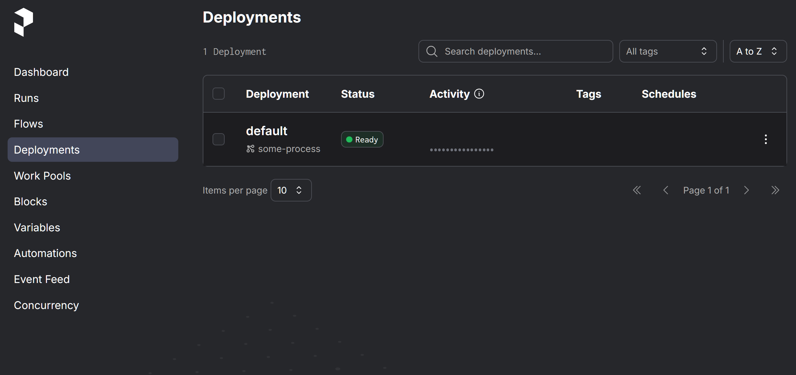

Prefect is one of my favourite modern orchestrators. Airflow (especially back in the days of 1.0) was painful to run and debug locally. Dagster is great, but does require conforming to their asset-style framework. Prefect, however, gets us closest to native python and is thus incredibly easy to adopt. One of the pain points that I see a lot of in the community slack, however, are deployments.

Or to be clearer: useful patterns that go beyond the simple examples in the Prefect documentation to registering flows and one or more deployments of them into Prefect Server or Prefect Cloud.

So let us assume some starting point:

1. You have a repository with some code you want orchestrated via Prefect.
2. This repo builds an image that you contains your code and dependencies.

This second step is flexible, and I've both used it and also utilised the Git storage feature of Prefect such that I don't need to rebuild an image each time code changes. I'm happy to write about this in a different post if there's interest.

If you want to follow along, let us first run Prefect Server in the background so we don't have a transient Prefect spun up each time:

```bash
docker run -p 4200:4200 -e PREFECT_SERVER_API_HOST=0.0.0.0 -e PREFECT_API_URL=http://localhost:4200/api prefecthq/prefect:3-latest prefect server start
```

This should output a little splash logo and also the endpoints you can use in `prefect config set`. Let's create an example ETL flow sans Prefect that simply filters some JSON to only keep active entries:

```python {class=reduced-code}
import json
from pathlib import Path

def load_data(data_path: str) -> list[dict]:
    return json.loads(Path(data_path).read_text())

def filter_data(data: list[dict]) -> list[dict]:
    return [item for item in data if item.get("active")]

def save_data(data: list[dict], output_path: str):
    Path(output_path).write_text(json.dumps(data))

def some_process(data_path: str, output_path: str):
    raw = load_data(data_path)
    filtered = filter_data(raw)
    save_data(filtered, output_path)
```

And now if we want to Prefectify it, its super simple.

```python {class=reduced-code}
import json
from pathlib import Path
from prefect import flow, task

@task
def load_data(data_path: str) -> list[dict]:
    return json.loads(Path(data_path).read_text())

@task
def filter_data(data: list[dict]) -> list[dict]:
    return [item for item in data if item.get("active")]

@task
def save_data(data: list[dict], output_path: str):
    Path(output_path).write_text(json.dumps(data))

@flow
def some_process(data_path: str, output_path: str):
    raw = load_data(data_path)
    filtered = filter_data(raw)
    save_data(filtered, output_path)
```

Great, so we could add an entrypoint and run this, so let's get into the deployment pattern I like. First, we create a deployment config object we can use to parametrise our deployments. Most of the options here will mirror what prefect exposes in [`Flow.to_deployment`](https://docs.prefect.io/v3/api-ref/python/prefect-flows#to-deployment)

```python {class=reduced-code}
from pydantic import BaseModel, Field

class DeploymentConfig(BaseModel):
    name: str = Field(default="default")
    cron: str | None = Field(default=None)
    active: bool = Field(default=True)
    work_pool: str = Field(default="default")
```

Normally I'd add description, examples, etc, but let's keep the code here brief. Now, let us add a registry. For brevity I will leave out the normal decorator type hints.

```python {class=reduced-code}
class Registry:
    def __init__(self):
        self.deployments: list[tuple[Flow, DeploymentConfig]] = []
    def __call__(self, config: DeploymentConfig):
        def inner(fn: Flow):
            self.deployments.append((fn, config))
            return fn
        return inner

    def get_deployments(self):
        return self.deployments

registry = Registry()
```

In the above, one could use the singleton pattern or class variables instead of a local variable which you'd import. Generally I'd put both the config class and the registry in the same python file, and each flow in its own file. We can import and use the registry and use it by decorating our flow:

```python {class=reduced-code}
@registry(DeploymentConfig(cron="0 9 * * *"))
@flow
def some_process(data_path: str, output_path: str):
    raw = load_data(data_path)
    filtered = filter_data(raw)
    save_data(filtered, output_path)
```

In our real use cases, we have flags for enabling in prod, dev, rrule specification, timezones, image overrides, CPU and memory requests, whether to run the via stateful workers on as an ECS task, branch control, and parameter overrides. One thing I won't touch on here is detecting deployment flow name collisions, so bear that in mind.

The final step is getting these deployments onto Prefect. I'd make a `deploy.py` file and throw in code like so:

```python
from collections import defaultdict
from prefect.deployments.runner import RunnerDeployment
from prefect import deploy
from prefect.settings import PREFECT_API_URL, temporary_settings

THIS_IMAGE = "ghcr.io/wherever/your/cicd/image/uploads/to"

def get_deployments() -> dict[str, list[RunnerDeployment]]:
    """Return a map of work pool to deployments."""
    deployments = defaultdict(list)
    for flow, deployment in registry.deployments:
        runner_deployment = flow.to_deployment(
            name=deployment.name,
            work_pool_name=deployment.work_pool,
        )
        # Depending on how you have your code inside your image
        # you may need to adjust the runner_deployment.entrypoint
        deployments[deployment.work_pool].append(runner_deployment)
    return deployments


def register_deployments(deployment_map: dict[str, list[RunnerDeployment]]) -> None:
    # Each deploy call has a single work pool name (dont ask me why)
    # which is why the previous map is grouped by work pool
    for work_pool, deployments in deployment_map.items():
        deploy(
            *deployments,
            work_pool_name=work_pool,
            image=THIS_IMAGE,
            build=False,
            push=False,
        )


if __name__ == "__main__":
    url = "http://localhost:4200/api"
    with temporary_settings({PREFECT_API_URL: url}):
        deployment_map = get_deployments()
        register_deployments(deployment_map)
```

We simply have two functions. The first, `get_deployments`, uses our registry to create a map from work pool to `RunnerDeployment` via `flow.to_deployment`. This is done because the `deploy` function requires a single work-pool, so you call it once per pool. Then... we do that. Image building and pushing is turned off (GitHub or your CICD should do this for you) because if we have two work pools we're pushing too we probably don't want to build and push the image twice. Now in your CICD, after your test and build jobs, you can add a deployment job which simply invokes this file, and all your flows will get deployed.

Now if you were to run this manually right now, Prefect would yell at you that your `default` work pool does not exist. You can make one and then start a worker (post adding `prefect-docker` via pip/uv/etc):

```bash {class=reduced-code}
export PREFECT_API_URL="http://localhost:4200/api"
prefect work-pool create --type docker default
prefect worker start -p default --type docker
```

With the work pool made, running the code manually (the whole thing is at the bottom of the writeup, don't worry) would give something like:

```bash {class=reduced-code}
Successfully created/updated all deployments!

                Deployments
┏━━━━━━━━━━━━━━━━━━━━━━┳━━━━━━━━━┳━━━━━━━━━┓
┃ Name                 ┃ Status  ┃ Details ┃
┡━━━━━━━━━━━━━━━━━━━━━━╇━━━━━━━━━╇━━━━━━━━━┩
│ some-process/default │ applied │         │
└──────────────────────┴─────────┴─────────┘
```

And if you then open [http://127.0.0.1:4200/deployments](http://127.0.0.1:4200/deployments) you should be able to see the new deployment, ready to go!



For extensions to this, note that the above code only pushes and updates deployments, it doesn't delete them. We have a step which runs after this and checks for flows which are separate from what we just pushed (deploy returns a list of flow ids so you can check against that). Flows not found then get removed.

So with this pattern, us adding a new flow for deployment is a two step process:

1. Add the `registry` decorator above the flow.
2. Ensure that our `deployment.py` imports this flow. We do this by having a `load_flows` function which is just a whole bunch of imports.

This means you don't need to have a deployment entrypoint in each flow file, but ensures that deployment configuration is always colocated with the flow definition itself.

Here's the full code in one file, which you can download and run (assuming you have `uv` on your system, which I hope you do), via `./code.py`:

```python
#!/usr/bin/env -S uv run --script
#
# /// script
# requires-python = ">=3.12"
# dependencies = ["prefect", "pydantic"]
# ///

import json
from collections import defaultdict
from pathlib import Path

from prefect import Flow, deploy, flow, task
from prefect.deployments.runner import RunnerDeployment
from prefect.settings import PREFECT_API_URL, temporary_settings
from pydantic import BaseModel, Field

THIS_IMAGE = "ghcr.io/wherever/your/cicd/image/uploads/to"


class DeploymentConfig(BaseModel):
    name: str = Field(default="default")
    cron: str | None = Field(default=None)
    active: bool = Field(default=True)
    work_pool: str = Field(default="default")


class Registry:
    def __init__(self):
        self.deployments: list[tuple[Flow, DeploymentConfig]] = []

    def __call__(self, config: DeploymentConfig):
        def inner(fn: Flow):
            self.deployments.append((fn, config))
            return fn

        return inner

    def get_deployments(self):
        return self.deployments


registry = Registry()


@task
def load_data(data_path: str) -> list[dict]:
    return json.loads(Path(data_path).read_text())


@task
def filter_data(data: list[dict]) -> list[dict]:
    return [item for item in data if item.get("active")]


@task
def save_data(data: list[dict], output_path: str):
    Path(output_path).write_text(json.dumps(data))


@registry(DeploymentConfig(cron="0 9 * * *"))
@flow
def some_process(data_path: str, output_path: str):
    raw = load_data(data_path)
    filtered = filter_data(raw)
    save_data(filtered, output_path)


def get_deployments() -> dict[str, list[RunnerDeployment]]:
    """Return a map of work pool to deployments."""
    deployments = defaultdict(list)
    for flow, deployment in registry.deployments:
        runner_deployment = flow.to_deployment(
            name=deployment.name,
            work_pool_name=deployment.work_pool,
        )
        # Depending on how you have your code inside your image
        # you may need to adjust the runner_deployment.entrypoint
        deployments[deployment.work_pool].append(runner_deployment)
    return deployments


def register_deployments(deployment_map: dict[str, list[RunnerDeployment]]) -> None:
    # Each deploy call has a single work pool name (dont ask me why)
    # which is why the previous map is grouped by work pool
    for work_pool, deployments in deployment_map.items():
        deploy(
            *deployments,
            work_pool_name=work_pool,
            image=THIS_IMAGE,
            build=False,
            push=False,
        )


if __name__ == "__main__":
    url = "http://localhost:4200/api"
    with temporary_settings({PREFECT_API_URL: url}):
        deployment_map = get_deployments()
        register_deployments(deployment_map)
```