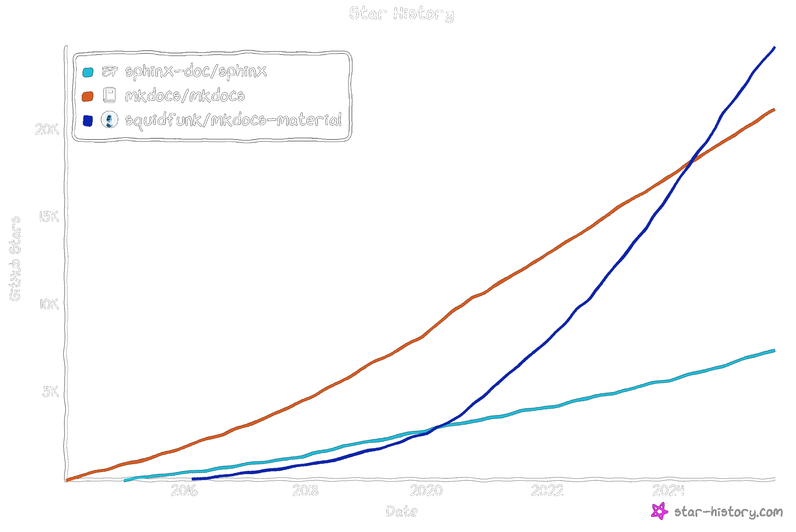

I've written, maintained, reviewed, and collaborating on a *lot* of code bases over the last fifteen years I've been a professional software engineer. Some are now archived away from the eyes of the world, gathering electric dust. Others are still in use. Many are locked behind private company organizations or collaboration groups. You'd think that the content of those repositories would be the defining factor in how enthusiastic I was to contribute to those projects. It (obviously) isn't. Instead, projects that made my life as a developer easy were the ones I put my time into. The projects that used modern tools, that even taught me new ones or new best practices, that raised my professional skills simply via their contribution guidelines and processes---those repos are the ones I think back most fondly too.

On the other side of the scale, repos with such poor documentation, code that only runs on the creator's machine, those I actively avoid using or contributing to. And off in its own area we have libraries like `scipy` and the likes, which---while having documented contribution guidelines and processes---require so much initial investment to get running and understanding all the pieces of the puzzle that what small contribution one makes seems to be unworthy the mammoth effort of setting up such a complex project.

All these words to say something simple: If you work with others and benefit from people using your code or contributing to it, make their life easy.

The rest of this document is my best effort to document how I personally have gone about such a process.

In fact, every suggestion and talking point I am about to go through is implemented on my [ChainConsumer](https://github.com/Samreay/ChainConsumer/) repository, so please feel free to use it as a reference.

## Templates and Cookie Cutters

Everyone and their doc has a cookie cutter project at this stage. Most of them are bad when written. Most of the good ones then become bad as they get out of date. So if you're going to use a template repository, make sure you pick one that's made by those in the know and who keep it up to date.

In fact, let's cut to the chase. Just use [the Scientific Python cookie-cutter](https://github.com/scientific-python/cookie) base. Even better, read their [development guidelines](https://learn.scientific-python.org/development/) beforehand so all the choices make sense. Now, the template above gives us tons of options, and here I am to share my opinions on them all!

Let's together make a new project using this template. [Instructions here](https://github.com/scientific-python/cookie?tab=readme-ov-file#to-use-copier-version).

<div class="reduced-code width-34" markdown=1>

```bash
uv tool install --with copier-templates-extensions copier
copier copy gh:scientific-python/cookie example --trust --vcs-ref=HEAD
```
</div>

If you run this, copier will start asking you questions. Some, like your name, you probably know the answer already. There are only two important ones, the build backend, and use version control for versioning (which I'd mark as yes).

### Build Backend

This option is for those who want other people to be able to use their code. If your repository isn't going on PyPI, if its not going to be used by other local projects of your own, then don't worry about this step too much. You'll still have to pick an option, but you'll never be making GitHub releases or tag versions, so you won't be interacting with that side of things.

If you do want your code out on PyPI, and you're not compiling C++/rust code in your build process:

1. **Best Option:** `uv_build`. Look, `uv` having a backend is very new, but Astral has such a fantastic track record with `uv` and `ruff` that I'm going all in on them. It's got [documentation](https://docs.astral.sh/uv/concepts/build-backend/) and makes it trivial to [publish pure-python packages](https://docs.astral.sh/uv/guides/package/). You're getting a `uv` frontend with the template, so why not the backend too?
2. **Also as good as the above:** `hatchling`. It's the recommended way from the [official python packaging guide](https://packaging.python.org/en/latest/tutorials/packaging-projects/), has tons of documentation, and will cover the vast majority of use cases.
3. **Do not use:** `setuptools`. Its legacy nature means a lot of baggage. If anyone tells you to write a `setup.py`, `setup.cfg`, or `MANIFEST.in`, stop taking coding advice from them. And sure there's the classic setuptools way using those files, or the more modern usage of it respecting [PEP621](https://peps.python.org/pep-0621/), but I've seen plenty of confusion and people trying to mix the two. So use a better tool.

Now, if you do have code to compile into binaries that you want to ship out too, look into `scikit-build-core` or `maturin` depending on if you're compiling C++ or rust respectively. I have also used `poetry-core` for this in the past, but found their support for compilation steps to be weak in the past (even if I know they've addressed a few concerns in the past years).

Special note to `poetry` - I've used it for dozens of projects before I converted them all to `uv` instead. They blazed a trail when they were new and pushed the needle a *ton*, but is now relatively superseded by `uv`.


## Project Structure

You should now have a bunch of top level files, a `src/package_name` directory, a `docs` directory, and a `tests` directory. This is how you want to lay things out. In the past it was common to see the `package_name` directory at the top level and not inside `src`, but convention has settled on having a `src` directory. I won't dig into the benefits, just make sure you don't try to simplify the structure and accidentally cause a bunch of issues down the line.

## Testing

I don't have much to add on top of the [pytest guide](https://learn.scientific-python.org/development/guides/pytest/) are just some addendums or slight disagreements I'll put forth.

1. `minversion = "6.0"` - not really an addendum, but with a new project if you run `uv add --group test pytest` to add this dependency you'll see that you'll probably have version 8 or greater as your requirement. So don't worry too much about needing v6 at a minimum, we're well beyond that.
2. `filterwarnings = ["error"]` - so this configuration says "If something raises a warning and that message has 'error' in it, then that's a test failure". In isolation, this makes sense, but if your project is using numpy, scipy, pandas, etc, I've found it to be a massive pain. Right now on the latest version of pandas and numpy, numpy will throw a bunch of "FutureError" warnings about how pandas does things like transposing and swapping axes (and other stuff), and I don't want my tests failing because numpy is waving an orange flag to *pandas*. Wave it at me, fine, I'll fix up the code to future proof it. But waving to packages I can't fix is not useful.

It's raised in a separate section of the guide, but one footgun is people who write tests (of which there need to be more) often include hefty data files to run off. Please *do not* include data files for tests that bloat the repo. In fact, you can (and should) ensure your pre-commit config has a maximum file size allowed. Rejoice, the pre-commit config that comes with the template repo has this enabled, with a default of 500kB file size.

## Documentation

Alright here is my first big disagreement with the template above. They still use sphinx when mkdocs is (IMHO) easier-to-use, wider-used, and provides a significantly improved user experience. Sphinx was what I started using over a decade ago, and I *cannot* tell you how many hours I have spent screaming at my computer when Sphinx just decides to stop working. No errors, no warnings, no output, just things silently crashing. Not a positive experience.

On the other hand, mkdocs is very clear about how you've done something wrong and where you can go to fix it. mkdocs, and the leading `mkdocs-material` documentation implementation on top of it have well and truly eclipsed Sphinx. If you look at its [official tutorial](https://squidfunk.github.io/mkdocs-material/getting-started/), [FastAPI](https://fastapi.tiangolo.com/), or [Pydantic](https://docs.pydantic.dev/latest/), [polars](https://docs.pola.rs/), etc, and see the consistent visual theme, you'll probably realise just how many python project documentation websites are built using it.



So what I recommend people do is delete the `docs` directory until I can update the template to include mkdocs as an option (vote [here](https://github.com/scientific-python/cookie/issues/648) to show support) and use my [ChainConsumer repo](https://github.com/Samreay/ChainConsumer/) as a base. The documentation for [mkdocs-material](https://squidfunk.github.io/mkdocs-material/getting-started/) is **fantastic.** You can auto-generate API from docstring, just like Sphinx. You can turn notebooks and iPython files into examples super easily. You can do ten thousand things (with a bunch of plugins like `mkdocstrings` all listed [here](https://github.com/mkdocs/catalog?tab=readme-ov-file#-api-documentation-building)). [So many components](https://squidfunk.github.io/mkdocs-material/reference/) are available right at your fingertips. No joke, if my website here was documentation focused you bet I'd be using it instead of Hugo.

To get `mkdocs` working, you really just want some markdown files in your `docs` folder, and at the top level of your project, a `mkdocs.yml` file will tie it all together. This file gets created when you `mkdocs new .`, but also feel free to copy the one from ChainConsumer and customise it. I've already got most of the plugins you'll want setup as well. On that note, be sure to grab the doc dependencies from my `pyproject.yml`, and you can see my `.github/workflow/deploy.yml` runs pre-commit, tests, documentation building, and then publishes to pypi (if the commit is associated with a v* tag).

## Task Running

The cookie cutter recommends using `nox` here, and no arguments for me if anyone wants to use it. For large projects, 100%, it's well worth it. For smaller projects I can't help but feel like it's overkill. In ChainConsumer, I just use a makefile. Makefiles with complexity are *the worst things in the world*, but if all you're doing is providing simple targets like:

<div class="reduced-code width-34" markdown=1>

```makefile
test:
  uv run pytest tests
```
</div>

Then I don't particularly see the need to add the complexity `nox` provides. The cookie-cutter `noxfile.py` provides six targets in 110 lines of code, while those same six targets in my makefile are 13 lines. In addition, makefiles can be run almost anywhere (Make comes with ubuntu), unlike `nox` (though it only needs python and pip). Still, so long as your top-level README.md documents how to run tests, build local documentation, etc, when the user types into terminal shouldn't matter too much. Use `nox` if you want, use a `makefile` if you don't need complexity in your targets.

## Where to quibble

If you've compared my repo to the cookie cutter, you'll also see our Github actions are different. I've simplified mine a fair amount and bundled it into a single yml file. My repo publishes to PyPI when you push a `v*` tag (like `v1.2.3`), the cookie-cutter publishes to pypi when you go into GitHub, go to the releases, and turn a tag into a release. I just wanted to cut out the middle man. Neither I think are worth quibbling over - CICD is not something you'd expect the average community contributor to contribute to. Spend your time and energy nailing the actual package code. How your CICD jobs are structured isn't too important, so long tests get run and builds go out along a documented process.


## Common Issues

#### Windows and WSL

Windows users, I need you to **never run any code in Windows.** [Install the linux subsystem](https://learn.microsoft.com/en-us/windows/wsl/install), and install [Windows Terminal](https://apps.microsoft.com/detail/9n0dx20hk701) so you can have an Ubuntu shell always at your fingertips. Set up VSCode (installed in windows) to [use WSL](https://code.visualstudio.com/docs/remote/wsl), and ensure you clone your projects out while in Ubuntu to the Ubuntu disc. Ie to `~/projects/your_project`, not to `C:\projects\your_project`. This, I promise you, will make your life better. For the PyCharm lovers out there, you may need to pay for [PyCharm Pro to use a WSL interpreter](https://www.jetbrains.com/help/pycharm/using-wsl-as-a-remote-interpreter.html), and remember that students and teachers get all JetBrain products for [free](https://www.jetbrains.com/pycharm/buy/?section=students&billing=yearly).

#### Frontend vs Backend

This comes up every time I talk to someone about packaging up projects. Your project will have dependencies, dependency groups (like dev, docs, test, etc), and probably a lock file that pins your dependency version and transitives to ensure a reproducible development environment. You will use your frontend project management tool (`uv`) to build your virtual environment, figure out what dependencies you need, etc. All of this is about *your* project and *your* dependencies and how to set up your development environment.

When setting up this environment, you'll (hopefully) install your dependencies (like numpy, etc) into your venv. To do this, your frontend (`uv`) will download the package from PyPI, and that package will have instructions as to how to install itself. `uv` will then, in an isolated way for every single package, let them build themselves using their build backend that they have specified. If you install `ChainConsumer` then in an isolated environment [uv_build](https://github.com/Samreay/ChainConsumer/blob/dbc1a8741211a47852d7903ae983b45656ce87b1/pyproject.toml#L2) will install and get ChainConsumer installed. If you need `numpy` then in its installation you'll temporarily have an isolated build environment with [meson and cython](https://github.com/numpy/numpy/blob/main/pyproject.toml#L3), and it will use those tools to compile what it needs into your system.

For most people in the scientific coding community, the frontend (`uv`) is what they will interact with every day, running `uv sync`, `uv add`, etc. So long as you follow the "put your code in the src directory and make sure its name matches your project", the backend is probably just a single set-and-forget pair of lines in your pyproject.toml.

#### Dependency Hell

If you're working closely with people in a collaboration, with different people or teams using packages from other members, it can become a massive pain to ensure your transitive dependencies all work nicely together, and an even larger pain when you need to constantly pull in the latest git commit for upstream packages. If this sounds like you, consider moving those packages and developers to work on the same repository with different packages and applications in different directories by using [uv workspaces](https://docs.astral.sh/uv/concepts/projects/workspaces/).

## Libraries I Wish Everyone Used


#### Configuration and cli

Use `pydantic` and `pydantic-settings`. Stop checking if `os.environ` has an env variable. Stop using `argparse`. Stop using click. Stop manually loading `.env` files. Let `pydantic` do it all for you. More applicable for applications instead of packages, but any time you think "I think my code should have some settings" then you want to be using `pydantic-settings`.

#### Data Transformations

If you've been using `pandas` for years and never tried `polars`, please give it a shot.

#### Logging

Your code should hopefully contain **ZERO** print statements. If you want to put something to stdout or stderr, using `logging`. Want to make life as easy as possible? Use `loguru`. If you really want to do pretty text output, look into `rich` and its `Console`.

#### Orchestration

If you're writing code to be run on other machines and want easy orchestration (like scheduling, retrying, caching, a UI, hooks on success/failure), consider looking into [Prefect](https://www.prefect.io/).


## Project Management

If you're working in a team then obviously it's a good idea to try and use *some* form of ticketing system. For the majority of science use cases, I'd expect that using good old GitHub Issues is entirely sufficient. But if you want a bit more, from the bottom of my jaded and tired heart, please, please, *please*, do not use Jira. Use [Linear](https://linear.app/homepage).

## Conclusion

Alright, let's boil down exactly what I would starting to make a repo from scratch that I want someone to contribute to:

1. Use the scientific python cookie cutter, and select `uv_build` as the backend.
2. Replace the docs from Sphinx to `mkdocs-material` by using ChainConsumer as a template.
3. Ensure I have an obvious `main.py` or similar entrypoint if I'm writing an application and not a package, with all configuration / settings done via `pydantic-settings` class that's found in a `settings.py`. This class is initialised in my main function, and its configuration logged immediately. My `main.py` should be as short and simple as possible.
4. Dance.
5. If you need project management, use Linear over Jira.

If you're ever curious if you've missed anything, the scientific python website offers a repo review service [here](https://learn.scientific-python.org/development/guides/repo-review/), where you just in your repo name and it'll tell you what things you've done correct and things you haven't done. Don't try and get all green in this, not all the red checkmarks will be applicable to every repo.