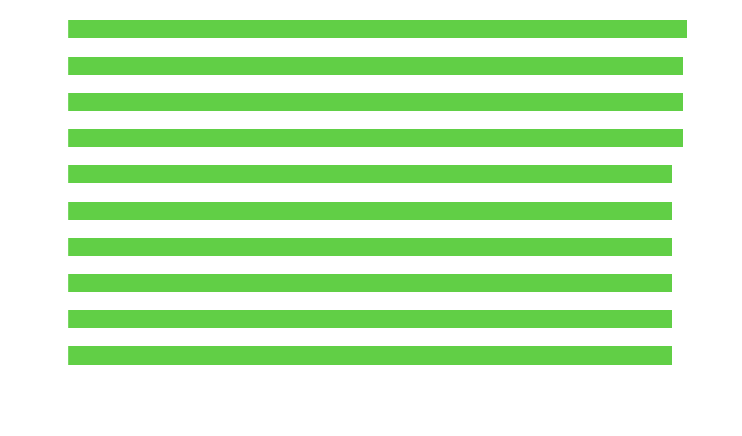
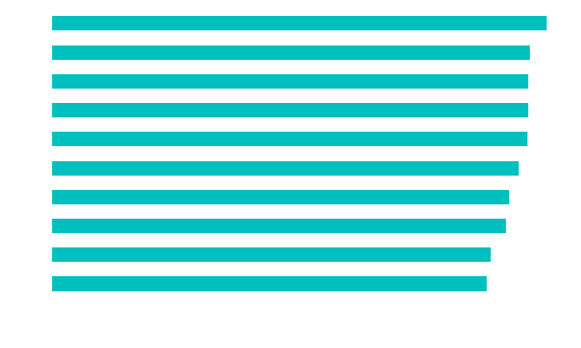

Recently, I---like many others---have indulged in the Wordle competitions with friends. Which raised the question of how to open and ensure that I *crushed* all my mates with my vastly superior score.

So here we are. About to do an unneccessary but fun deep dive into Wordle words.

# TL;DR

If you care both about getting letters, *and* getting them in the right location, start with "lares" or "tares".

If you try "lares" and get nothing, try "tonic" or "point".

If you try "tares" and get nothing, try "noily" or "doily".


# Our data

As I was writing this up, a friend of mine, [Ravi Gupta](http://www.raviryangupta.com/) [beat me to the punch](https://towardsdatascience.com/wordle-vision-simple-analytics-to-up-your-wordle-game-65daf4f1aa6f) with a similar analysis. I shall try to add value onto this, so please keep reading. I also use a different list of words from [this github repo](https://github.com/raun/Scrabble/blob/master/words.txt): if it's good enough for Scrabble, it's good enough for me.

I've downloaded it into a wordle folder for posterity.


<div class="reduced-code width-49" markdown=1>

```python
import pandas as pd

with open("wordle/words.txt") as f:
    words = f.read().splitlines()

# Get 5 letter words
words = [x.lower() for x in words if len(x) == 5]
words[:5]
```

</div>


    ['aahed', 'aalii', 'aargh', 'abaca', 'abaci']


Oh dear, that's a lot of a's. Let's get rid of things which might not be appropriate, and restrict down to five letters.

# Letter Frequency

First thing first, let's determine what the most frequent letters are. We assume all words have equal weight.


<div class=" width-61" markdown=1>

```python
cols = "abcdefghijklmnopqrstuvwxyz"
df = pd.DataFrame({x: [x in y for y in words] for x in cols})
occurence = df.mean().sort_values(ascending=False)
occurence.plot.bar(rot=0);
```

</div>


    

    


If only 'searo' was a word, problem solved!

Instead, lets assign a value per letter and see what words are most valuable in total. Let's not count letter twice, or 'sears' is going to win.


<div class=" width-70" markdown=1>

```python
shortlist = [x for x in words if "s" in x or "e" in x or "a" in x]
values = {x: sum(list(map(occurence.get, set(x)))) for x in shortlist}
top_words = pd.Series(values).sort_values(ascending=False)
top_words.head(10)[::-1].plot.barh()
```

</div>


    

    


I'm personally partial to arise and arose, but you can see theres lots of competition at the top.

# Care about position

So how can we improve this? Well, right now its useful to know if a letter is in the word, but more useful if the letter is in the word **and** in the right spot.

So let's take the top 100 words and do a more thorough comparison against our corpus of words, giving a point for having the letter, and an additional half point if its in the right place.


<div class=" width-72" markdown=1>

```python
best = top_words.head(100).index.tolist()

def calc_positions(best, words):
    # Lordy forgive me for the for loops
    scores = {}
    for b in best:
        score = 0
        for w in words:
            # Get our yellow points and dont double count double letters
            score += len(set(b).intersection(w))
            for i, l1 in enumerate(b):
                # Yay for being in the right place
                if l1 == w[i]:
                    score += 0.5
                    
        scores[b] = score / len(words)
    return pd.Series(scores).sort_values(ascending=False)

position_score = calc_positions(best, words)
position_score.head(10)[::-1].plot.barh()
```

</div>


    

    


Some big upsets here. Serai dropped off, because not many words end in "i". Lots of words end with "es", so no surprise those rose to the top, even with "arise" and "arose" being great picks.

Interestingly, lares and tares remain the top pair even when you reduce the extra value given to the correct position down to 0.2, with arise and arose returning to the top around 0.1 value. 

So, final question, if we now go with "lares" does not give you any letters at all, what should you do?


<div class="expanded-code width-89" markdown=1>

```python
words_without_lares = [x for x in words if all(y not in x for y in "lares")]

# Calculate a shortlist of letter scores
top_words_lares = {x: sum(list(map(occurence.get, set(x)))) for x in words_without_lares}
top_words_lares = pd.Series(top_words_lares).sort_values(ascending=False).head(10)

pos_arose = calc_positions(top_words_lares.index, words_without_lares)

pos_arose.head(10)[::-1].plot.barh()
```

</div>


    

    


If you try "lares" and get nothing, try "tonic" or "point".

If you try "tares" and get nothing, try "noily" or "doily".

If you decide you don't care about getting the position right, then you might want to go with "arise" or "arose".

If you try "arose" and get nothing, consider "linty" or "until".

If you try "arise" and get nothing,, try "octyl" or "clout".

# If everything fails

Just for fun, lets go with lares and tonic, and both of them give you nothing! What to do!? Go with bumpy.

******

For your convenience, here's the code in one block:

```python
import pandas as pd

with open("wordle/words.txt") as f:
    words = f.read().splitlines()

# Get 5 letter words
words = [x.lower() for x in words if len(x) == 5]
words[:5]
cols = "abcdefghijklmnopqrstuvwxyz"
df = pd.DataFrame({x: [x in y for y in words] for x in cols})
occurence = df.mean().sort_values(ascending=False)
occurence.plot.bar(rot=0);
shortlist = [x for x in words if "s" in x or "e" in x or "a" in x]
values = {x: sum(list(map(occurence.get, set(x)))) for x in shortlist}
top_words = pd.Series(values).sort_values(ascending=False)
top_words.head(10)[::-1].plot.barh()
best = top_words.head(100).index.tolist()

def calc_positions(best, words):
    # Lordy forgive me for the for loops
    scores = {}
    for b in best:
        score = 0
        for w in words:
            # Get our yellow points and dont double count double letters
            score += len(set(b).intersection(w))
            for i, l1 in enumerate(b):
                # Yay for being in the right place
                if l1 == w[i]:
                    score += 0.5
                    
        scores[b] = score / len(words)
    return pd.Series(scores).sort_values(ascending=False)

position_score = calc_positions(best, words)
position_score.head(10)[::-1].plot.barh()
words_without_lares = [x for x in words if all(y not in x for y in "lares")]

# Calculate a shortlist of letter scores
top_words_lares = {x: sum(list(map(occurence.get, set(x)))) for x in words_without_lares}
top_words_lares = pd.Series(top_words_lares).sort_values(ascending=False).head(10)

pos_arose = calc_positions(top_words_lares.index, words_without_lares)

pos_arose.head(10)[::-1].plot.barh()
```